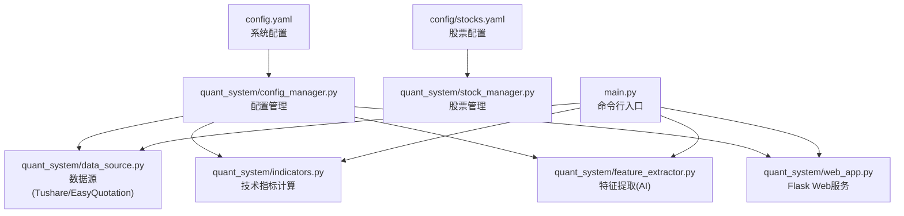
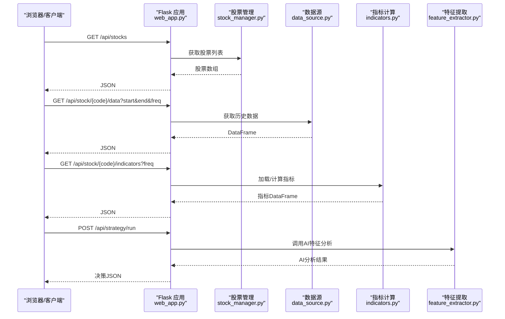
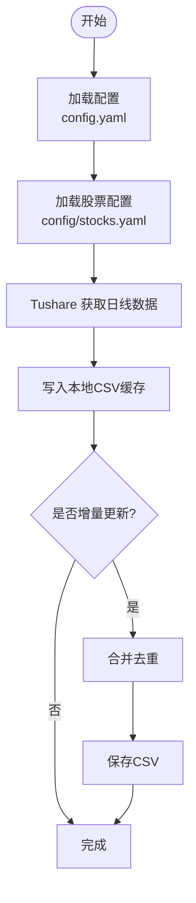
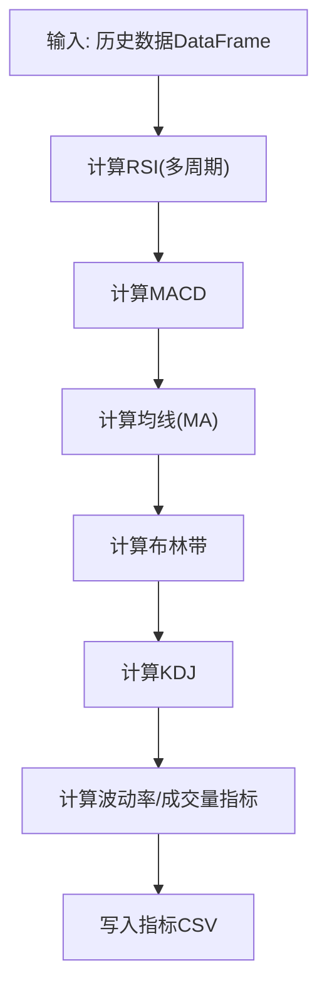
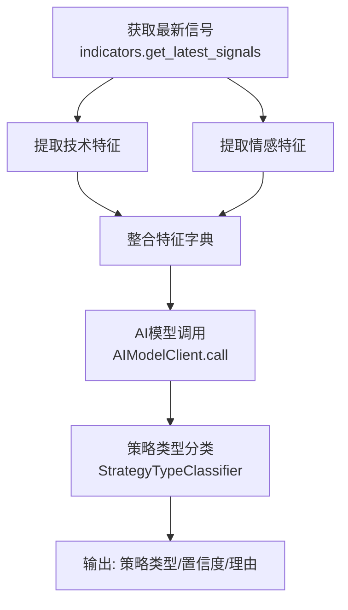
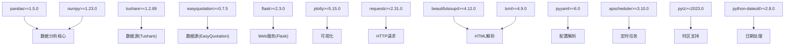

# 服务器配置

<cite>
**本文引用的文件**
- [config.yaml](file://config.yaml)
- [requirements.txt](file://requirements.txt)
- [main.py](file://main.py)
- [quant_system/web_app.py](file://quant_system/web_app.py)
- [quant_system/config_manager.py](file://quant_system/config_manager.py)
- [quant_system/data_source.py](file://quant_system/data_source.py)
- [quant_system/stock_manager.py](file://quant_system/stock_manager.py)
- [quant_system/indicators.py](file://quant_system/indicators.py)
- [quant_system/feature_extractor.py](file://quant_system/feature_extractor.py)
- [config/stocks.yaml](file://config/stocks.yaml)
</cite>

## 目录
1. [简介](#简介)
2. [项目结构](#项目结构)
3. [核心组件](#核心组件)
4. [架构总览](#架构总览)
5. [详细组件分析](#详细组件分析)
6. [依赖分析](#依赖分析)
7. [性能考虑](#性能考虑)
8. [故障排查指南](#故障排查指南)
9. [结论](#结论)
10. [附录](#附录)

## 简介
本指南面向部署 vibequation 量化交易系统的服务器环境，提供从硬件规格、操作系统、Python 环境、依赖安装、网络与安全配置，到性能调优与监控的完整建议。内容基于仓库中的配置文件与核心模块实现，确保读者能够按步骤完成生产级部署。

## 项目结构
项目采用模块化组织，核心模块包括配置管理、数据源、指标计算、特征提取、Web 服务等。主要目录与文件如下：
- config：系统配置与股票代码配置
- quant_system：核心业务模块（配置、数据、指标、特征、策略、Web）
- data：数据存储目录（历史、实时、指标、特征、回测等）
- logs：日志输出目录
- main.py：命令行入口，提供数据更新、策略运行、回测、Web 启动等子命令
- requirements.txt：依赖清单



**图表来源**
- [config.yaml:1-88](file://config.yaml#L1-L88)
- [quant_system/config_manager.py:1-178](file://quant_system/config_manager.py#L1-L178)
- [config/stocks.yaml:1-71](file://config/stocks.yaml#L1-L71)
- [quant_system/stock_manager.py:1-278](file://quant_system/stock_manager.py#L1-L278)
- [quant_system/data_source.py:1-423](file://quant_system/data_source.py#L1-L423)
- [quant_system/indicators.py:1-500](file://quant_system/indicators.py#L1-L500)
- [quant_system/feature_extractor.py:1-405](file://quant_system/feature_extractor.py#L1-L405)
- [quant_system/web_app.py:1-1126](file://quant_system/web_app.py#L1-L1126)
- [main.py:1-365](file://main.py#L1-L365)

**章节来源**
- [config.yaml:1-88](file://config.yaml#L1-L88)
- [config/stocks.yaml:1-71](file://config/stocks.yaml#L1-L71)
- [main.py:1-365](file://main.py#L1-L365)

## 核心组件
- 配置管理：集中管理 tokens、数据目录、Web 服务、日志、风控、回测等配置项
- 数据源：统一接入 Tushare（历史）与 EasyQuotation（实时），并做本地缓存与增量更新
- 技术指标：计算 RSI、MACD、均线、布林带、KDJ、波动率等指标
- 特征提取：结合技术指标与新闻情感，通过 AI 模型输出策略类型与置信度
- Web 服务：基于 Flask 提供可视化界面与 API，支持策略运行、回测、风险控制等
- 命令行入口：提供数据更新、指标更新、新闻采集、特征提取、策略运行、回测、Web 启动等子命令

**章节来源**
- [quant_system/config_manager.py:1-178](file://quant_system/config_manager.py#L1-L178)
- [quant_system/data_source.py:1-423](file://quant_system/data_source.py#L1-L423)
- [quant_system/indicators.py:1-500](file://quant_system/indicators.py#L1-L500)
- [quant_system/feature_extractor.py:1-405](file://quant_system/feature_extractor.py#L1-L405)
- [quant_system/web_app.py:1-1126](file://quant_system/web_app.py#L1-L1126)
- [main.py:1-365](file://main.py#L1-L365)

## 架构总览
系统采用“配置驱动 + 模块化”的架构设计，Web 层通过 API 调用各功能模块；命令行入口提供批处理能力；数据层通过本地 CSV 缓存与外部数据源协同工作。

```mermaid
graph TB
subgraph "Web 层"
W1["Flask 应用<br/>quant_system/web_app.py"]
end
subgraph "业务层"
M1["配置管理<br/>quant_system/config_manager.py"]
M2["股票管理<br/>quant_system/stock_manager.py"]
M3["数据源<br/>quant_system/data_source.py"]
M4["指标计算<br/>quant_system/indicators.py"]
M5["特征提取<br/>quant_system/feature_extractor.py"]
end
subgraph "数据层"
D1["本地CSV缓存<br/>./data/*"]
D2["外部数据源<br/>Tushare / EasyQuotation"]
end
subgraph "CLI"
CLI["命令行入口<br/>main.py"]
end
CLI --> M3
CLI --> M4
CLI --> M5
W1 --> M2
W1 --> M3
W1 --> M4
W1 --> M5
M1 --> M2
M1 --> M3
M1 --> M4
M1 --> M5
M3 --> D1
M3 --> D2
```

**图表来源**
- [quant_system/web_app.py:1-1126](file://quant_system/web_app.py#L1-L1126)
- [quant_system/config_manager.py:1-178](file://quant_system/config_manager.py#L1-L178)
- [quant_system/stock_manager.py:1-278](file://quant_system/stock_manager.py#L1-L278)
- [quant_system/data_source.py:1-423](file://quant_system/data_source.py#L1-L423)
- [quant_system/indicators.py:1-500](file://quant_system/indicators.py#L1-L500)
- [quant_system/feature_extractor.py:1-405](file://quant_system/feature_extractor.py#L1-L405)
- [main.py:1-365](file://main.py#L1-L365)

## 详细组件分析

### Web 服务与 API 流程
Web 服务通过 Flask 提供前端页面与 REST API，典型流程包括：获取股票列表、历史数据、技术指标、K线图、运行策略、回测、风险控制等。



**图表来源**
- [quant_system/web_app.py:41-270](file://quant_system/web_app.py#L41-L270)
- [quant_system/stock_manager.py:95-144](file://quant_system/stock_manager.py#L95-L144)
- [quant_system/data_source.py:307-356](file://quant_system/data_source.py#L307-L356)
- [quant_system/indicators.py:188-274](file://quant_system/indicators.py#L188-L274)
- [quant_system/feature_extractor.py:213-284](file://quant_system/feature_extractor.py#L213-L284)

**章节来源**
- [quant_system/web_app.py:1-1126](file://quant_system/web_app.py#L1-L1126)

### 数据采集与缓存策略
数据采集模块统一接入 Tushare（历史）与 EasyQuotation（实时），并提供本地 CSV 缓存与增量更新机制，降低对外部 API 的依赖与频率限制。



**图表来源**
- [quant_system/data_source.py:64-136](file://quant_system/data_source.py#L64-L136)
- [quant_system/data_source.py:396-420](file://quant_system/data_source.py#L396-L420)
- [config.yaml:10-19](file://config.yaml#L10-L19)
- [config/stocks.yaml:1-71](file://config/stocks.yaml#L1-L71)

**章节来源**
- [quant_system/data_source.py:1-423](file://quant_system/data_source.py#L1-L423)
- [config.yaml:1-88](file://config.yaml#L1-L88)
- [config/stocks.yaml:1-71](file://config/stocks.yaml#L1-L71)

### 技术指标计算与存储
指标模块支持多周期 RSI、MACD、均线、布林带、KDJ、波动率等指标计算，并将结果持久化到本地 CSV，便于后续分析与可视化。



**图表来源**
- [quant_system/indicators.py:188-274](file://quant_system/indicators.py#L188-L274)
- [quant_system/indicators.py:275-305](file://quant_system/indicators.py#L275-L305)

**章节来源**
- [quant_system/indicators.py:1-500](file://quant_system/indicators.py#L1-L500)

### 特征提取与策略类型分类
特征提取模块结合技术指标与新闻情感，通过 AI 模型输出策略类型、置信度与推荐指标，辅助策略选择与风险评估。



**图表来源**
- [quant_system/feature_extractor.py:190-284](file://quant_system/feature_extractor.py#L190-L284)
- [quant_system/feature_extractor.py:323-400](file://quant_system/feature_extractor.py#L323-L400)

**章节来源**
- [quant_system/feature_extractor.py:1-405](file://quant_system/feature_extractor.py#L1-L405)

## 依赖分析
系统依赖通过 requirements.txt 管理，涵盖数据处理、Web 框架、可视化、HTTP 请求、HTML 解析、配置解析、定时任务与时区等模块。



**图表来源**
- [requirements.txt:1-33](file://requirements.txt#L1-L33)

**章节来源**
- [requirements.txt:1-33](file://requirements.txt#L1-L33)

## 性能考虑
- 硬件规格建议
  - CPU：多核处理器优先，建议至少 8 核 16 线程，满足并发数据处理与指标计算需求
  - 内存：建议 16GB+，用于 Pandas/Numpy 大规模数据处理与缓存
  - 存储：SSD 至少 500GB，用于存放历史/实时/指标/特征/回测等大量 CSV 文件
  - 网络：稳定宽带，确保 Tushare API 与 AI 模型服务访问稳定
- 操作系统兼容性
  - Linux：推荐 Ubuntu 20.04/22.04 或 CentOS 7/8，具备良好的 Python 生态与内核参数调优能力
  - Windows：可作为开发/测试环境，生产建议使用 Linux
- Python 环境
  - 建议使用 Python 3.9–3.11，与依赖版本兼容性最佳
  - 使用虚拟环境隔离依赖，避免系统级冲突
- 依赖安装
  - 使用 requirements.txt 安装依赖，确保版本满足最低要求
  - 若需加速，可配置国内镜像源（如清华源）
- 网络与安全
  - Web 服务默认绑定 127.0.0.1，仅本机可访问
  - 生产部署建议通过反向代理（Nginx/HAProxy）暴露服务，并启用 HTTPS
  - 防火墙开放必要端口（如 8080），限制来源 IP
  - 配置安全组规则（云服务器）：允许 8080/22/443 端口入站，拒绝其他端口
- 性能调优
  - 文件描述符：ulimit -n 至少 65536，满足高并发请求
  - 内核参数：调整 net.core.somaxconn、net.ipv4.tcp_tw_reuse 等参数提升连接处理能力
  - Web 服务器：使用 Gunicorn/uWSGI 部署 Flask，设置 worker 数量与进程/线程模型
  - 数据缓存：合理设置指标与特征缓存周期，避免频繁重复计算
  - AI 模型：ModelScope API 调用需考虑限流与降级策略，必要时启用本地模型或缓存结果
- 监控与日志
  - 日志：按配置文件设置日志级别与轮转大小，定期归档
  - 指标：采集 CPU/内存/磁盘/网络/进程数/请求耗时等指标，结合 Prometheus/Grafana
  - 告警：对 API 错误率、响应时间、磁盘空间、文件描述符上限等设置阈值告警

**章节来源**
- [config.yaml:76-87](file://config.yaml#L76-L87)
- [quant_system/web_app.py:34-36](file://quant_system/web_app.py#L34-L36)
- [quant_system/config_manager.py:167-173](file://quant_system/config_manager.py#L167-L173)

## 故障排查指南
- 配置问题
  - 确认 config.yaml 中 tokens、数据目录、Web 服务参数正确
  - 确认 config/stocks.yaml 中股票代码配置完整
- 数据采集失败
  - 检查 Tushare Token 是否有效，确认网络可达
  - 查看日志中关于 Tushare 速率限制与异常的记录
- 指标计算异常
  - 检查历史数据是否完整，字段是否标准化
  - 确认指标目录存在且有写权限
- Web 服务无法访问
  - 检查绑定地址与端口，确认防火墙放行
  - 查看 Flask 启动日志与错误页
- AI 模型调用失败
  - 检查 ModelScope Token 与网络连通性
  - 观察降级逻辑是否生效（Mock 响应）

**章节来源**
- [config.yaml:1-88](file://config.yaml#L1-L88)
- [config/stocks.yaml:1-71](file://config/stocks.yaml#L1-L71)
- [quant_system/data_source.py:46-55](file://quant_system/data_source.py#L46-L55)
- [quant_system/feature_extractor.py:48-97](file://quant_system/feature_extractor.py#L48-L97)
- [quant_system/web_app.py:218-223](file://quant_system/web_app.py#L218-L223)

## 结论
通过合理的硬件与操作系统选择、严格的依赖与环境管理、完善的网络与安全配置，以及持续的性能调优与监控，vibequation 量化交易系统可在生产环境中稳定高效地运行。建议在上线前完成全链路压测与安全审计，并建立自动化运维与应急响应机制。

## 附录
- 常用命令参考
  - 更新所有数据：python main.py update-data
  - 更新技术指标：python main.py update-indicators
  - 采集新闻：python main.py collect-news
  - 提取特征：python main.py extract-features
  - 运行策略：python main.py run-strategy -c <code> -s <strategy>
  - 回测：python main.py backtest -c <code> -s <strategy> --start-date <date> --end-date <date>
  - 启动 Web 服务：python main.py web --host 0.0.0.0 --port 8080
- 关键配置项定位
  - tokens、数据目录、Web 服务、日志：config.yaml
  - 股票代码：config/stocks.yaml
  - 技术指标周期、MACD 参数：config.yaml
  - AI 模型提供商与参数：config.yaml

**章节来源**
- [main.py:261-365](file://main.py#L261-L365)
- [config.yaml:1-88](file://config.yaml#L1-L88)
- [config/stocks.yaml:1-71](file://config/stocks.yaml#L1-L71)