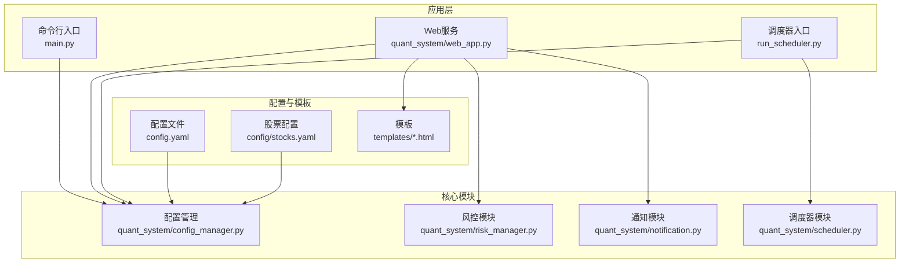
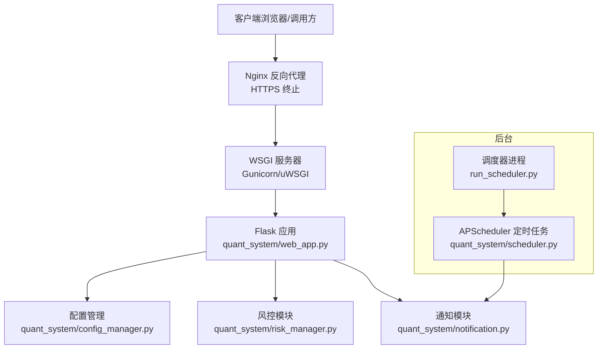
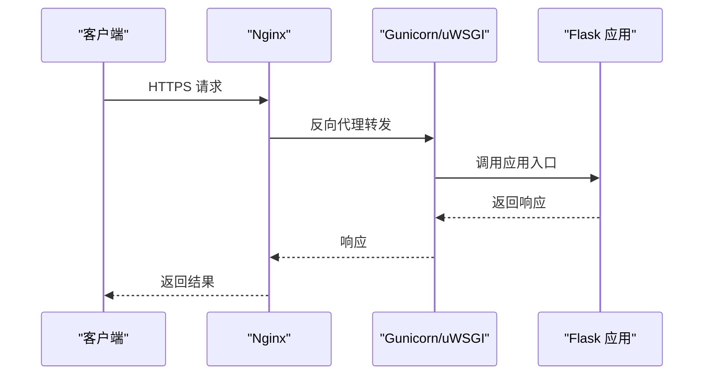
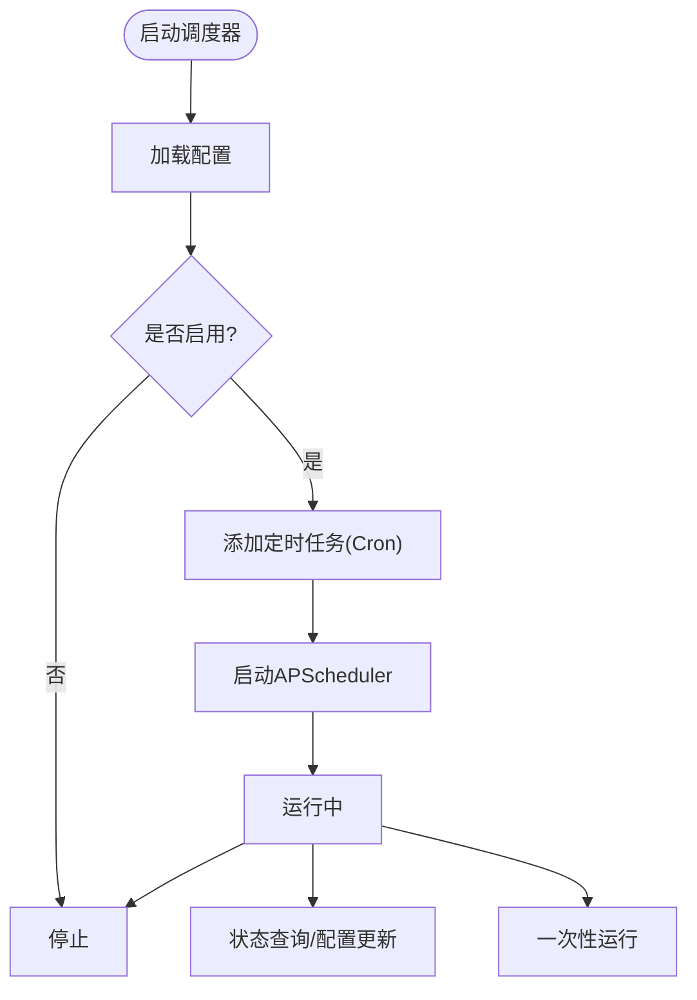
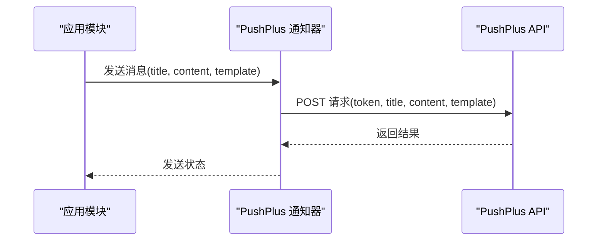
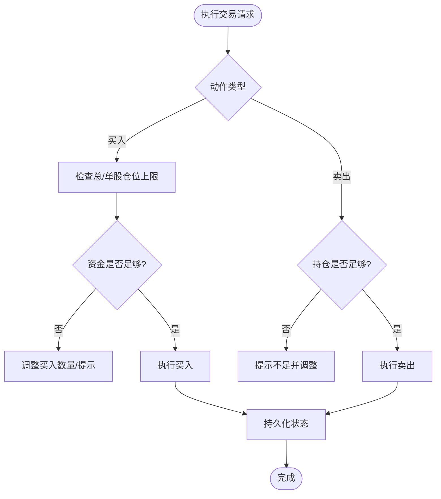
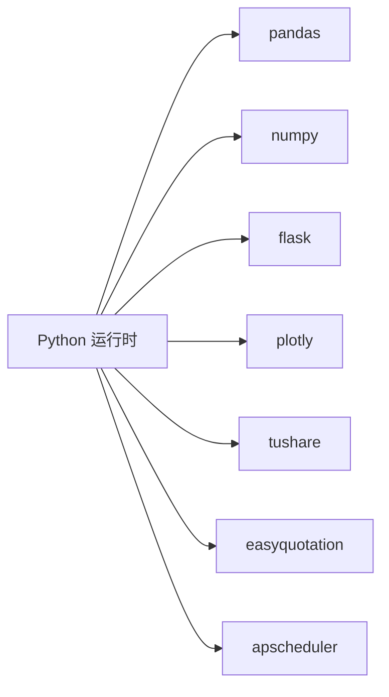

# 生产部署

<cite>
**本文引用的文件**
- [main.py](file://main.py)
- [config.yaml](file://config.yaml)
- [requirements.txt](file://requirements.txt)
- [config\stocks.yaml](file://config/stocks.yaml)
- [quant_system\web_app.py](file://quant_system/web_app.py)
- [quant_system\config_manager.py](file://quant_system/config_manager.py)
- [quant_system\scheduler.py](file://quant_system/scheduler.py)
- [run_scheduler.py](file://run_scheduler.py)
- [quant_system\notification.py](file://quant_system/notification.py)
- [quant_system\risk_manager.py](file://quant_system/risk_manager.py)
- [quant_system\templates\risk.html](file://quant_system/templates/risk.html)
- [quant_system\templates\base.html](file://quant_system/templates/base.html)
- [introduction.txt](file://introduction.txt)
</cite>

## 目录
1. [简介](#简介)
2. [项目结构](#项目结构)
3. [核心组件](#核心组件)
4. [架构总览](#架构总览)
5. [详细组件分析](#详细组件分析)
6. [依赖分析](#依赖分析)
7. [性能考虑](#性能考虑)
8. [故障排查指南](#故障排查指南)
9. [结论](#结论)
10. [附录](#附录)

## 简介
本方案面向vibequation量化交易系统在生产环境的完整部署，覆盖服务器硬件与操作系统要求、网络与安全配置、WSGI服务器（Gunicorn/uWSGI）、Nginx反向代理与SSL、进程管理（systemd/supervisor）、自动重启与健康检查、数据库与缓存（Redis/Memcached）以及文件存储、容器化（Docker）与Kubernetes编排、负载均衡与高可用及灾备策略。文档同时结合代码库中的配置与实现细节，给出可落地的部署步骤与最佳实践。

## 项目结构
系统采用Python单体架构，核心入口为命令行工具与Flask Web服务，数据与配置通过统一的配置管理模块加载，调度器独立运行，消息通知基于第三方推送服务。

**图表来源**
- [main.py:1-365](file://main.py#L1-L365)
- [quant_system\web_app.py:1-873](file://quant_system/web_app.py#L1-L873)
- [quant_system\config_manager.py:1-178](file://quant_system/config_manager.py#L1-L178)
- [quant_system\scheduler.py:199-237](file://quant_system/scheduler.py#L199-L237)
- [run_scheduler.py:1-105](file://run_scheduler.py#L1-L105)
- [config.yaml:1-88](file://config.yaml#L1-L88)
- [config\stocks.yaml:1-71](file://config/stocks.yaml#L1-L71)

**章节来源**
- [main.py:261-365](file://main.py#L261-L365)
- [quant_system\web_app.py:844-872](file://quant_system/web_app.py#L844-L872)
- [quant_system\config_manager.py:28-55](file://quant_system/config_manager.py#L28-L55)
- [config.yaml:10-88](file://config.yaml#L10-L88)

## 核心组件
- 命令行入口与子命令：负责数据更新、指标计算、新闻采集、特征提取、策略运行、回测、风险报告、Web服务等。
- Web服务：基于Flask提供REST API与前端页面，支持K线图、回测图表、风控面板等。
- 配置管理：集中管理tokens、数据目录、技术指标、AI模型、回测、风控、Web服务、日志等配置。
- 调度器：基于APScheduler的定时任务，支持工作日定时执行、任务开关与配置热更新。
- 通知模块：基于PushPlus的微信推送能力，用于策略信号与回测报告通知。
- 风控模块：提供仓位与资金校验、止损止盈等风控逻辑。

**章节来源**
- [main.py:48-223](file://main.py#L48-L223)
- [quant_system\web_app.py:41-872](file://quant_system/web_app.py#L41-L872)
- [quant_system\config_manager.py:101-177](file://quant_system/config_manager.py#L101-L177)
- [quant_system\scheduler.py:199-237](file://quant_system/scheduler.py#L199-L237)
- [quant_system\notification.py:17-54](file://quant_system/notification.py#L17-L54)
- [quant_system\risk_manager.py:191-227](file://quant_system/risk_manager.py#L191-L227)

## 架构总览
生产部署采用“Nginx反向代理 + WSGI服务器（Gunicorn/uWSGI） + Flask应用 + 调度器守护进程”的架构。Web服务默认监听本地回环地址，通过Nginx对外暴露HTTPS；调度器作为独立进程运行，支持配置热更新与状态查询；通知模块通过外部API推送消息；日志落盘至独立目录，便于运维与审计。

**图表来源**
- [quant_system\web_app.py:844-872](file://quant_system/web_app.py#L844-L872)
- [quant_system\config_manager.py:167-173](file://quant_system/config_manager.py#L167-L173)
- [quant_system\scheduler.py:199-237](file://quant_system/scheduler.py#L199-L237)
- [run_scheduler.py:39-73](file://run_scheduler.py#L39-L73)

## 详细组件分析

### Web服务与WSGI配置
- 监听地址与端口：默认监听本地回环地址，生产环境应绑定到内网IP并由Nginx代理。
- 调试模式：生产环境关闭调试模式，避免敏感信息泄露。
- 启动方式：通过命令行入口或直接调用启动函数，加载系统状态与策略文件。

**图表来源**
- [quant_system\web_app.py:844-872](file://quant_system/web_app.py#L844-L872)
- [config.yaml:76-81](file://config.yaml#L76-L81)

**章节来源**
- [quant_system\web_app.py:844-872](file://quant_system/web_app.py#L844-L872)
- [config.yaml:76-81](file://config.yaml#L76-L81)

### 调度器与进程管理
- 启动与停止：提供独立脚本启动/停止/状态查看/一次性运行。
- 定时任务：基于Cron表达式在交易日下午固定时间触发，支持配置启用/禁用、定时时间、选中股票与任务开关。
- 状态持久化：调度器配置与状态可序列化到文件，便于重启后恢复。

**图表来源**
- [run_scheduler.py:39-105](file://run_scheduler.py#L39-L105)
- [quant_system\scheduler.py:199-237](file://quant_system/scheduler.py#L199-L237)

**章节来源**
- [run_scheduler.py:39-105](file://run_scheduler.py#L39-L105)
- [quant_system\scheduler.py:199-237](file://quant_system/scheduler.py#L199-L237)

### 通知与消息推送
- PushPlus推送：通过HTTP API发送文本/Markdown消息，需配置Token。
- 使用场景：策略信号、回测报告、调度器状态等。

**图表来源**
- [quant_system\notification.py:17-54](file://quant_system/notification.py#L17-L54)

**章节来源**
- [quant_system\notification.py:17-54](file://quant_system/notification.py#L17-L54)
- [config.yaml:4-7](file://config.yaml#L4-L7)

### 风控与资金管理
- 仓位与资金校验：买入时检查总仓位、单股仓位、资金是否充足；卖出时检查持仓数量。
- 风控参数：最大总仓位、单股占比、止损/止盈比例，可通过API动态调整并持久化。

**图表来源**
- [quant_system\risk_manager.py:191-227](file://quant_system/risk_manager.py#L191-L227)
- [quant_system\web_app.py:375-427](file://quant_system/web_app.py#L375-L427)

**章节来源**
- [quant_system\risk_manager.py:191-227](file://quant_system/risk_manager.py#L191-L227)
- [quant_system\web_app.py:375-427](file://quant_system/web_app.py#L375-L427)
- [config.yaml:69-75](file://config.yaml#L69-L75)

## 依赖分析
- Python版本与依赖：系统使用较新的pandas、numpy、flask、plotly、tushare、easyquotation、apscheduler等，建议在生产环境中锁定版本并使用虚拟环境隔离。
- 数据目录：配置管理会自动创建数据目录，包括历史、实时、新闻、指标、特征、回测等子目录，以及日志目录。
- 股票配置：支持个股、板块、指数三类，便于扩展与维护。

**图表来源**
- [requirements.txt:1-33](file://requirements.txt#L1-L33)
- [quant_system\config_manager.py:39-54](file://quant_system/config_manager.py#L39-L54)
- [config\stocks.yaml:1-71](file://config/stocks.yaml#L1-L71)

**章节来源**
- [requirements.txt:1-33](file://requirements.txt#L1-L33)
- [quant_system\config_manager.py:39-54](file://quant_system/config_manager.py#L39-L54)
- [config\stocks.yaml:1-71](file://config/stocks.yaml#L1-L71)

## 性能考虑
- Web服务并发：生产环境推荐使用Gunicorn多进程+多线程或uWSGI，合理设置worker数量与线程数，依据CPU核数与内存资源评估。
- I/O密集优化：数据采集与指标计算可异步化，避免阻塞请求；对高频API调用增加重试与限速。
- 缓存策略：热点数据（如K线、指标）可引入Redis缓存，减少重复计算；注意缓存失效策略与一致性。
- 日志轮转：配置日志文件大小与备份数量，避免磁盘占满；生产环境建议使用系统级日志轮转工具。
- 数据存储：数据目录分散到不同子目录，定期清理过期数据，监控磁盘空间。

## 故障排查指南
- Web服务无法访问：检查Nginx反代配置、防火墙放行、WSGI进程状态与日志。
- 调度器不运行：确认调度器进程状态、Cron时间是否正确、任务开关是否启用。
- 通知失败：检查PushPlus Token配置、网络连通性与API返回码。
- 风控拒绝交易：查看风控参数设置与当前持仓/资金情况，必要时调整参数或追加资金。
- 日志定位：关注应用日志与调度器日志，结合错误堆栈快速定位问题。

**章节来源**
- [quant_system\web_app.py:844-872](file://quant_system/web_app.py#L844-L872)
- [run_scheduler.py:39-73](file://run_scheduler.py#L39-L73)
- [quant_system\notification.py:17-54](file://quant_system/notification.py#L17-L54)
- [quant_system\risk_manager.py:191-227](file://quant_system/risk_manager.py#L191-L227)
- [config.yaml:82-88](file://config.yaml#L82-L88)

## 结论
本方案基于代码库的实际实现，给出了vibequation在生产环境的部署蓝图：以Nginx为边界、WSGI承载应用、独立调度器守护后台任务、完善的配置与日志体系、可扩展的通知与风控机制。按此方案实施，可在保证稳定性的同时，兼顾可观测性与可维护性。

## 附录

### 服务器硬件与操作系统要求
- CPU：至少4核以上，建议8核以上以支撑多进程WSGI与并发请求。
- 内存：建议16GB以上，数据处理与缓存占用较高。
- 存储：SSD固态硬盘优先，预留足够的数据目录空间（历史、实时、指标、特征、回测、日志）。
- 操作系统：Linux发行版（如Ubuntu 20.04/22.04或CentOS 8+/Rocky Linux），内核建议较新版本以获得更好的文件系统与网络性能。
- 网络：开放必要的端口（如80/443/Nginx、WSGI端口、调度器端口），配置防火墙白名单与DDoS防护。

### WSGI服务器配置（Gunicorn/uWSGI）
- Gunicorn
  - 进程与线程：根据CPU核数设置worker数量，每个worker内线程数视I/O密集程度而定。
  - 绑定地址：绑定到内网IP，由Nginx反代。
  - 日志：分离access/error日志，配置轮转。
  - 进程管理：systemd或Supervisor托管，开启自动重启与健康检查。
- uWSGI
  - 配置文件：定义socket、module、processes、threads、logto等。
  - 与Nginx集成：通过uwsgi_pass转发请求。
  - 进程管理：systemd或Supervisor托管，健康检查与自动重启。

### Nginx反向代理与SSL
- 反向代理：将HTTP/HTTPS请求转发至WSGI服务器，支持静态资源缓存与压缩。
- SSL证书：使用Let’s Encrypt免费证书或商业证书，配置强加密套件与安全头部。
- 健康检查：Nginx可配置上游健康检查，结合WSGI进程状态实现故障切换。

### 进程管理（systemd或Supervisor）
- systemd
  - 服务单元：分别定义Web服务、调度器服务，设置Restart=always、RestartSec=10。
  - 环境变量：通过EnvironmentFile注入配置路径与Token。
  - 健康检查：使用Type=forking或自定义HealthCheck脚本。
- Supervisor
  - 程序配置：定义program项，设置autostart、autorestart、redirect_stderr等。
  - 日志：stdout_logfile与stderr_logfile统一管理。

### 数据库与缓存
- 数据库：系统未直接使用关系型数据库，数据以文件形式存储于配置的数据目录。若后续扩展，建议使用MySQL/PostgreSQL并启用连接池与备份策略。
- 缓存：Redis适合存放热点指标与会话数据；Memcached适合轻量缓存。注意设置过期策略与内存淘汰策略。

### 文件存储管理
- 数据目录：由配置管理自动创建，建议挂载独立磁盘分区并配置RAID与快照。
- 日志目录：独立目录，配置日志轮转与保留周期，避免磁盘占满。
- 备份策略：定期备份数据目录与配置文件，验证恢复流程。

### Docker容器化与Kubernetes编排
- Docker镜像：基于Python基础镜像，安装依赖并复制应用代码，暴露WSGI端口。
- Kubernetes
  - Deployment：定义副本数、滚动更新策略、资源限制与探针。
  - Service：ClusterIP或LoadBalancer暴露服务。
  - ConfigMap：挂载config.yaml与股票配置。
  - Secret：挂载tokens等敏感信息。
  - Job/CronJob：用于一次性任务与定时任务替代调度器进程。
  - Ingress：集成Nginx Ingress控制器，配置TLS与路由规则。

### 负载均衡、高可用与灾备
- 负载均衡：Nginx或HAProxy做四层/七层负载均衡，多实例部署。
- 高可用：多节点部署，共享存储或对象存储保存数据；使用数据库主从或集群。
- 灾难恢复：定期备份与演练，建立RTO/RPO目标，监控与告警联动。