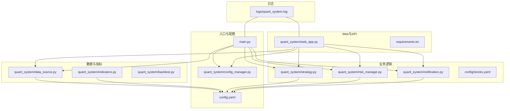
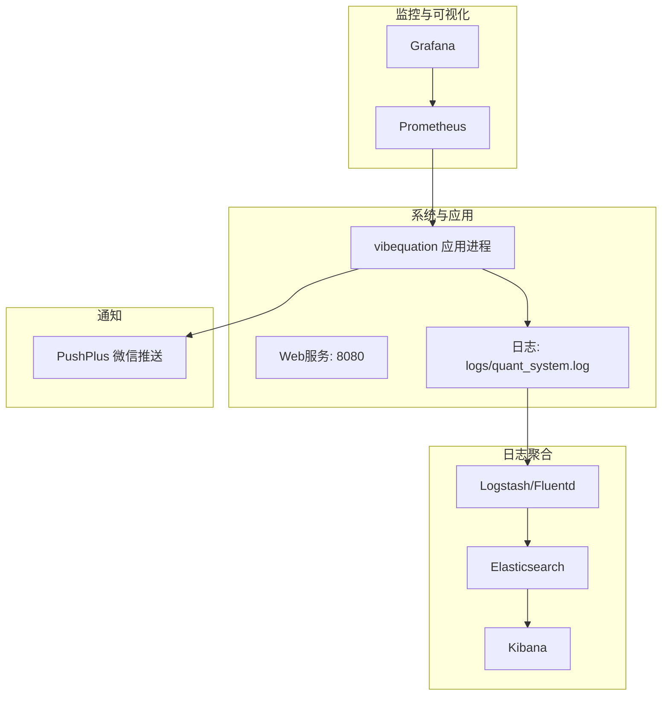
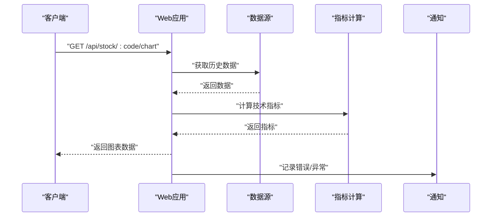
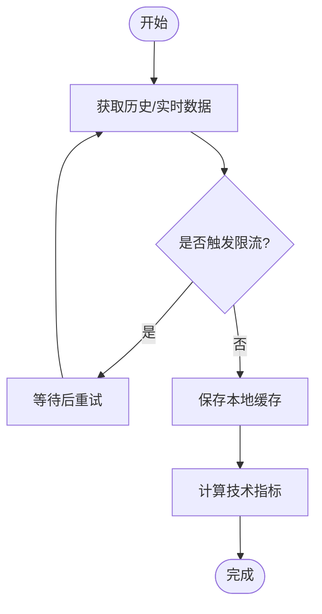
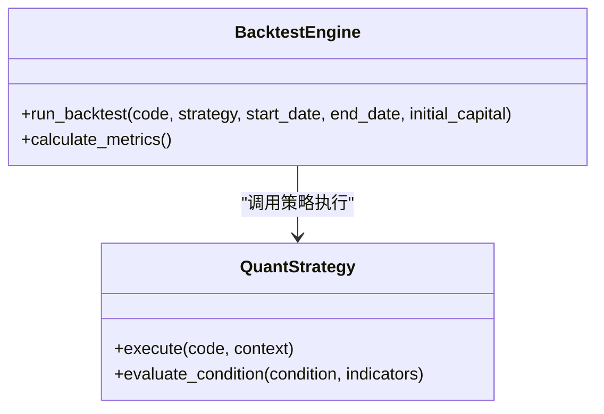
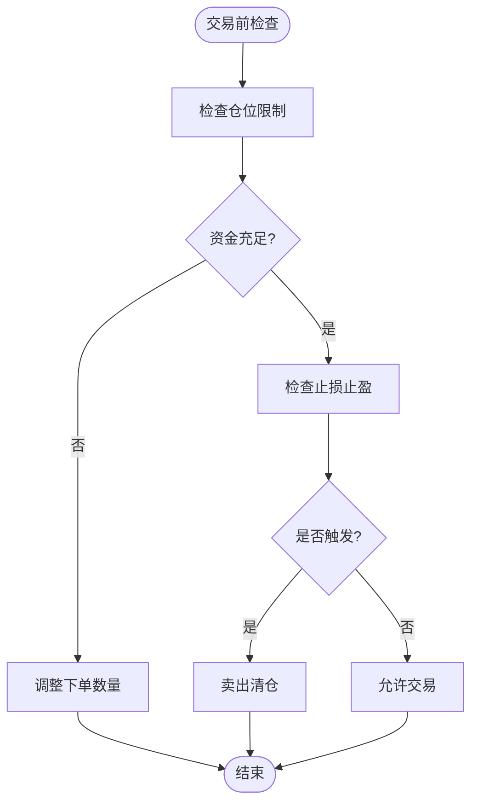
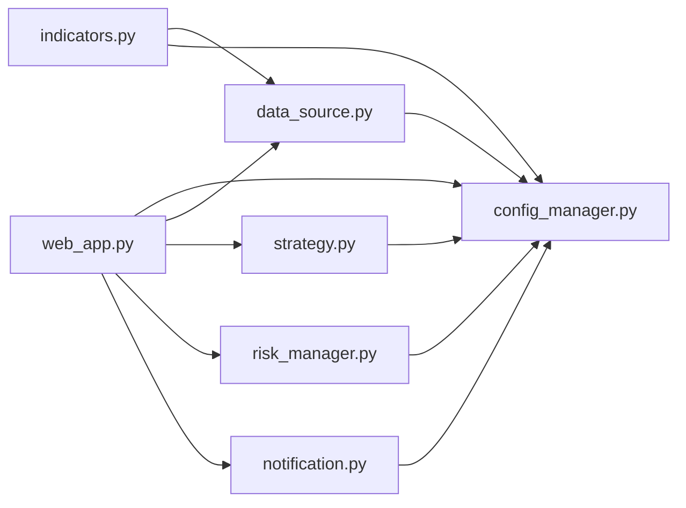

# 监控告警

<cite>
**本文引用的文件**   
- [main.py](file://main.py)
- [config.yaml](file://config.yaml)
- [requirements.txt](file://requirements.txt)
- [quant_system/web_app.py](file://quant_system/web_app.py)
- [quant_system/config_manager.py](file://quant_system/config_manager.py)
- [quant_system/data_source.py](file://quant_system/data_source.py)
- [quant_system/indicators.py](file://quant_system/indicators.py)
- [quant_system/backtest.py](file://quant_system/backtest.py)
- [quant_system/risk_manager.py](file://quant_system/risk_manager.py)
- [quant_system/notification.py](file://quant_system/notification.py)
- [quant_system/strategy.py](file://quant_system/strategy.py)
- [config/stocks.yaml](file://config/stocks.yaml)
- [logs/quant_system.log](file://logs/quant_system.log)
</cite>

## 目录
1. [简介](#简介)
2. [项目结构](#项目结构)
3. [核心组件](#核心组件)
4. [架构总览](#架构总览)
5. [详细组件分析](#详细组件分析)
6. [依赖分析](#依赖分析)
7. [性能考虑](#性能考虑)
8. [故障排查指南](#故障排查指南)
9. [结论](#结论)
10. [附录](#附录)

## 简介
本方案面向vibequation量化交易系统在生产环境的监控与告警，覆盖CPU、内存、磁盘、网络、数据库连接数等关键性能指标；提供Prometheus与Grafana的部署与配置指南及自定义仪表板设计思路；给出告警规则、阈值与通知渠道（邮件、微信、钉钉）的落地方法；结合系统日志与错误追踪，构建ELK（Elasticsearch、Logstash、Kibana）栈实现日志聚合与分析；最后提出故障自愈与运维自动化建议。

## 项目结构
vibequation采用模块化分层设计，主要模块包括：命令行入口与调度、Web服务与API、数据采集与指标计算、策略与回测、风控与通知、配置管理等。系统通过统一配置中心集中管理日志、数据目录、Web服务、风控与AI模型参数等。

**图表来源**
- [main.py:1-365](file://main.py#L1-L365)
- [quant_system/web_app.py:1-1126](file://quant_system/web_app.py#L1-L1126)
- [quant_system/config_manager.py:1-178](file://quant_system/config_manager.py#L1-L178)
- [quant_system/data_source.py:1-423](file://quant_system/data_source.py#L1-L423)
- [quant_system/indicators.py:1-200](file://quant_system/indicators.py#L1-L200)
- [quant_system/backtest.py:1-200](file://quant_system/backtest.py#L1-L200)
- [quant_system/risk_manager.py:1-404](file://quant_system/risk_manager.py#L1-L404)
- [quant_system/notification.py:1-301](file://quant_system/notification.py#L1-L301)
- [config.yaml:1-88](file://config.yaml#L1-L88)
- [config/stocks.yaml:1-71](file://config/stocks.yaml#L1-L71)
- [requirements.txt:1-33](file://requirements.txt#L1-L33)
- [logs/quant_system.log:1-356](file://logs/quant_system.log#L1-L356)

**章节来源**
- [main.py:1-365](file://main.py#L1-L365)
- [config.yaml:1-88](file://config.yaml#L1-L88)
- [quant_system/web_app.py:1-1126](file://quant_system/web_app.py#L1-L1126)
- [quant_system/config_manager.py:1-178](file://quant_system/config_manager.py#L1-L178)
- [quant_system/data_source.py:1-423](file://quant_system/data_source.py#L1-L423)
- [quant_system/indicators.py:1-200](file://quant_system/indicators.py#L1-L200)
- [quant_system/backtest.py:1-200](file://quant_system/backtest.py#L1-L200)
- [quant_system/risk_manager.py:1-404](file://quant_system/risk_manager.py#L1-L404)
- [quant_system/notification.py:1-301](file://quant_system/notification.py#L1-L301)
- [config/stocks.yaml:1-71](file://config/stocks.yaml#L1-L71)
- [requirements.txt:1-33](file://requirements.txt#L1-L33)
- [logs/quant_system.log:1-356](file://logs/quant_system.log#L1-L356)

## 核心组件
- 命令行入口与调度：负责日志初始化、子命令解析与执行，支撑数据更新、策略运行、回测、Web服务等。
- 配置管理：集中管理日志级别、日志文件、数据目录、Web服务、风控与AI模型参数等。
- Web服务与API：提供前端可视化与REST接口，包括股票数据、指标、图表、回测、风控、策略管理等。
- 数据采集与指标：封装Tushare与EasyQuotation数据源，统一历史与实时数据接口，并计算技术指标。
- 策略与回测：内置多策略（RSI、MACD、均线、综合），支持AI决策与回测引擎。
- 风控与通知：风控检查（仓位、止损止盈、资金）、风险报告生成；通知模块对接PushPlus实现微信消息推送。
- 日志：统一日志配置与落盘，便于ELK聚合与分析。

**章节来源**
- [main.py:26-45](file://main.py#L26-L45)
- [quant_system/config_manager.py:12-178](file://quant_system/config_manager.py#L12-L178)
- [quant_system/web_app.py:41-800](file://quant_system/web_app.py#L41-L800)
- [quant_system/data_source.py:24-423](file://quant_system/data_source.py#L24-L423)
- [quant_system/indicators.py:21-200](file://quant_system/indicators.py#L21-L200)
- [quant_system/strategy.py:150-556](file://quant_system/strategy.py#L150-L556)
- [quant_system/backtest.py:66-200](file://quant_system/backtest.py#L66-L200)
- [quant_system/risk_manager.py:47-404](file://quant_system/risk_manager.py#L47-L404)
- [quant_system/notification.py:17-301](file://quant_system/notification.py#L17-L301)
- [config.yaml:82-88](file://config.yaml#L82-L88)

## 架构总览
下图展示生产环境监控与告警的总体架构：Prometheus采集节点指标，Grafana可视化与告警；系统日志接入ELK进行聚合与检索；通知通道通过PushPlus实现微信消息推送。

[此图为概念性架构示意，不直接映射具体源码文件，故不附“图表来源”]

## 详细组件分析

### Web服务与API监控
- 关键指标：HTTP请求QPS、响应时间、错误码分布、并发连接数、路由耗时。
- 监控要点：暴露应用内部指标（如请求计数、错误计数）；利用Grafana仪表板展示API健康度与性能瓶颈。
- 告警规则：请求错误率（5xx）阈值、P95/P99响应时间、路由异常峰值。

**图表来源**
- [quant_system/web_app.py:142-225](file://quant_system/web_app.py#L142-L225)
- [quant_system/data_source.py:300-395](file://quant_system/data_source.py#L300-L395)
- [quant_system/indicators.py:188-200](file://quant_system/indicators.py#L188-L200)
- [quant_system/notification.py:276-297](file://quant_system/notification.py#L276-L297)

**章节来源**
- [quant_system/web_app.py:41-800](file://quant_system/web_app.py#L41-L800)
- [quant_system/data_source.py:300-423](file://quant_system/data_source.py#L300-L423)
- [quant_system/indicators.py:188-200](file://quant_system/indicators.py#L188-L200)
- [quant_system/notification.py:84-301](file://quant_system/notification.py#L84-L301)

### 数据采集与指标计算监控
- 关键指标：数据源调用成功率、Tushare限流退避、指标计算耗时、缓存命中率。
- 监控要点：Tushare速率限制与重试、本地缓存命中与过期策略、指标计算异常告警。
- 告警规则：数据源失败率、计算超时、缓存未命中率过高。

**图表来源**
- [quant_system/data_source.py:56-62](file://quant_system/data_source.py#L56-L62)
- [quant_system/data_source.py:90-135](file://quant_system/data_source.py#L90-L135)
- [quant_system/indicators.py:37-80](file://quant_system/indicators.py#L37-L80)

**章节来源**
- [quant_system/data_source.py:43-221](file://quant_system/data_source.py#L43-L221)
- [quant_system/indicators.py:21-200](file://quant_system/indicators.py#L21-L200)

### 策略与回测监控
- 关键指标：策略执行耗时、回测收益指标（总收益、年化、最大回撤、夏普比率、胜率、盈亏比）、交易笔数与滑点成本。
- 监控要点：回测引擎稳定性、策略信号触发频度、风控拦截比例。
- 告警规则：回测异常（收益为负、最大回撤超阈）、策略信号异常波动。

**图表来源**
- [quant_system/backtest.py:66-200](file://quant_system/backtest.py#L66-L200)
- [quant_system/strategy.py:229-300](file://quant_system/strategy.py#L229-L300)

**章节来源**
- [quant_system/backtest.py:66-200](file://quant_system/backtest.py#L66-L200)
- [quant_system/strategy.py:150-316](file://quant_system/strategy.py#L150-L316)

### 风控与通知监控
- 关键指标：总资金、可用资金、持仓市值、仓位比例、集中度、浮动盈亏、风控拦截数、止损触发数。
- 监控要点：风控阈值执行情况、资金变动趋势、风险等级评估。
- 告警规则：总仓位超阈、单股超阈、止损触发、资金不足自动调整。

**图表来源**
- [quant_system/risk_manager.py:89-240](file://quant_system/risk_manager.py#L89-L240)

**章节来源**
- [quant_system/risk_manager.py:47-404](file://quant_system/risk_manager.py#L47-L404)
- [quant_system/notification.py:84-301](file://quant_system/notification.py#L84-L301)

## 依赖分析
- 外部依赖：tushare、easyquotation、flask、plotly、requests、beautifulsoup4、lxml、pyyaml、apscheduler、pytz等。
- 内部模块耦合：web_app依赖config_manager、data_source、strategy、risk_manager、notification；data_source依赖config_manager与stock_manager；indicators依赖data_source与config_manager。

**图表来源**
- [quant_system/web_app.py:17-26](file://quant_system/web_app.py#L17-L26)
- [quant_system/data_source.py:17-18](file://quant_system/data_source.py#L17-L18)
- [quant_system/indicators.py:14-16](file://quant_system/indicators.py#L14-L16)
- [quant_system/strategy.py:19-22](file://quant_system/strategy.py#L19-L22)
- [quant_system/risk_manager.py:17-18](file://quant_system/risk_manager.py#L17-L18)
- [quant_system/notification.py:12](file://quant_system/notification.py#L12)

**章节来源**
- [requirements.txt:1-33](file://requirements.txt#L1-L33)
- [quant_system/web_app.py:17-26](file://quant_system/web_app.py#L17-L26)
- [quant_system/data_source.py:17-18](file://quant_system/data_source.py#L17-L18)
- [quant_system/indicators.py:14-16](file://quant_system/indicators.py#L14-L16)
- [quant_system/strategy.py:19-22](file://quant_system/strategy.py#L19-L22)
- [quant_system/risk_manager.py:17-18](file://quant_system/risk_manager.py#L17-L18)
- [quant_system/notification.py:12](file://quant_system/notification.py#L12)

## 性能考虑
- I/O与缓存：优先读取本地缓存，减少外部API调用；合理设置缓存有效期与增量更新策略。
- 计算优化：指标计算尽量向量化，避免逐行循环；批量写入与压缩存储。
- 并发与限流：对外部API实施速率限制与退避重试；Web服务使用生产级WSGI服务器。
- 监控开销：指标采集与日志落盘应异步化，避免阻塞主线程。

[本节为通用性能指导，无需“章节来源”]

## 故障排查指南
- 日志定位：通过统一日志配置与落盘，结合Grafana日志面板快速定位错误堆栈与异常。
- 常见问题：
  - Tushare Token无效：检查配置文件与网络连通性，必要时更换Token。
  - 技术指标计算异常：检查数据完整性与列名标准化，确认缓存路径与权限。
  - Web路由报错：根据错误码与堆栈信息，核对API参数与数据源可用性。
- 通知验证：通过通知模块发送测试消息，验证PushPlus通道可用性。

**章节来源**
- [config.yaml:82-88](file://config.yaml#L82-L88)
- [logs/quant_system.log:1-356](file://logs/quant_system.log#L1-L356)
- [quant_system/notification.py:17-82](file://quant_system/notification.py#L17-L82)

## 结论
通过Prometheus/Grafana实现系统与应用指标的全链路监控，结合ELK实现日志聚合与检索，配合PushPlus通知通道，形成完整的生产环境监控与告警体系。同时，依托策略、回测、风控与通知模块的可观测性设计，可进一步提升系统的稳定性与可维护性。

[本节为总结性内容，无需“章节来源”]

## 附录

### Prometheus与Grafana部署与配置指南
- 部署方式：使用容器编排（如Docker/Kubernetes）部署Prometheus与Grafana，挂载持久化卷与配置目录。
- 指标暴露：
  - 应用侧：在Web服务中增加指标收集（如prometheus-client），暴露HTTP端点供Prometheus抓取。
  - 系统侧：使用node_exporter采集主机指标（CPU、内存、磁盘、网络）。
  - 数据库侧：如使用PostgreSQL，使用postgres_exporter采集连接数、查询性能等。
- Grafana仪表板：
  - 新建数据源为Prometheus。
  - 导入或自定义仪表板，涵盖应用QPS/响应时间、错误率、资源使用、业务指标（回测收益、风控拦截）。
- 告警规则：
  - 请求错误率（5xx）> 1% 持续5分钟。
  - P95响应时间 > 阈值（按业务场景设定）。
  - CPU使用率 > 80% 持续10分钟。
  - 内存使用率 > 85% 持续10分钟。
  - 磁盘使用率 > 90% 持续10分钟。
  - 数据库连接数 > 阈值（根据实例规格设定）。
- 通知渠道：
  - 邮件：SMTP配置。
  - 微信/钉钉：通过企业微信或钉钉机器人Webhook集成（与PushPlus并行或替换）。

[本节为通用部署与配置指导，无需“章节来源”]

### ELK日志聚合与分析
- 架构：Filebeat/Fluentd采集日志，Logstash进行解析与过滤，Elasticsearch存储，Kibana可视化。
- 关键步骤：
  - 在应用中启用结构化日志（JSON格式），包含时间戳、级别、模块、消息体。
  - 配置Logstash Pipeline解析字段，建立索引模板。
  - 在Kibana中创建仪表板与告警（如错误率阈值、特定关键词搜索）。
- 使用建议：
  - 对高频错误进行去重与聚合统计。
  - 建立错误追踪流程：发现—定位—修复—验证—复盘。

[本节为通用ELK指导，无需“章节来源”]

### 故障自愈与运维自动化
- 自愈机制：
  - 服务重启：当进程异常退出或长时间无响应时，自动拉起（使用Supervisor/Docker健康检查）。
  - 数据源降级：当外部API不可用时，切换到本地缓存或降级策略。
  - 风控拦截：资金不足或超阈时自动调整下单数量或触发清仓。
- 运维自动化：
  - 定时任务：通过APScheduler或Cron定期执行数据更新、回测、风控报告。
  - 告警联动：告警触发后自动执行预设脚本（如扩容、限流、切换备用数据源）。
  - 配置热更新：通过配置中心动态下发参数（如风控阈值、通知开关）。

[本节为通用运维建议，无需“章节来源”]