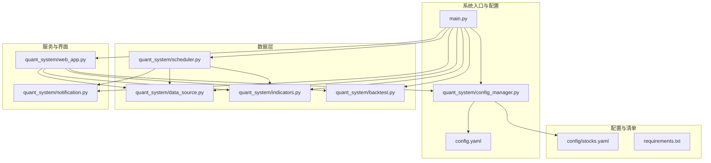
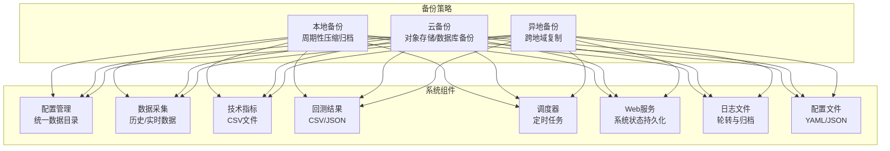
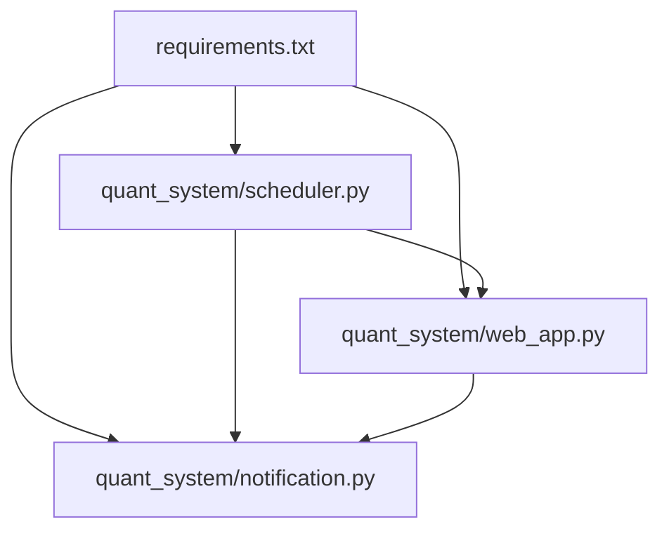

# 备份恢复

<cite>
**本文引用的文件**   
- [main.py](file://main.py)
- [config.yaml](file://config.yaml)
- [config_manager.py](file://quant_system/config_manager.py)
- [data_source.py](file://quant_system/data_source.py)
- [indicators.py](file://quant_system/indicators.py)
- [backtest.py](file://quant_system/backtest.py)
- [scheduler.py](file://quant_system/scheduler.py)
- [web_app.py](file://quant_system/web_app.py)
- [notification.py](file://quant_system/notification.py)
- [stocks.yaml](file://config/stocks.yaml)
- [requirements.txt](file://requirements.txt)
</cite>

## 目录
1. [引言](#引言)
2. [项目结构](#项目结构)
3. [核心组件](#核心组件)
4. [架构总览](#架构总览)
5. [详细组件分析](#详细组件分析)
6. [依赖分析](#依赖分析)
7. [性能考量](#性能考量)
8. [故障排查指南](#故障排查指南)
9. [结论](#结论)
10. [附录](#附录)

## 引言
本文件面向vibequation量化交易系统，制定一套完整的备份与恢复策略文档。内容覆盖历史数据、实时数据、配置文件、日志文件等的备份方案与执行方式；明确本地、云、异地三类存储策略的选型与配置；提供自动化备份脚本与定时任务设置思路；给出数据恢复流程与测试验证方法；包含灾难恢复计划与业务连续性保障措施；设定备份完整性检查与恢复时间目标（RTO/RPO）；并说明备份数据的安全保护与访问控制。

## 项目结构
系统采用模块化设计，围绕“配置管理、数据采集、指标计算、回测分析、Web服务、调度器、通知”等模块组织。数据存储路径集中于配置中心，便于统一备份与恢复。

**图表来源**
- [main.py](file://main.py)
- [config.yaml](file://config.yaml)
- [config_manager.py](file://quant_system/config_manager.py)
- [data_source.py](file://quant_system/data_source.py)
- [indicators.py](file://quant_system/indicators.py)
- [backtest.py](file://quant_system/backtest.py)
- [scheduler.py](file://quant_system/scheduler.py)
- [web_app.py](file://quant_system/web_app.py)
- [notification.py](file://quant_system/notification.py)
- [stocks.yaml](file://config/stocks.yaml)
- [requirements.txt](file://requirements.txt)

**章节来源**
- [main.py](file://main.py)
- [config.yaml](file://config.yaml)
- [config_manager.py](file://quant_system/config_manager.py)

## 核心组件
- 配置管理：集中读取与校验配置，确保数据目录存在，提供统一的路径与参数访问。
- 数据采集：统一历史与实时数据源，负责数据落盘与增量更新。
- 技术指标：计算并持久化指标文件，支持按周期与频率存储。
- 回测引擎：生成回测结果与相关中间数据，便于归档与复现。
- 调度器：基于APScheduler的定时任务，自动执行数据更新、指标计算、AI分析与通知。
- Web服务：提供系统状态持久化接口，支持手动触发与配置管理。
- 通知模块：通过PushPlus推送策略信号、回测报告、系统通知等。

**章节来源**
- [config_manager.py](file://quant_system/config_manager.py)
- [data_source.py](file://quant_system/data_source.py)
- [indicators.py](file://quant_system/indicators.py)
- [backtest.py](file://quant_system/backtest.py)
- [scheduler.py](file://quant_system/scheduler.py)
- [web_app.py](file://quant_system/web_app.py)
- [notification.py](file://quant_system/notification.py)

## 架构总览
下图展示备份与恢复策略在系统中的落地位置与交互关系。

**图表来源**
- [config_manager.py](file://quant_system/config_manager.py)
- [data_source.py](file://quant_system/data_source.py)
- [indicators.py](file://quant_system/indicators.py)
- [backtest.py](file://quant_system/backtest.py)
- [scheduler.py](file://quant_system/scheduler.py)
- [web_app.py](file://quant_system/web_app.py)
- [config.yaml](file://config.yaml)

## 详细组件分析

### 数据备份方案
- 历史数据
  - 存储位置：由配置中心统一管理，路径来自配置项。
  - 备份策略：按日/周/月生成压缩包，保留最近N个版本；对大文件采用分片压缩。
  - 关键路径参考：[config.yaml](file://config.yaml)，[config_manager.py](file://quant_system/config_manager.py)，[data_source.py](file://quant_system/data_source.py)。
- 实时数据
  - 存储位置：实时数据目录由配置中心提供。
  - 备份策略：按小时/天归档，保留滚动窗口内的最新数据；对高频写入场景建议合并写入。
  - 关键路径参考：[config.yaml](file://config.yaml)，[config_manager.py](file://quant_system/config_manager.py)，[data_source.py](file://quant_system/data_source.py)。
- 技术指标
  - 存储位置：指标目录由配置中心提供。
  - 备份策略：按周期（日/周/月）与时间框架分别归档；与历史数据同盘或同卷备份。
  - 关键路径参考：[config.yaml](file://config.yaml)，[config_manager.py](file://quant_system/config_manager.py)，[indicators.py](file://quant_system/indicators.py)。
- 回测结果
  - 存储位置：回测结果目录由配置中心提供。
  - 备份策略：回测报告与交易明细CSV/JSON一并备份；保留历史回测快照以便复盘。
  - 关键路径参考：[config.yaml](file://config.yaml)，[config_manager.py](file://quant_system/config_manager.py)，[backtest.py](file://quant_system/backtest.py)。
- 配置文件
  - 存储位置：YAML配置与股票清单。
  - 备份策略：版本化管理，变更记录与差异对比；与系统配置同步备份。
  - 关键路径参考：[config.yaml](file://config.yaml)，[stocks.yaml](file://config/stocks.yaml)。
- 日志文件
  - 存储位置：日志文件路径由配置中心提供。
  - 备份策略：按大小轮转与时间归档，保留N个历史副本；压缩后归档。
  - 关键路径参考：[config.yaml](file://config.yaml)，[config_manager.py](file://quant_system/config_manager.py)，[main.py](file://main.py)。

**章节来源**
- [config.yaml](file://config.yaml)
- [config_manager.py](file://quant_system/config_manager.py)
- [data_source.py](file://quant_system/data_source.py)
- [indicators.py](file://quant_system/indicators.py)
- [backtest.py](file://quant_system/backtest.py)
- [stocks.yaml](file://config/stocks.yaml)
- [main.py](file://main.py)

### 备份存储策略
- 本地备份
  - 适用：快速恢复、低延迟验证；适合小规模数据与短期保留。
  - 建议：使用磁盘阵列或网络存储，定期校验完整性。
- 云备份
  - 适用：弹性扩展、高可用、跨区域容灾；适合大规模数据与长期归档。
  - 建议：对象存储（冷/温/热层）与数据库备份结合；启用版本控制与生命周期策略。
- 异地备份
  - 适用：应对区域性灾难；满足监管与合规要求。
  - 建议：跨机房/跨城市复制，建立复制监控与切换演练机制。

[本节为通用策略说明，无需特定文件引用]

### 自动化备份脚本与定时任务
- 备份脚本建议
  - 任务编排：按数据类型与容量选择不同策略（全量/增量），设定压缩与加密。
  - 触发方式：Cron或APScheduler触发；失败重试与告警。
  - 校验机制：生成校验和（哈希）并与索引文件一起归档。
- 定时任务设置
  - 系统级：Linux Cron或Windows任务计划程序，按日/周/月执行。
  - 应用内：利用调度器模块（如APScheduler）注册备份任务，实现与业务解耦。
  - 关键路径参考：[scheduler.py](file://quant_system/scheduler.py)，[requirements.txt](file://requirements.txt)。

**章节来源**
- [scheduler.py](file://quant_system/scheduler.py)
- [requirements.txt](file://requirements.txt)

### 数据恢复流程与测试验证
- 恢复流程
  - 识别故障类型：单文件损坏、目录丢失、全盘故障。
  - 选择恢复源：优先本地/云，再异地；核对版本与时间戳。
  - 执行恢复：按目录结构重建，逐项校验完整性。
  - 验证功能：运行数据完整性检查与关键功能回归测试。
- 测试验证
  - 完整性校验：比对校验和与文件元数据。
  - 功能回归：执行典型命令（如更新数据、回测、生成报告）。
  - RTO/RPO验证：模拟故障与恢复，测量恢复时间与数据时效性。
- 关键路径参考：[main.py](file://main.py)，[config_manager.py](file://quant_system/config_manager.py)，[data_source.py](file://quant_system/data_source.py)，[indicators.py](file://quant_system/indicators.py)，[backtest.py](file://quant_system/backtest.py)。

**章节来源**
- [main.py](file://main.py)
- [config_manager.py](file://quant_system/config_manager.py)
- [data_source.py](file://quant_system/data_source.py)
- [indicators.py](file://quant_system/indicators.py)
- [backtest.py](file://quant_system/backtest.py)

### 灾难恢复计划与业务连续性
- DRP目标
  - RTO：核心功能（数据更新、指标计算、Web服务）恢复时间≤X小时。
  - RPO：数据丢失窗口≤Y小时/天。
- 组织与职责
  - 指挥小组：明确角色与权限；建立沟通渠道。
  - 应急响应：分级处置、快速隔离、最小化影响。
- 切换与演练
  - 切换预案：双活或多活架构；自动化切换与人工接管结合。
  - 定期演练：模拟真实场景，验证流程有效性与人员熟练度。
- 关键路径参考：[scheduler.py](file://quant_system/scheduler.py)，[web_app.py](file://quant_system/web_app.py)，[notification.py](file://quant_system/notification.py)。

**章节来源**
- [scheduler.py](file://quant_system/scheduler.py)
- [web_app.py](file://quant_system/web_app.py)
- [notification.py](file://quant_system/notification.py)

### 备份完整性检查与RTO/RPO设定
- 完整性检查
  - 文件级：校验和（SHA-256/MD5）与索引一致性。
  - 结构级：关键表/CSV字段完整性与数据类型校验。
  - 功能级：抽样查询与业务逻辑验证。
- RTO/RPO设定
  - RTO：根据SLA与业务影响确定；优先保障核心模块。
  - RPO：结合数据更新频率与容忍度；对高频数据采用更短窗口。
- 关键路径参考：[config.yaml](file://config.yaml)，[config_manager.py](file://quant_system/config_manager.py)。

**章节来源**
- [config.yaml](file://config.yaml)
- [config_manager.py](file://quant_system/config_manager.py)

### 备份数据安全与访问控制
- 数据保护
  - 传输加密：HTTPS/FTPS；对象存储传输加密。
  - 存储加密：静态加密（AES-256）；密钥管理（KMS/密钥环）。
  - 压缩与脱敏：对敏感字段脱敏处理；仅备份必要信息。
- 访问控制
  - 最小权限：仅授权人员可访问备份介质与密钥。
  - 审计日志：记录访问与修改行为；定期审计。
  - 网络隔离：专用VPC/子网；防火墙策略与白名单。
- 关键路径参考：[config.yaml](file://config.yaml)，[notification.py](file://quant_system/notification.py)。

**章节来源**
- [config.yaml](file://config.yaml)
- [notification.py](file://quant_system/notification.py)

## 依赖分析
- 组件耦合
  - 配置管理贯穿各模块，提供统一路径与参数；数据采集依赖配置中心与股票清单。
  - 调度器独立于业务模块，通过API触发数据更新与分析；Web服务依赖调度器与通知模块。
- 外部依赖
  - APscheduler用于定时任务；Flask提供Web服务；PushPlus用于消息推送。
- 关键路径参考：[requirements.txt](file://requirements.txt)，[scheduler.py](file://quant_system/scheduler.py)，[web_app.py](file://quant_system/web_app.py)，[notification.py](file://quant_system/notification.py)。

**图表来源**
- [requirements.txt](file://requirements.txt)
- [scheduler.py](file://quant_system/scheduler.py)
- [web_app.py](file://quant_system/web_app.py)
- [notification.py](file://quant_system/notification.py)

**章节来源**
- [requirements.txt](file://requirements.txt)
- [scheduler.py](file://quant_system/scheduler.py)
- [web_app.py](file://quant_system/web_app.py)
- [notification.py](file://quant_system/notification.py)

## 性能考量
- 备份性能
  - 增量备份与并行压缩；分时段执行，避免与业务高峰冲突。
- 恢复性能
  - 多级缓存与预热；热点数据优先恢复；分批加载与索引重建。
- 监控与告警
  - 备份成功率、耗时、失败原因；恢复时间与数据一致性验证。

[本节为通用指导，无需特定文件引用]

## 故障排查指南
- 常见问题
  - 配置文件缺失：检查配置中心与路径；确认目录创建逻辑。
  - 数据目录不存在：确认配置加载与目录创建顺序。
  - 定时任务未执行：检查调度器状态与Cron表达式。
  - 通知发送失败：检查Token与网络连通性。
- 关键路径参考：[config_manager.py](file://quant_system/config_manager.py)，[scheduler.py](file://quant_system/scheduler.py)，[notification.py](file://quant_system/notification.py)。

**章节来源**
- [config_manager.py](file://quant_system/config_manager.py)
- [scheduler.py](file://quant_system/scheduler.py)
- [notification.py](file://quant_system/notification.py)

## 结论
通过统一配置管理、模块化数据流与可插拔的调度器，vibequation具备良好的备份与恢复基础。建议结合本地、云与异地三层备份策略，配合自动化脚本与定时任务，建立完善的完整性校验与RTO/RPO目标，并强化安全与访问控制，确保在各类故障场景下实现快速恢复与业务连续性。

[本节为总结，无需特定文件引用]

## 附录
- 关键路径参考汇总
  - [config.yaml](file://config.yaml)
  - [config_manager.py](file://quant_system/config_manager.py)
  - [data_source.py](file://quant_system/data_source.py)
  - [indicators.py](file://quant_system/indicators.py)
  - [backtest.py](file://quant_system/backtest.py)
  - [scheduler.py](file://quant_system/scheduler.py)
  - [web_app.py](file://quant_system/web_app.py)
  - [notification.py](file://quant_system/notification.py)
  - [stocks.yaml](file://config/stocks.yaml)
  - [requirements.txt](file://requirements.txt)

[本节为补充说明，无需特定文件引用]