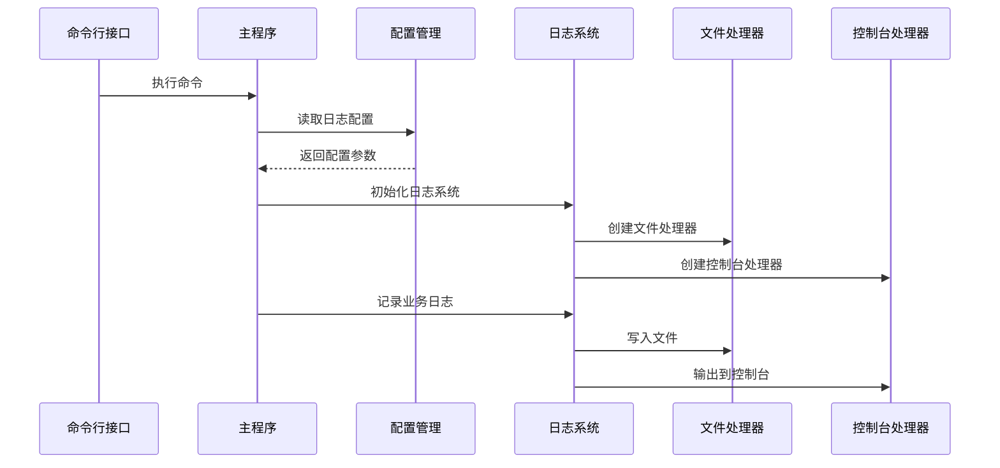
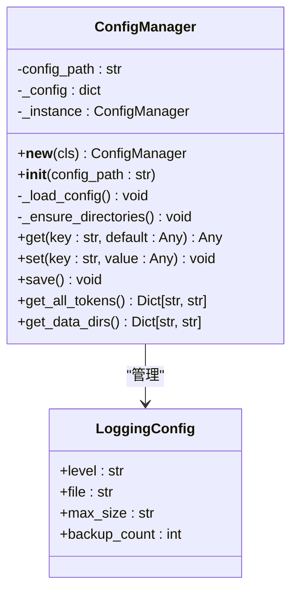
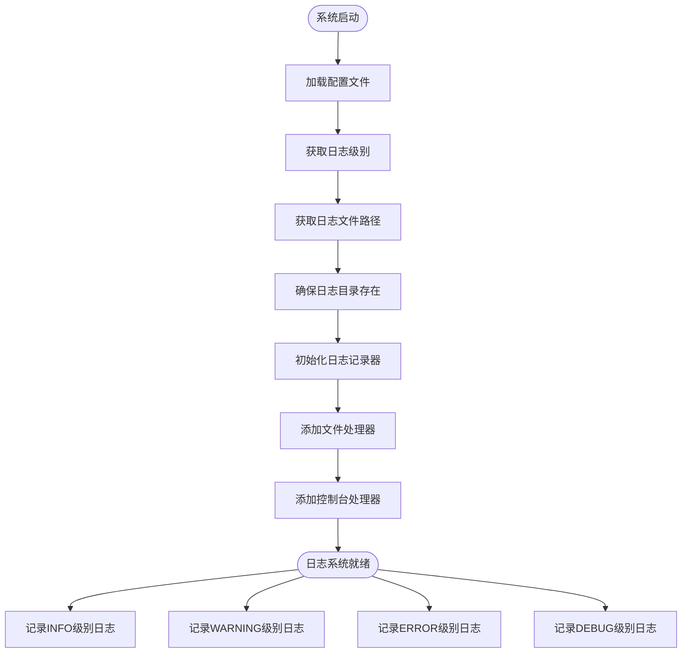
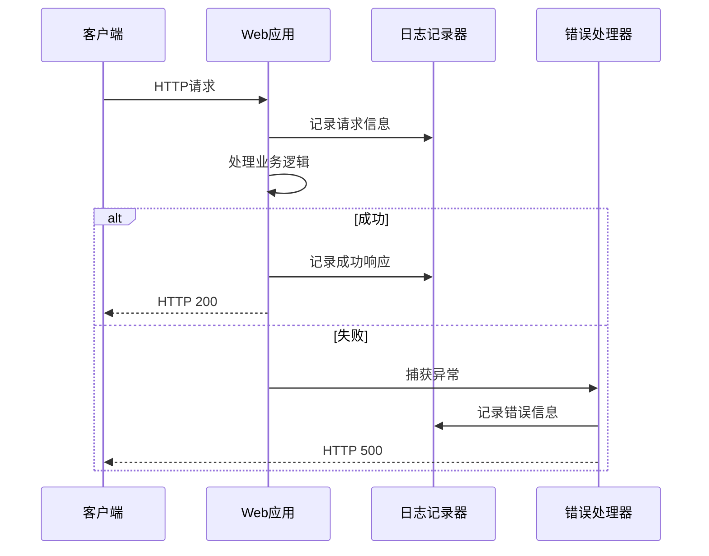
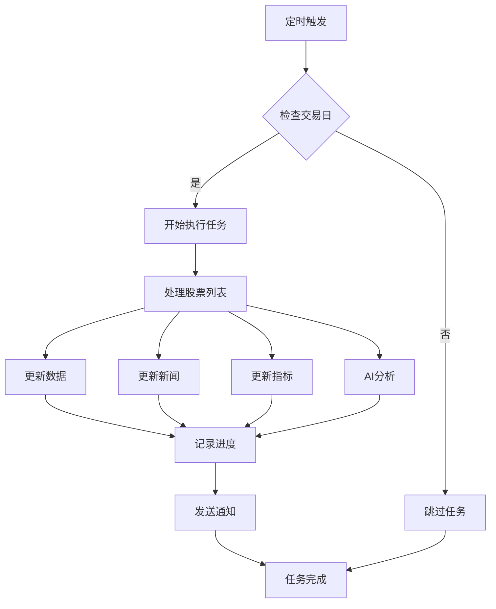
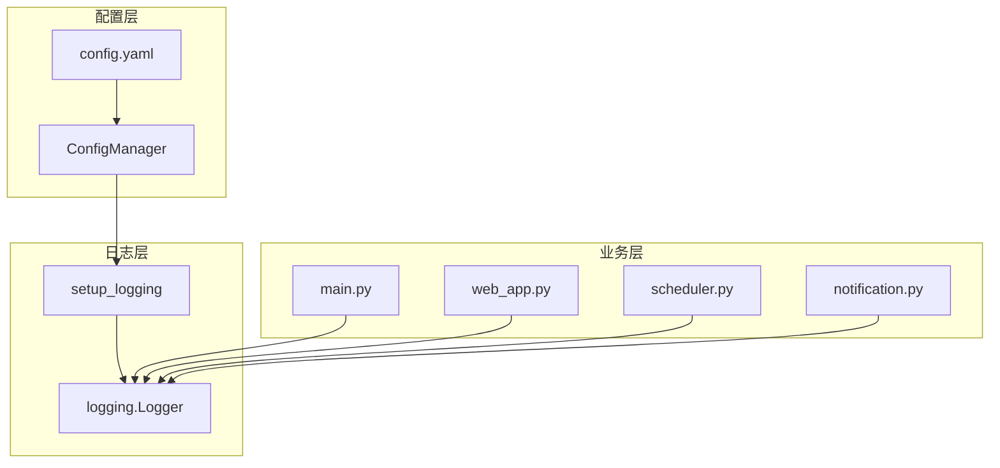
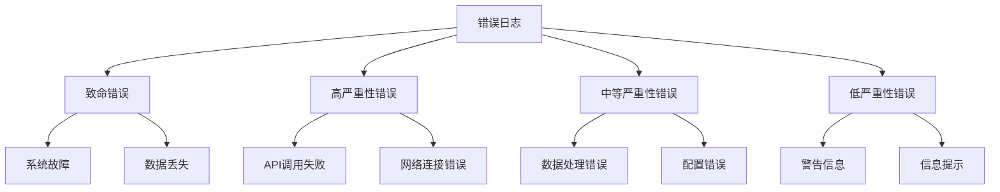
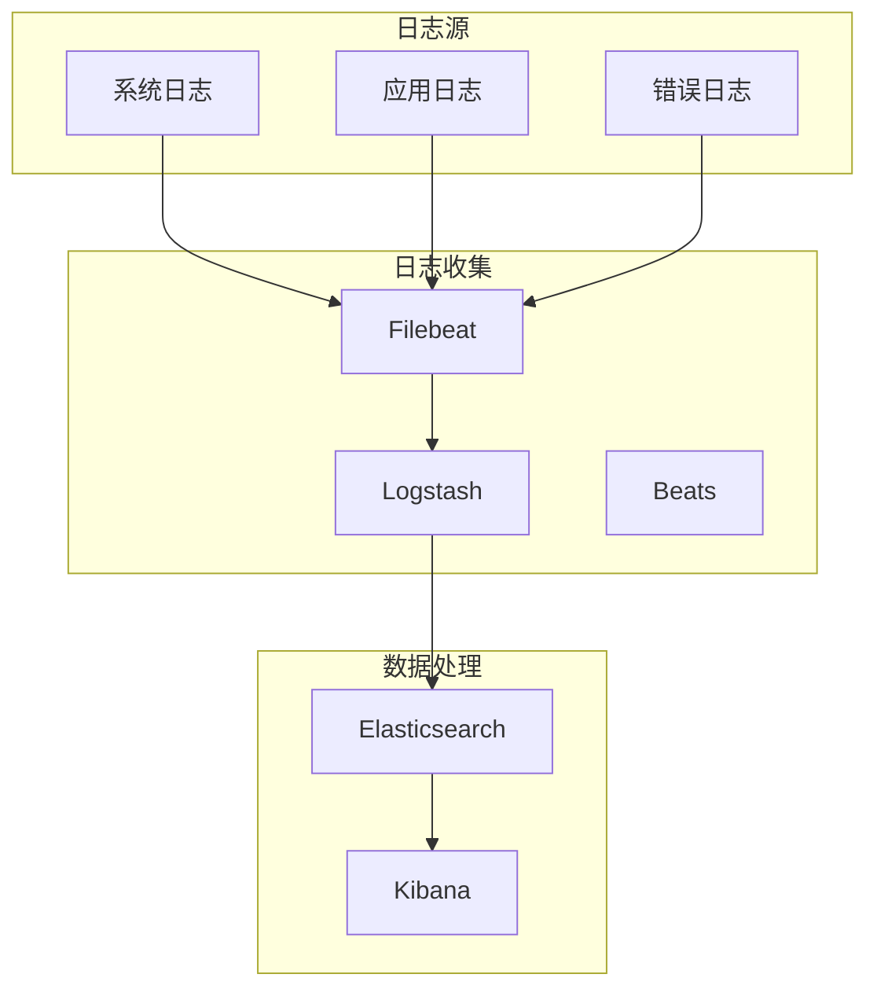
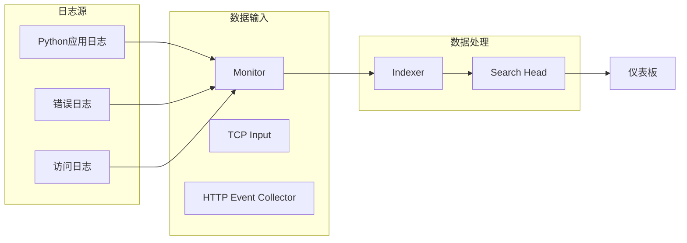

# 日志管理

<cite>
**本文引用的文件**
- [config.yaml](file://config.yaml)
- [main.py](file://main.py)
- [quant_system/config_manager.py](file://quant_system/config_manager.py)
- [quant_system/web_app.py](file://quant_system/web_app.py)
- [quant_system/notification.py](file://quant_system/notification.py)
- [quant_system/scheduler.py](file://quant_system/scheduler.py)
- [run_scheduler.py](file://run_scheduler.py)
</cite>

## 目录
1. [简介](#简介)
2. [项目结构](#项目结构)
3. [核心组件](#核心组件)
4. [架构概览](#架构概览)
5. [详细组件分析](#详细组件分析)
6. [依赖关系分析](#依赖关系分析)
7. [性能考虑](#性能考虑)
8. [故障排除指南](#故障排除指南)
9. [结论](#结论)
10. [附录](#附录)

## 简介

vibequation量化交易系统采用Python构建，集成了实时数据采集、技术分析、AI决策和Web可视化功能。系统通过结构化的日志管理机制确保交易过程的可追踪性和可审计性。本文档详细说明了系统的日志配置参数、轮转策略、集中化收集方案以及分析工具的使用方法。

## 项目结构

系统采用模块化设计，主要包含以下与日志管理相关的组件：

```mermaid
graph TB
subgraph "日志管理系统"
Config[配置管理<br/>config.yaml]
Logger[日志配置<br/>setup_logging()]
Handler[日志处理器<br/>FileHandler/StreamHandler]
Rotator[日志轮转<br/>基于文件大小]
Storage[日志存储<br/>./logs/]
end
subgraph "业务模块"
Main[主程序<br/>main.py]
Web[Web服务<br/>web_app.py]
Scheduler[定时调度<br/>scheduler.py]
Notify[通知系统<br/>notification.py]
end
Config --> Logger
Logger --> Handler
Handler --> Rotator
Rotator --> Storage
Main --> Logger
Web --> Logger
Scheduler --> Logger
Notify --> Logger
```

**图表来源**
- [config.yaml:82-88](file://config.yaml#L82-L88)
- [main.py:26-42](file://main.py#L26-L42)
- [quant_system/config_manager.py:39-54](file://quant_system/config_manager.py#L39-L54)

**章节来源**
- [config.yaml:1-88](file://config.yaml#L1-L88)
- [main.py:1-365](file://main.py#L1-L365)

## 核心组件

### 日志配置参数

系统通过配置文件统一管理日志参数，包括：

| 参数名称 | 类型 | 默认值 | 描述 |
|---------|------|--------|------|
| logging.level | 字符串 | "INFO" | 日志级别：DEBUG/INFO/WARNING/ERROR |
| logging.file | 字符串 | "./logs/quant_system.log" | 日志文件路径 |
| logging.max_size | 字符串 | "10MB" | 单个日志文件最大大小 |
| logging.backup_count | 整数 | 5 | 保留的历史日志文件数量 |

### 日志记录器初始化

系统采用双重日志输出机制：
- 文件日志：持久化存储，便于后续分析
- 控制台日志：实时监控，便于开发调试

**章节来源**
- [config.yaml:82-88](file://config.yaml#L82-L88)
- [main.py:26-42](file://main.py#L26-L42)
- [quant_system/config_manager.py:39-54](file://quant_system/config_manager.py#L39-L54)

## 架构概览

系统日志架构采用分层设计，确保不同组件的日志需求得到满足：



**图表来源**
- [main.py:26-42](file://main.py#L26-L42)
- [quant_system/config_manager.py:28-38](file://quant_system/config_manager.py#L28-L38)

## 详细组件分析

### 配置管理器

配置管理器负责统一管理所有配置信息，包括日志配置：



**图表来源**
- [quant_system/config_manager.py:12-100](file://quant_system/config_manager.py#L12-L100)
- [config.yaml:82-88](file://config.yaml#L82-L88)

### 日志系统实现

系统采用Python标准库logging模块，实现了基础的日志记录功能：



**图表来源**
- [main.py:26-42](file://main.py#L26-L42)
- [quant_system/config_manager.py:28-38](file://quant_system/config_manager.py#L28-L38)

### 业务模块日志记录

各业务模块通过统一的日志接口记录操作状态：

| 模块 | 关键日志事件 | 日志级别 | 触发条件 |
|------|-------------|----------|----------|
| 数据更新 | 开始/完成数据更新 | INFO | 命令执行 |
| 技术指标 | 开始/完成指标计算 | INFO | 命令执行 |
| 新闻采集 | 开始/完成新闻采集 | INFO | 命令执行 |
| 特征提取 | 开始/完成特征分析 | INFO | 命令执行 |
| 策略运行 | 开始/完成策略执行 | INFO | 命令执行 |
| 回测分析 | 开始/完成回测 | INFO | 命令执行 |
| 错误处理 | 异常/错误信息 | ERROR | 异常发生 |
| 警告提示 | 警告信息 | WARNING | 异常情况 |

**章节来源**
- [main.py:48-174](file://main.py#L48-L174)
- [quant_system/web_app.py:79-581](file://quant_system/web_app.py#L79-L581)

### Web服务日志

Web服务模块记录API请求和响应信息：



**图表来源**
- [quant_system/web_app.py:79-581](file://quant_system/web_app.py#L79-L581)

**章节来源**
- [quant_system/web_app.py:1-800](file://quant_system/web_app.py#L1-L800)

### 定时调度日志

定时调度器记录自动化任务的执行状态：



**图表来源**
- [quant_system/scheduler.py:95-162](file://quant_system/scheduler.py#L95-L162)

**章节来源**
- [quant_system/scheduler.py:1-307](file://quant_system/scheduler.py#L1-L307)

## 依赖关系分析

系统日志管理的依赖关系如下：



**图表来源**
- [config.yaml:82-88](file://config.yaml#L82-L88)
- [main.py:26-42](file://main.py#L26-L42)
- [quant_system/config_manager.py:12-26](file://quant_system/config_manager.py#L12-L26)

**章节来源**
- [config.yaml:1-88](file://config.yaml#L1-L88)
- [main.py:14-24](file://main.py#L14-L24)

## 性能考虑

### 日志性能优化

1. **异步日志写入**：当前实现使用同步文件写入，建议在高并发场景下考虑异步日志处理器
2. **日志级别过滤**：生产环境建议使用INFO级别，避免DEBUG级别的高频日志
3. **缓冲机制**：合理设置日志缓冲，平衡性能和可靠性
4. **磁盘I/O优化**：定期清理旧日志文件，避免磁盘空间不足

### 内存使用控制

- 日志文件大小限制：当前配置为10MB，可根据实际需求调整
- 历史文件数量：保留5个历史文件，平衡存储空间和历史追溯需求
- 日志轮转策略：基于文件大小的轮转机制，确保单个文件不会过大

## 故障排除指南

### 常见日志问题

| 问题类型 | 症状 | 解决方案 |
|----------|------|----------|
| 日志文件权限 | 无法写入日志文件 | 检查logs目录权限，确保应用程序有写入权限 |
| 磁盘空间不足 | 日志轮转失败 | 清理旧日志文件，增加磁盘空间 |
| 配置文件错误 | 日志系统初始化失败 | 检查config.yaml格式，确保配置项正确 |
| 编码问题 | 中文字符显示异常 | 确保文件编码为UTF-8，设置正确的编码参数 |

### 错误日志分类

系统按严重程度对错误进行分类：



**图表来源**
- [main.py:144-146](file://main.py#L144-L146)
- [quant_system/web_app.py:79-81](file://quant_system/web_app.py#L79-L81)

### 日志分析工具集成

#### ELK Stack配置



#### Splunk配置



**章节来源**
- [quant_system/notification.py:17-82](file://quant_system/notification.py#L17-L82)

## 结论

vibequation量化交易系统的日志管理方案提供了完整的日志记录、存储和分析能力。通过统一的配置管理和标准化的日志格式，系统能够有效支持交易过程的监控、故障排查和合规审计。建议在生产环境中根据实际需求调整日志级别和轮转策略，并考虑引入更高级的日志分析工具以提升运维效率。

## 附录

### 日志查询语法示例

#### 基础查询
- 查找所有ERROR级别日志：`level:ERROR`
- 查找特定模块日志：`module:web_app`
- 查找特定时间段日志：`timestamp:[2024-01-01 TO 2024-12-31]`

#### 高级查询
- 查找包含特定关键词的日志：`message:"数据库连接"`
- 查找特定用户操作：`user_id:12345`
- 组合条件查询：`level:ERROR AND module:web_app`

### 日志备份和归档策略

1. **本地备份**：定期将日志文件复制到备份存储
2. **压缩归档**：对历史日志进行压缩存储
3. **远程同步**：将重要日志同步到远程服务器
4. **生命周期管理**：根据法规要求设定日志保留期限

### 合规性要求

- **数据保护**：敏感信息应进行脱敏处理
- **审计追踪**：确保所有关键操作都有完整日志记录
- **访问控制**：限制日志文件的访问权限
- **完整性校验**：定期检查日志文件的完整性