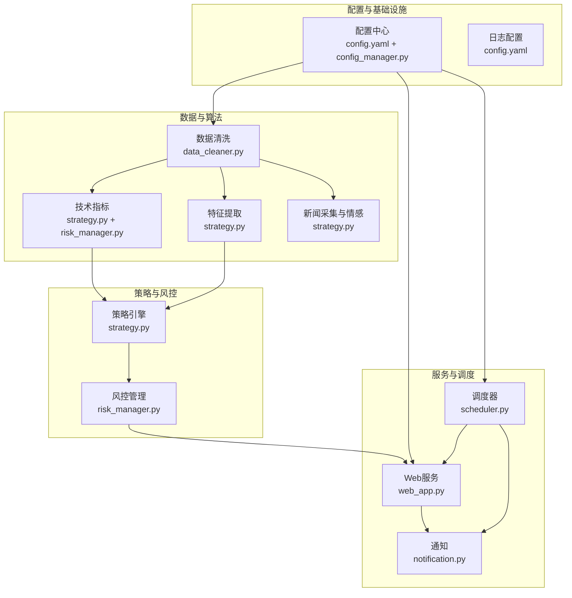
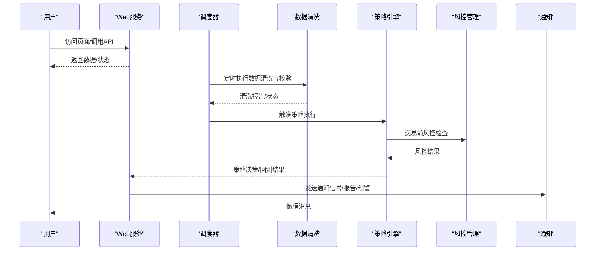
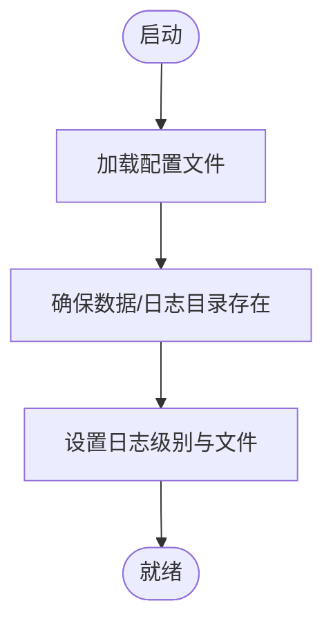
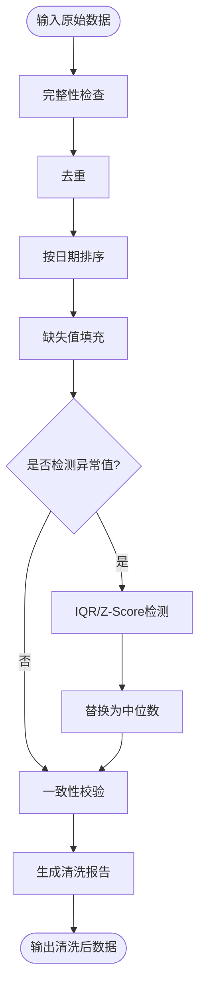
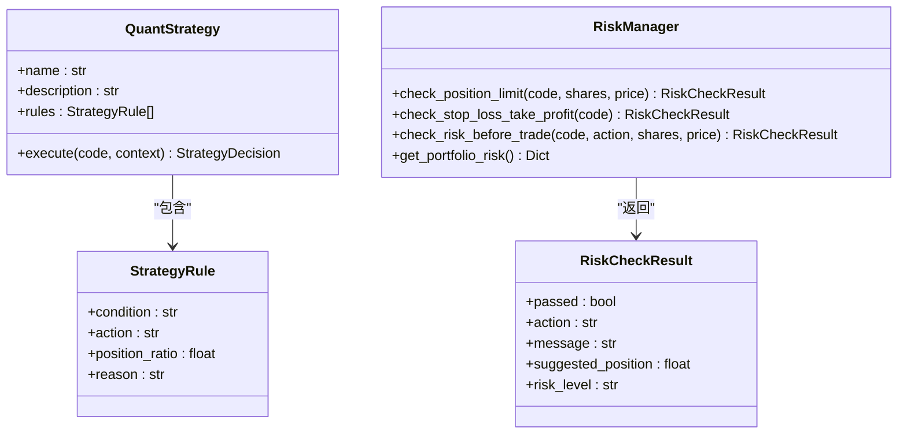
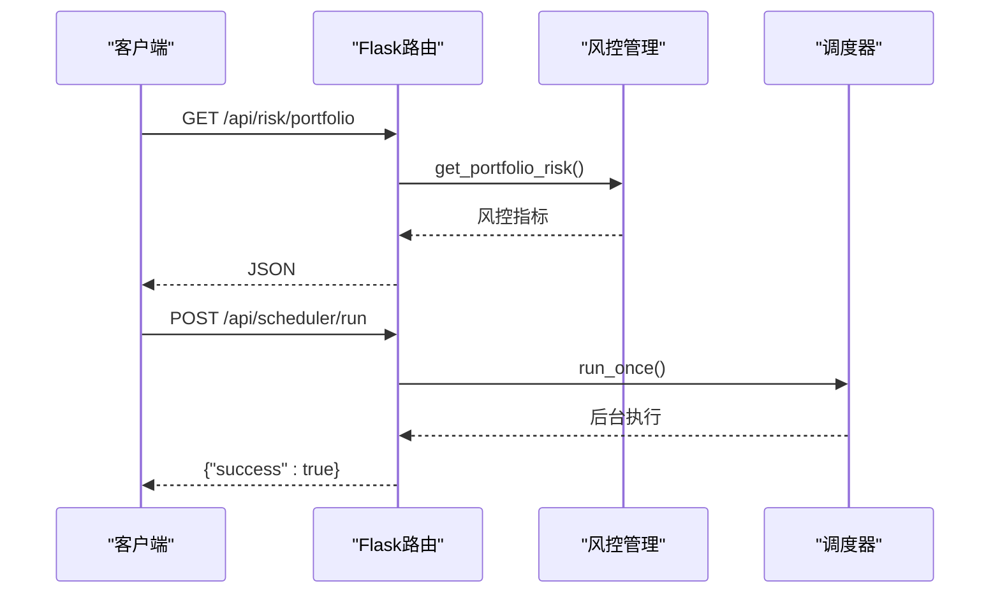
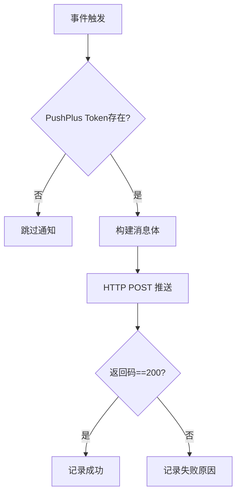
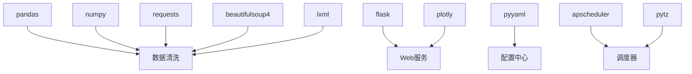

# 监控维护

<cite>
**本文引用的文件**
- [config.yaml](file://config.yaml)
- [main.py](file://main.py)
- [quant_system/web_app.py](file://quant_system/web_app.py)
- [quant_system/config_manager.py](file://quant_system/config_manager.py)
- [quant_system/data_cleaner.py](file://quant_system/data_cleaner.py)
- [quant_system/notification.py](file://quant_system/notification.py)
- [quant_system/risk_manager.py](file://quant_system/risk_manager.py)
- [quant_system/strategy.py](file://quant_system/strategy.py)
- [quant_system/scheduler.py](file://quant_system/scheduler.py)
- [config/stocks.yaml](file://config/stocks.yaml)
- [requirements.txt](file://requirements.txt)
</cite>

## 目录
1. [简介](#简介)
2. [项目结构](#项目结构)
3. [核心组件](#核心组件)
4. [架构总览](#架构总览)
5. [详细组件分析](#详细组件分析)
6. [依赖分析](#依赖分析)
7. [性能与监控](#性能与监控)
8. [维护与自动化](#维护与自动化)
9. [备份与恢复](#备份与恢复)
10. [故障排查与应急响应](#故障排查与应急响应)
11. [结论](#结论)

## 简介
本指南面向vibequation量化交易系统，围绕“监控与维护”主题，提供一套可落地的运维实践方案。内容覆盖系统监控指标采集与告警、日志管理策略、性能监控工具配置、定期维护任务自动化、系统健康检查与异常检测、自动恢复机制、备份与恢复流程，以及故障排查与应急响应流程。文档以仓库现有代码为基础，结合Web服务、调度器、通知与风控等模块，给出可执行的步骤与最佳实践。

## 项目结构
系统采用模块化设计，核心包括：
- 配置中心：统一读取与校验配置，确保数据目录与日志路径存在
- 数据管线：数据清洗、指标计算、特征提取、新闻采集与情感分析
- 策略与风控：策略执行、AI辅助决策、风控检查与报告
- Web服务：Flask提供API与前端页面，支持策略管理、回测、风控面板、调度器配置
- 调度器：基于APScheduler的定时任务，支持工作日定时执行数据更新、指标更新、AI分析与通知
- 通知：基于PushPlus的消息推送，支持交易信号、回测报告、风控预警、系统通知

**图表来源**
- [config.yaml:1-88](file://config.yaml#L1-L88)
- [quant_system/config_manager.py:12-100](file://quant_system/config_manager.py#L12-L100)
- [quant_system/web_app.py:34-80](file://quant_system/web_app.py#L34-L80)
- [quant_system/scheduler.py:199-237](file://quant_system/scheduler.py#L199-L237)
- [quant_system/notification.py:84-90](file://quant_system/notification.py#L84-L90)
- [quant_system/data_cleaner.py:21-81](file://quant_system/data_cleaner.py#L21-L81)
- [quant_system/strategy.py:150-316](file://quant_system/strategy.py#L150-L316)
- [quant_system/risk_manager.py:47-144](file://quant_system/risk_manager.py#L47-L144)

**章节来源**
- [config.yaml:1-88](file://config.yaml#L1-L88)
- [quant_system/config_manager.py:12-100](file://quant_system/config_manager.py#L12-L100)
- [quant_system/web_app.py:34-80](file://quant_system/web_app.py#L34-L80)
- [quant_system/scheduler.py:199-237](file://quant_system/scheduler.py#L199-L237)
- [quant_system/notification.py:84-90](file://quant_system/notification.py#L84-L90)
- [quant_system/data_cleaner.py:21-81](file://quant_system/data_cleaner.py#L21-L81)
- [quant_system/strategy.py:150-316](file://quant_system/strategy.py#L150-L316)
- [quant_system/risk_manager.py:47-144](file://quant_system/risk_manager.py#L47-L144)

## 核心组件
- 配置中心：集中管理API Token、数据目录、日志、Web服务、技术指标、AI模型、回测与风控参数，并在启动时确保目录存在
- 数据清洗与验证：完整性检查、去重、缺失值填充、异常值检测、一致性校验与清洗报告
- 策略与风控：策略规则执行、AI辅助决策、风控检查（仓位上限、单股上限、止损止盈）、组合风险评估与报告
- Web服务：提供策略、回测、风控、新闻、特征、调度器等API；支持系统状态持久化与加载
- 调度器：工作日定时任务，支持手动触发与配置更新
- 通知：基于PushPlus的Markdown/HTML/JSON消息推送，支持交易信号、回测报告、风控预警、系统通知

**章节来源**
- [quant_system/config_manager.py:12-178](file://quant_system/config_manager.py#L12-L178)
- [quant_system/data_cleaner.py:21-444](file://quant_system/data_cleaner.py#L21-L444)
- [quant_system/strategy.py:150-556](file://quant_system/strategy.py#L150-L556)
- [quant_system/risk_manager.py:47-404](file://quant_system/risk_manager.py#L47-L404)
- [quant_system/web_app.py:41-80](file://quant_system/web_app.py#L41-L80)
- [quant_system/scheduler.py:199-237](file://quant_system/scheduler.py#L199-L237)
- [quant_system/notification.py:84-301](file://quant_system/notification.py#L84-L301)

## 架构总览
系统采用“配置驱动 + 模块化组件 + Web调度 + 通知闭环”的架构。Web服务作为统一入口，调度器按计划执行数据与指标更新，策略与风控模块负责决策与风控，通知模块负责将结果与告警推送给用户。

**图表来源**
- [quant_system/web_app.py:41-80](file://quant_system/web_app.py#L41-L80)
- [quant_system/scheduler.py:199-237](file://quant_system/scheduler.py#L199-L237)
- [quant_system/data_cleaner.py:244-286](file://quant_system/data_cleaner.py#L244-L286)
- [quant_system/strategy.py:409-425](file://quant_system/strategy.py#L409-L425)
- [quant_system/risk_manager.py:185-240](file://quant_system/risk_manager.py#L185-L240)
- [quant_system/notification.py:131-172](file://quant_system/notification.py#L131-L172)

## 详细组件分析

### 配置管理与日志
- 配置加载与校验：读取config.yaml，确保数据目录与日志目录存在
- 日志配置：日志级别、文件路径、轮转大小与备份数量
- Web服务配置：主机、端口、调试模式

**图表来源**
- [quant_system/config_manager.py:28-55](file://quant_system/config_manager.py#L28-L55)
- [config.yaml:82-88](file://config.yaml#L82-L88)
- [quant_system/web_app.py:34-37](file://quant_system/web_app.py#L34-L37)

**章节来源**
- [quant_system/config_manager.py:28-55](file://quant_system/config_manager.py#L28-L55)
- [config.yaml:82-88](file://config.yaml#L82-L88)

### 数据清洗与验证
- 完整性检查：缺失列、缺失值、重复日期、日期断层
- 去重与排序：按日期去重并排序
- 缺失值填充：价格前向/后向填充、成交量/金额0填充
- 异常值检测：IQR/Z-Score
- 一致性校验：OHLC关系、价格跳空、零成交量
- 生成清洗报告：对比清洗前后指标

**图表来源**
- [quant_system/data_cleaner.py:27-81](file://quant_system/data_cleaner.py#L27-L81)
- [quant_system/data_cleaner.py:116-139](file://quant_system/data_cleaner.py#L116-L139)
- [quant_system/data_cleaner.py:82-115](file://quant_system/data_cleaner.py#L82-L115)
- [quant_system/data_cleaner.py:205-243](file://quant_system/data_cleaner.py#L205-L243)
- [quant_system/data_cleaner.py:287-339](file://quant_system/data_cleaner.py#L287-L339)
- [quant_system/data_cleaner.py:340-388](file://quant_system/data_cleaner.py#L340-L388)

**章节来源**
- [quant_system/data_cleaner.py:27-388](file://quant_system/data_cleaner.py#L27-L388)

### 策略与风控
- 策略规则：支持自然语言到规则的解析与规则到自然语言的翻译
- 策略执行：评估条件、统计买入/卖出信号、计算置信度与建议仓位
- 风控检查：单股/总仓位上限、资金充足性、止损止盈触发
- 组合风险评估：总仓位、集中度、浮动盈亏、风控提醒

**图表来源**
- [quant_system/strategy.py:35-54](file://quant_system/strategy.py#L35-L54)
- [quant_system/strategy.py:150-316](file://quant_system/strategy.py#L150-L316)
- [quant_system/risk_manager.py:89-144](file://quant_system/risk_manager.py#L89-L144)
- [quant_system/risk_manager.py:36-45](file://quant_system/risk_manager.py#L36-L45)

**章节来源**
- [quant_system/strategy.py:150-460](file://quant_system/strategy.py#L150-L460)
- [quant_system/risk_manager.py:47-284](file://quant_system/risk_manager.py#L47-L284)

### Web服务与调度器
- Web路由：股票、指标、图表、策略、回测、风控、新闻、特征、调度器API
- 系统状态持久化：风控状态与时间戳保存到文件，启动时加载
- 调度器：工作日定时任务、手动触发、配置更新

**图表来源**
- [quant_system/web_app.py:318-373](file://quant_system/web_app.py#L318-L373)
- [quant_system/web_app.py:722-739](file://quant_system/web_app.py#L722-L739)
- [quant_system/risk_manager.py:241-284](file://quant_system/risk_manager.py#L241-L284)
- [quant_system/scheduler.py:199-237](file://quant_system/scheduler.py#L199-L237)

**章节来源**
- [quant_system/web_app.py:41-80](file://quant_system/web_app.py#L41-L80)
- [quant_system/web_app.py:741-772](file://quant_system/web_app.py#L741-L772)
- [quant_system/scheduler.py:199-237](file://quant_system/scheduler.py#L199-L237)

### 通知与告警
- PushPlus消息推送：文本、HTML、JSON、Markdown
- 通知类型：交易信号、策略信号、风控预警、回测报告、系统通知
- 启用条件：配置中存在PushPlus Token

**图表来源**
- [quant_system/notification.py:17-82](file://quant_system/notification.py#L17-L82)
- [quant_system/notification.py:131-172](file://quant_system/notification.py#L131-L172)
- [quant_system/notification.py:231-275](file://quant_system/notification.py#L231-L275)
- [quant_system/notification.py:276-297](file://quant_system/notification.py#L276-L297)

**章节来源**
- [quant_system/notification.py:17-301](file://quant_system/notification.py#L17-L301)

## 依赖分析
系统依赖主要集中在数据处理、Web框架、可视化、HTTP请求、配置解析与定时任务等方面。这些依赖为监控与维护提供了基础能力，例如：
- pandas/numpy：数据清洗与指标计算
- flask/plotly：Web服务与图表渲染
- requests/beautifulsoup4/lxml：数据采集与解析
- pyyaml：配置文件解析
- apscheduler/pytz：定时任务调度

**图表来源**
- [requirements.txt:1-33](file://requirements.txt#L1-L33)
- [quant_system/data_cleaner.py:12-14](file://quant_system/data_cleaner.py#L12-L14)
- [quant_system/web_app.py:12-16](file://quant_system/web_app.py#L12-L16)
- [quant_system/scheduler.py:199-237](file://quant_system/scheduler.py#L199-L237)
- [quant_system/config_manager.py:33-34](file://quant_system/config_manager.py#L33-L34)

**章节来源**
- [requirements.txt:1-33](file://requirements.txt#L1-L33)

## 性能与监控
本节提供基于现有代码的监控与性能建议，不直接分析具体文件行。

- CPU与内存
  - Web服务与调度器在高并发或大数据量时可能占用较多资源。建议：
    - 使用进程/线程池限制同时执行的任务数
    - 对长耗时任务（如回测、特征提取）启用异步或后台线程
    - 结合系统监控工具（如top/htop、Windows任务管理器）观察峰值
- 磁盘
  - 数据目录（历史、实时、指标、特征、回测）持续增长。建议：
    - 定期清理旧数据与临时文件
    - 启用日志轮转（已在配置中设置）
    - 监控磁盘使用率，设置阈值告警
- 网络
  - 数据采集依赖外部API（如tushare、PushPlus）。建议：
    - 设置请求超时与重试
    - 对外部接口进行降级与熔断
- 数据库连接数
  - 当前代码未显式使用数据库。若后续接入数据库，请：
    - 控制连接池大小
    - 监控活跃连接数与等待时间
    - 使用连接复用与超时控制

[本节为通用指导，无需“章节来源”]

## 维护与自动化
- 定时任务
  - 调度器在工作日下午固定时间执行数据更新、指标更新、新闻采集、AI分析与通知
  - 支持手动触发与配置更新
- 数据维护
  - 数据清洗与验证：定期运行validate-data命令，查看数据质量
  - 指标与特征：按需更新指标与特征，确保回测与策略执行的数据新鲜度
- 风控与报告
  - 定期生成风险报告，关注风控提醒与组合集中度
- 通知联动
  - 将风控预警与回测报告通过PushPlus推送给用户

**章节来源**
- [quant_system/scheduler.py:199-237](file://quant_system/scheduler.py#L199-L237)
- [quant_system/web_app.py:722-739](file://quant_system/web_app.py#L722-L739)
- [quant_system/risk_manager.py:351-404](file://quant_system/risk_manager.py#L351-L404)
- [main.py:184-215](file://main.py#L184-L215)

## 备份与恢复
- 数据备份
  - 历史数据、实时数据、指标、特征、回测结果所在目录应纳入定期备份
  - 系统状态文件（风控状态）位于数据目录下，需随数据一并备份
- 配置备份
  - config.yaml与config/stocks.yaml需纳入版本控制或独立备份
- 代码备份
  - 仓库代码即为源码备份；建议保留多个版本快照
- 恢复流程
  - 恢复数据：将备份数据拷贝至对应目录，确保权限正确
  - 恢复配置：替换config.yaml与stocks.yaml，重启服务
  - 恢复系统状态：启动时会自动加载系统状态文件

**章节来源**
- [quant_system/web_app.py:743-772](file://quant_system/web_app.py#L743-L772)
- [config.yaml:11-18](file://config.yaml#L11-L18)
- [config/stocks.yaml:1-71](file://config/stocks.yaml#L1-L71)

## 故障排查与应急响应
- 日志定位
  - 查看日志文件位置与轮转配置，定位错误堆栈
  - 关注Web服务与调度器的日志输出
- 通知确认
  - 若未收到通知，检查PushPlus Token配置与网络连通性
- 数据问题
  - 使用validate-data命令查看各股票数据状态
  - 对异常数据执行数据清洗与修复
- 应急响应
  - 临时关闭调度器或调整任务时间
  - 降级外部API调用，启用本地降级逻辑
  - 回滚到最近一次稳定版本的配置与数据

**章节来源**
- [config.yaml:82-88](file://config.yaml#L82-L88)
- [quant_system/notification.py:17-82](file://quant_system/notification.py#L17-L82)
- [main.py:184-215](file://main.py#L184-L215)
- [quant_system/scheduler.py:236-237](file://quant_system/scheduler.py#L236-L237)

## 结论
vibequation系统具备完善的配置管理、数据清洗与验证、策略与风控、Web服务与调度器、通知等模块，能够支撑日常监控与维护需求。结合本文提供的监控指标采集与告警、日志管理策略、性能监控工具配置、定期维护自动化、健康检查与异常检测、自动恢复机制、备份与恢复流程以及故障排查与应急响应建议，可进一步提升系统的稳定性与可运维性。建议在生产环境中补充系统级监控（CPU/内存/磁盘/网络/数据库连接数）与告警策略，并持续优化调度与通知链路。