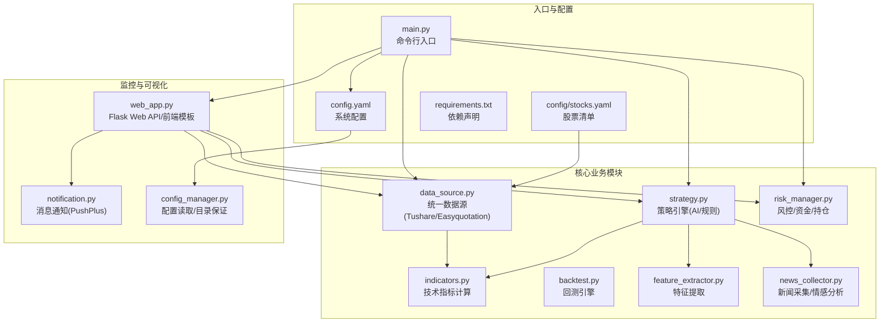
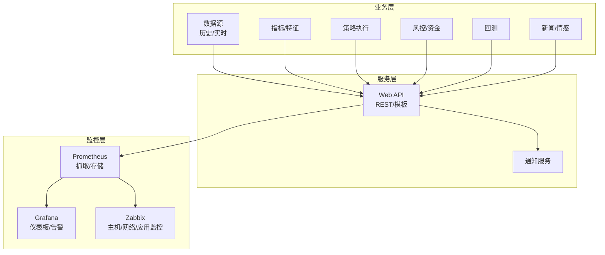
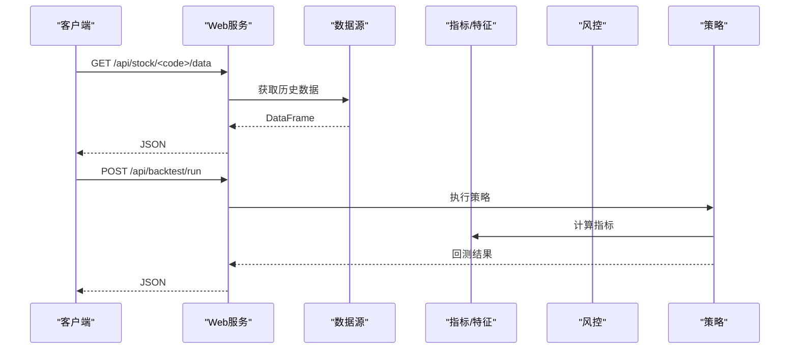
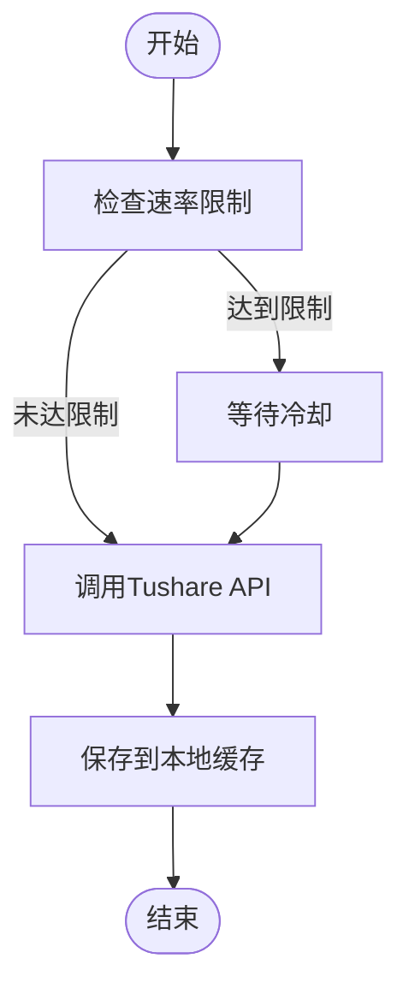
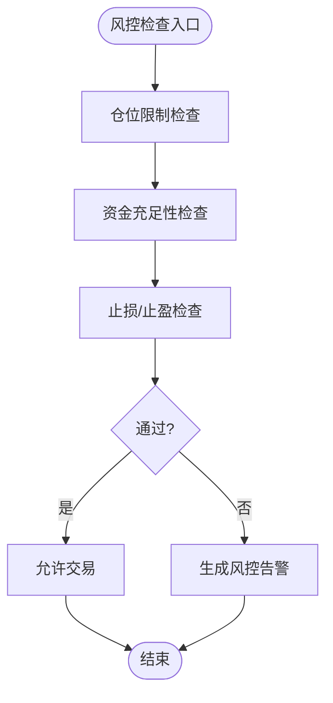
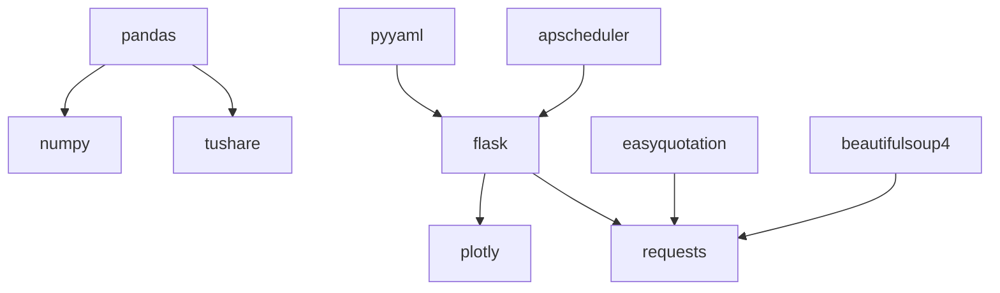

# 系统监控

<cite>
**本文引用的文件**
- [main.py](file://main.py)
- [config.yaml](file://config.yaml)
- [config\stocks.yaml](file://config\stocks.yaml)
- [requirements.txt](file://requirements.txt)
- [quant_system\config_manager.py](file://quant_system\config_manager.py)
- [quant_system\data_source.py](file://quant_system\data_source.py)
- [quant_system\web_app.py](file://quant_system\web_app.py)
- [quant_system\notification.py](file://quant_system\notification.py)
- [quant_system\risk_manager.py](file://quant_system\risk_manager.py)
- [quant_system\strategy.py](file://quant_system\strategy.py)
</cite>

## 目录
1. [简介](#简介)
2. [项目结构](#项目结构)
3. [核心组件](#核心组件)
4. [架构总览](#架构总览)
5. [详细组件分析](#详细组件分析)
6. [依赖分析](#依赖分析)
7. [性能考虑](#性能考虑)
8. [故障排查指南](#故障排查指南)
9. [结论](#结论)
10. [附录](#附录)

## 简介
本文件面向vibequation量化交易系统，提供系统监控与可观测性设计文档。重点覆盖以下方面：
- 系统层指标：CPU、内存、磁盘、网络等
- 应用层指标：数据库连接数、查询性能、缓存命中率等
- 监控工具配置：Prometheus、Grafana、Zabbix等
- 告警规则与自动告警机制
- 监控数据的采集、存储与可视化
- 仪表板设计与关键阈值建议

当前仓库未包含专门的监控采集与埋点代码，因此本文件在现有代码基础上，提出可落地的监控方案与最佳实践，帮助在不侵入业务的前提下实现全面可观测。

## 项目结构
系统采用模块化分层设计，核心模块包括数据采集、指标计算、策略执行、回测、风控、Web可视化与通知等。整体结构如下：

**图表来源**
- [main.py:1-365](file://main.py#L1-L365)
- [config.yaml:1-88](file://config.yaml#L1-L88)
- [config\stocks.yaml:1-71](file://config\stocks.yaml#L1-L71)
- [requirements.txt:1-33](file://requirements.txt#L1-L33)
- [quant_system\data_source.py:1-423](file://quant_system\data_source.py#L1-L423)
- [quant_system\web_app.py:1-1126](file://quant_system\web_app.py#L1-L1126)
- [quant_system\notification.py:1-301](file://quant_system\notification.py#L1-L301)
- [quant_system\risk_manager.py:1-404](file://quant_system\risk_manager.py#L1-L404)
- [quant_system\strategy.py:1-556](file://quant_system\strategy.py#L1-L556)

**章节来源**
- [main.py:1-365](file://main.py#L1-L365)
- [config.yaml:1-88](file://config.yaml#L1-L88)
- [config\stocks.yaml:1-71](file://config\stocks.yaml#L1-L71)
- [requirements.txt:1-33](file://requirements.txt#L1-L33)

## 核心组件
- 配置中心：集中管理日志、数据目录、API Token、风控参数、Web服务等配置
- 数据源：统一接入Tushare与Easyquotation，提供历史与实时行情
- 指标与特征：技术指标计算、特征工程与情感分析
- 策略引擎：规则策略与AI综合决策
- 风控：资金、仓位、止损止盈与组合风险评估
- Web服务：REST API与前端页面，支持回测、图表、风控面板
- 通知：基于PushPlus的消息推送

**章节来源**
- [quant_system\config_manager.py:1-178](file://quant_system\config_manager.py#L1-L178)
- [quant_system\data_source.py:1-423](file://quant_system\data_source.py#L1-L423)
- [quant_system\strategy.py:1-556](file://quant_system\strategy.py#L1-L556)
- [quant_system\risk_manager.py:1-404](file://quant_system\risk_manager.py#L1-L404)
- [quant_system\web_app.py:1-1126](file://quant_system\web_app.py#L1-L1126)
- [quant_system\notification.py:1-301](file://quant_system\notification.py#L1-L301)

## 架构总览
下图展示监控视角下的系统交互：业务模块产生事件与指标，Web服务暴露指标端点，外部监控系统拉取并存储，最终在可视化面板呈现与告警。

[此图为概念性架构示意，不直接映射具体源码文件，故无“图表来源”]

## 详细组件分析

### Web API与监控端点
- Web服务提供丰富的REST API，涵盖数据、指标、回测、风控、策略、新闻等接口，是监控数据采集的主要来源
- 建议在Web服务侧增加标准指标端点，导出系统健康度、请求耗时、错误率、队列长度等

**图表来源**
- [quant_system\web_app.py:41-374](file://quant_system\web_app.py#L41-L374)
- [quant_system\data_source.py:300-423](file://quant_system\data_source.py#L300-L423)
- [quant_system\strategy.py:409-444](file://quant_system\strategy.py#L409-L444)

**章节来源**
- [quant_system\web_app.py:1-1126](file://quant_system\web_app.py#L1-L1126)

### 数据采集与网络流量监控
- Tushare数据源实现速率限制与重试，适合作为网络流量与API调用质量的观测点
- 建议采集指标：请求次数、响应时间、错误率、限流触发次数

**图表来源**
- [quant_system\data_source.py:56-62](file://quant_system\data_source.py#L56-L62)
- [quant_system\data_source.py:108-135](file://quant_system\data_source.py#L108-L135)

**章节来源**
- [quant_system\data_source.py:1-423](file://quant_system\data_source.py#L1-L423)

### 风控与资金指标
- 风控模块提供组合风险指标：总资产、可用资金、总仓位、集中度、浮动盈亏、止损预警等
- 建议将上述指标作为Prometheus指标导出，便于趋势分析与阈值告警

**图表来源**
- [quant_system\risk_manager.py:89-239](file://quant_system\risk_manager.py#L89-L239)

**章节来源**
- [quant_system\risk_manager.py:1-404](file://quant_system\risk_manager.py#L1-L404)

### 通知与告警联动
- 通知模块基于PushPlus，可用于系统异常、风控触发、回测完成等场景的自动推送
- 建议结合监控系统告警，形成“告警→通知”的闭环

**章节来源**
- [quant_system\notification.py:1-301](file://quant_system\notification.py#L1-L301)

## 依赖分析
- Python依赖集中在数据处理、HTTP请求、Web框架、可视化与定时任务等方面
- 监控集成可通过Prometheus客户端库扩展，无需大幅修改现有代码

**图表来源**
- [requirements.txt:1-33](file://requirements.txt#L1-L33)

**章节来源**
- [requirements.txt:1-33](file://requirements.txt#L1-L33)

## 性能考虑
- 数据采集与指标计算可能成为性能瓶颈，建议：
  - 使用缓存与增量更新，减少重复请求
  - 对批量任务采用异步或队列化处理
  - 优化Pandas/Numpy操作，避免不必要的复制
  - 控制并发与速率限制，避免被上游API限流

[本节为通用性能建议，不直接分析具体文件，故无“章节来源”]

## 故障排查指南
- 日志配置位于配置文件，建议：
  - 设置合适的日志级别与轮转策略
  - 关注数据采集失败、API限流、Web接口异常等关键日志
- 常见问题定位：
  - 数据为空：检查股票代码、日期范围、缓存路径
  - 接口报错：查看Web服务日志与上游API响应
  - 通知失败：确认PushPlus Token与网络连通性

**章节来源**
- [config.yaml:82-88](file://config.yaml#L82-L88)
- [quant_system\web_app.py:79-81](file://quant_system\web_app.py#L79-L81)
- [quant_system\notification.py:40-68](file://quant_system\notification.py#L40-L68)

## 结论
vibequation当前具备良好的模块化结构与Web可视化能力，但缺少专门的监控采集与埋点。建议在现有基础上：
- 在Web服务中新增标准指标端点，导出系统健康与性能指标
- 集成Prometheus抓取与Grafana可视化
- 借助Zabbix补充主机与网络监控
- 基于通知模块建立自动告警闭环

## 附录

### 监控指标清单与采集建议
- 系统层（主机）
  - CPU使用率、内存占用、磁盘空间、磁盘IO、网络流量
  - 建议：Zabbix或Prometheus Node Exporter
- 应用层（Python服务）
  - 请求QPS、P95/P99延迟、错误率、活动连接数
  - 建议：在Web服务中增加指标端点，Prometheus抓取
- 数据层（可选）
  - 数据库连接数、查询耗时、慢查询、缓存命中率
  - 建议：根据实际使用的数据库与缓存组件，配置对应exporter
- 业务层
  - 策略执行耗时、回测耗时、风控触发次数、消息推送成功率

[本节为通用监控建议，不直接分析具体文件，故无“章节来源”]

### 监控工具配置与告警规则
- Prometheus
  - 配置job抓取Web指标端点
  - 配置告警规则：请求错误率、延迟阈值、资源使用率阈值
- Grafana
  - 创建仪表板：系统资源、业务指标、告警状态
  - 集成Prometheus数据源
- Zabbix
  - 主机发现与模板
  - 网络与应用监控项（如进程存活、端口监听）

[本节为通用配置建议，不直接分析具体文件，故无“章节来源”]

### 仪表板设计与阈值建议
- 仪表板建议分区：
  - 系统健康：CPU/内存/磁盘/网络
  - 业务健康：请求量/错误率/策略执行耗时
  - 风控与资金：总仓位、集中度、可用资金、止损预警
  - 通知与告警：推送成功率、告警数量
- 阈值建议（示例，需按生产环境调整）：
  - CPU使用率 > 80% 持续5分钟
  - 内存使用率 > 85%
  - 磁盘剩余空间 < 10%
  - 请求P99 > 5s
  - 错误率 > 1%
  - 总仓位 > 配置上限 × 80%

[本节为通用设计建议，不直接分析具体文件，故无“章节来源”]