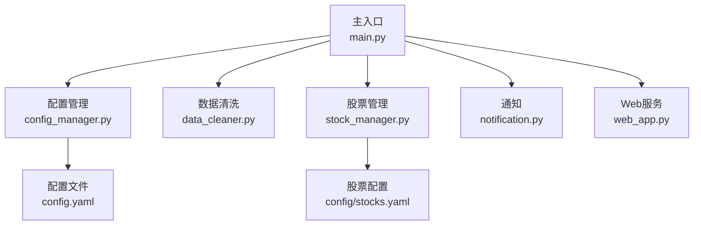
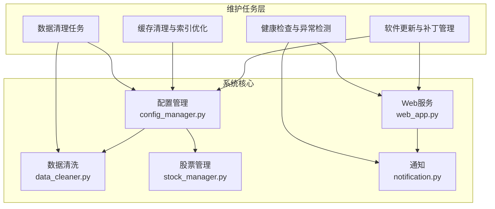
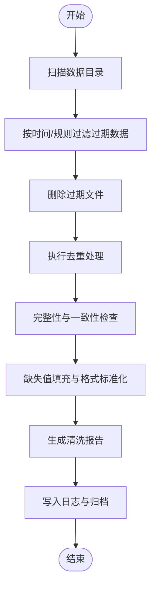
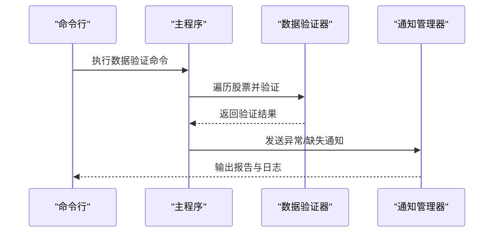
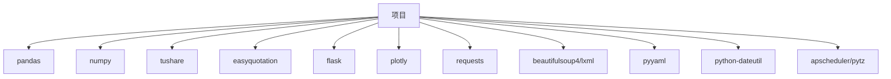

# 维护任务

<cite>
**本文引用的文件**
- [main.py](file://main.py)
- [config.yaml](file://config.yaml)
- [config_manager.py](file://quant_system/config_manager.py)
- [data_cleaner.py](file://quant_system/data_cleaner.py)
- [stock_manager.py](file://quant_system/stock_manager.py)
- [notification.py](file://quant_system/notification.py)
- [web_app.py](file://quant_system/web_app.py)
- [requirements.txt](file://requirements.txt)
- [config/stocks.yaml](file://config/stocks.yaml)
</cite>

## 目录
1. [简介](#简介)
2. [项目结构](#项目结构)
3. [核心组件](#核心组件)
4. [架构总览](#架构总览)
5. [详细组件分析](#详细组件分析)
6. [依赖分析](#依赖分析)
7. [性能考量](#性能考量)
8. [故障排查指南](#故障排查指南)
9. [结论](#结论)
10. [附录](#附录)

## 简介
本指南面向vibequation量化交易系统的运维与维护场景，围绕“定期维护任务”目标，系统化梳理以下方面：
- 数据清理任务：过期数据删除、重复数据处理、数据格式标准化
- 缓存清理与索引优化策略
- 系统健康检查与异常检测工具配置
- 软件更新与补丁管理流程
- 维护窗口规划与影响评估方法
- 维护任务的日志记录与效果跟踪
- 维护任务的优先级排序与资源分配

本指南既适用于具备一定技术背景的用户，也提供可直接落地的操作步骤与参考路径。

## 项目结构
系统采用模块化设计，核心模块包括配置管理、数据清洗、股票管理、通知、Web服务与调度器等。数据目录通过配置集中管理，便于维护任务的批量执行与追踪。

**图表来源**
- [main.py:1-365](file://main.py#L1-L365)
- [config_manager.py:1-178](file://quant_system/config_manager.py#L1-L178)
- [data_cleaner.py:1-444](file://quant_system/data_cleaner.py#L1-L444)
- [stock_manager.py:1-278](file://quant_system/stock_manager.py#L1-L278)
- [notification.py:1-301](file://quant_system/notification.py#L1-L301)
- [web_app.py:1-1126](file://quant_system/web_app.py#L1-L1126)
- [config.yaml:1-88](file://config.yaml#L1-L88)
- [config/stocks.yaml:1-71](file://config/stocks.yaml#L1-L71)

**章节来源**
- [main.py:1-365](file://main.py#L1-L365)
- [config_manager.py:1-178](file://quant_system/config_manager.py#L1-L178)
- [config.yaml:1-88](file://config.yaml#L1-L88)
- [config/stocks.yaml:1-71](file://config/stocks.yaml#L1-L71)

## 核心组件
- 配置管理：集中读取与校验配置，确保数据目录、日志路径、令牌等关键参数一致可用。
- 数据清洗：提供完整性检查、去重、缺失值填充、异常值检测与价格复权、多数据对齐等功能。
- 股票管理：统一管理股票、板块、指数的代码与格式，支持多格式转换与查询。
- 通知：基于PushPlus实现策略信号、交易提醒、回测报告、系统通知等消息推送。
- Web服务：提供数据更新、实时数据、回测、风险、新闻、特征等API，支持调度器配置与状态查看。
- 依赖管理：通过requirements.txt声明第三方库版本，保障环境一致性。

**章节来源**
- [config_manager.py:1-178](file://quant_system/config_manager.py#L1-L178)
- [data_cleaner.py:1-444](file://quant_system/data_cleaner.py#L1-L444)
- [stock_manager.py:1-278](file://quant_system/stock_manager.py#L1-L278)
- [notification.py:1-301](file://quant_system/notification.py#L1-L301)
- [web_app.py:1-1126](file://quant_system/web_app.py#L1-L1126)
- [requirements.txt:1-33](file://requirements.txt#L1-L33)

## 架构总览
下图展示了维护任务在系统中的位置与交互关系，重点体现数据流与控制流：

**图表来源**
- [config_manager.py:1-178](file://quant_system/config_manager.py#L1-L178)
- [data_cleaner.py:1-444](file://quant_system/data_cleaner.py#L1-L444)
- [stock_manager.py:1-278](file://quant_system/stock_manager.py#L1-L278)
- [notification.py:1-301](file://quant_system/notification.py#L1-L301)
- [web_app.py:1-1126](file://quant_system/web_app.py#L1-L1126)

## 详细组件分析

### 数据清理任务（过期数据删除、重复数据处理、数据格式标准化）
- 过期数据删除
  - 建议在数据目录层面按时间维度清理历史文件，结合配置中的默认起止日期与数据存储路径进行批量扫描与删除。
  - 可在维护窗口内执行，避免与实时数据采集冲突。
- 重复数据处理
  - 使用数据清洗模块的去重能力，针对日期列进行去重并记录移除数量，确保后续分析稳定性。
- 数据格式标准化
  - 通过完整性检查与缺失值填充，统一OHLC、成交量等字段；必要时进行价格复权与多数据对齐，保证跨股票对比的一致性。
- 自动化脚本建议
  - 基于主入口命令行接口，封装定期任务脚本，调用数据验证与清洗流程，输出清洗报告并记录日志。

**图表来源**
- [data_cleaner.py:27-286](file://quant_system/data_cleaner.py#L27-L286)
- [config_manager.py:121-131](file://quant_system/config_manager.py#L121-L131)
- [config.yaml:11-18](file://config.yaml#L11-L18)

**章节来源**
- [data_cleaner.py:1-444](file://quant_system/data_cleaner.py#L1-L444)
- [config_manager.py:121-131](file://quant_system/config_manager.py#L121-L131)
- [config.yaml:11-18](file://config.yaml#L11-L18)

### 缓存清理与索引优化
- 缓存清理
  - Web服务与数据模块可能产生中间缓存文件，可在维护窗口内清理临时文件与缓存目录，释放磁盘空间。
  - 建议结合数据目录配置，定位缓存路径并制定清理策略。
- 索引优化
  - 若使用数据库或索引文件，建议在低峰期重建索引，减少查询延迟。
  - 对于CSV/Parquet等文件，可按需重排与压缩，提升读取效率。

**章节来源**
- [config_manager.py:121-131](file://quant_system/config_manager.py#L121-L131)
- [config.yaml:11-18](file://config.yaml#L11-L18)

### 系统健康检查与异常检测
- 健康检查
  - 使用数据验证命令对全量股票数据进行完整性与一致性检查，输出汇总结果，识别异常与缺失。
- 异常检测
  - 利用数据清洗模块的异常值检测能力，识别价格跳空、零成交量等异常信号。
- 通知联动
  - 将健康检查与异常检测结果通过通知模块发送至微信，便于及时响应。

**图表来源**
- [main.py:184-215](file://main.py#L184-L215)
- [data_cleaner.py:396-438](file://quant_system/data_cleaner.py#L396-L438)
- [notification.py:84-301](file://quant_system/notification.py#L84-L301)

**章节来源**
- [main.py:184-215](file://main.py#L184-L215)
- [data_cleaner.py:396-438](file://quant_system/data_cleaner.py#L396-L438)
- [notification.py:84-301](file://quant_system/notification.py#L84-L301)

### 软件更新与补丁管理
- 依赖更新
  - 通过requirements.txt统一管理第三方库版本，定期核对并升级安全补丁。
- 配置变更
  - 更新配置文件后，确保配置管理模块能正确加载并创建所需目录，避免维护任务因路径缺失而失败。
- 回滚策略
  - 建立版本快照与回滚清单，确保更新失败时可快速恢复。

**章节来源**
- [requirements.txt:1-33](file://requirements.txt#L1-L33)
- [config_manager.py:28-54](file://quant_system/config_manager.py#L28-L54)
- [config.yaml:1-88](file://config.yaml#L1-L88)

### 维护窗口规划与影响评估
- 窗口选择
  - 选择交易日非活跃时段（如午间休市或夜间），降低对实时数据与回测的影响。
- 影响评估
  - 评估磁盘清理、数据重算、缓存重建对系统资源与响应时间的影响，必要时分批执行。
- 通知与监控
  - 在维护开始与结束时发送系统通知，监控日志与Web服务状态。

**章节来源**
- [web_app.py:871-941](file://quant_system/web_app.py#L871-L941)
- [notification.py:276-296](file://quant_system/notification.py#L276-L296)

### 日志记录与效果跟踪
- 日志配置
  - 通过配置文件设置日志级别、文件路径与轮转策略，确保维护任务全程可追溯。
- 效果跟踪
  - 在数据清洗、验证与更新流程中输出统计信息与报告，结合通知模块对外通报。

**章节来源**
- [config.yaml:82-88](file://config.yaml#L82-L88)
- [main.py:27-42](file://main.py#L27-L42)
- [data_cleaner.py:340-387](file://quant_system/data_cleaner.py#L340-L387)

### 维护任务优先级与资源分配
- 优先级排序
  - 高优先级：数据完整性与一致性检查、关键指标重算
  - 中优先级：缓存清理、日志轮转
  - 低优先级：索引重建、历史数据归档
- 资源分配
  - CPU与IO：在低峰期执行重算与重建；合理设置并发度，避免与实时数据采集冲突
  - 存储：定期清理过期文件，保持磁盘空间充足

**章节来源**
- [web_app.py:800-862](file://quant_system/web_app.py#L800-L862)
- [config.yaml:11-18](file://config.yaml#L11-L18)

## 依赖分析
系统依赖主要集中在数据处理、网络请求、Web框架与定时任务等方面，维护时应关注版本兼容性与安全补丁。

**图表来源**
- [requirements.txt:1-33](file://requirements.txt#L1-L33)

**章节来源**
- [requirements.txt:1-33](file://requirements.txt#L1-L33)

## 性能考量
- 数据处理
  - 使用向量化与批处理减少内存占用；对大文件采用分块读取与延迟计算。
- 网络请求
  - 控制并发与超时，避免被外部API限流；对失败请求进行重试与熔断。
- Web服务
  - 合理设置静态资源缓存与Gzip压缩；在维护期间关闭高负载路由，降低响应时间。

## 故障排查指南
- 日志定位
  - 检查日志文件路径与级别，定位错误堆栈与异常信息。
- 数据问题
  - 使用数据验证命令快速定位缺失与异常；结合清洗报告确认修复效果。
- 通知问题
  - 核对通知令牌配置，测试消息发送接口，确保异常能及时触达。

**章节来源**
- [config.yaml:82-88](file://config.yaml#L82-L88)
- [main.py:184-215](file://main.py#L184-L215)
- [notification.py:17-82](file://quant_system/notification.py#L17-L82)

## 结论
通过规范化的维护任务流程与工具链，vibequation系统能够在保证业务连续性的前提下，持续提升数据质量、系统稳定性与可观测性。建议将上述流程纳入标准作业程序（SOP），并配合自动化脚本与监控告警，实现高效、可追溯的运维管理。

## 附录
- 维护任务清单（示例）
  - 每日：数据完整性检查、异常检测、缓存清理
  - 每周：技术指标重算、日志轮转、依赖安全扫描
  - 每月：索引重建、历史数据归档、配置审计
- 关键命令参考
  - 数据验证：[main.py:184-215](file://main.py#L184-L215)
  - Web服务：[web_app.py:1-1126](file://quant_system/web_app.py#L1-L1126)
  - 配置管理：[config_manager.py:1-178](file://quant_system/config_manager.py#L1-L178)