# 部署运维

<cite>
**本文引用的文件**
- [config.yaml](file://config.yaml)
- [requirements.txt](file://requirements.txt)
- [main.py](file://main.py)
- [quant_system/web_app.py](file://quant_system/web_app.py)
- [quant_system/config_manager.py](file://quant_system/config_manager.py)
- [quant_system/data_source.py](file://quant_system/data_source.py)
- [quant_system/stock_manager.py](file://quant_system/stock_manager.py)
- [quant_system/strategy.py](file://quant_system/strategy.py)
- [quant_system/indicators.py](file://quant_system/indicators.py)
- [quant_system/feature_extractor.py](file://quant_system/feature_extractor.py)
- [quant_system/backtest.py](file://quant_system/backtest.py)
- [quant_system/risk_manager.py](file://quant_system/risk_manager.py)
- [quant_system/notification.py](file://quant_system/notification.py)
- [config/stocks.yaml](file://config/stocks.yaml)
</cite>

## 目录
1. [简介](#简介)
2. [项目结构](#项目结构)
3. [核心组件](#核心组件)
4. [架构总览](#架构总览)
5. [详细组件分析](#详细组件分析)
6. [依赖关系分析](#依赖关系分析)
7. [性能考虑](#性能考虑)
8. [故障排查指南](#故障排查指南)
9. [结论](#结论)
10. [附录](#附录)

## 简介
本指南面向vibequation量化交易系统的生产环境部署与运维，覆盖准备阶段、服务器配置、依赖安装、容器化部署、反向代理与SSL、监控与日志、性能优化、数据库与缓存、文件存储、自动化流水线与版本发布、故障排查与应急响应、备份与恢复、最佳实践与安全加固等全链路运维主题。文档以仓库现有代码为依据，结合系统模块职责与配置文件，给出可落地的实施步骤与可视化图示。

## 项目结构
项目采用按功能域划分的模块化组织方式，核心模块包括：
- 配置管理：集中读取与校验配置，确保数据目录与日志目录存在
- 数据采集：统一历史与实时数据源，封装Tushare与Easyquotation
- 技术指标：RSI、MACD、均线、布林带、KDJ等指标计算与持久化
- 特征提取：结合技术指标与情感分析，输出AI驱动的特征
- 策略层：量化策略与自然语言策略互译，策略执行与AI决策
- 回测引擎：基于历史数据的策略回测与指标统计
- 风控模块：仓位控制、止损止盈、风险评估
- 通知模块：PushPlus消息推送
- Web服务：Flask提供可视化界面与API

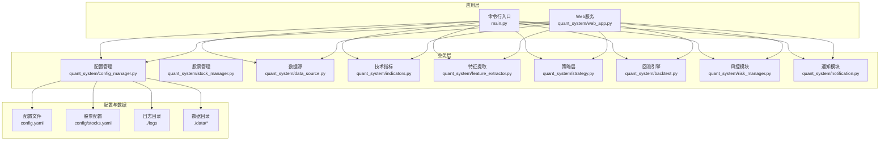

**图示来源**
- [quant_system/web_app.py:1-466](file://quant_system/web_app.py#L1-L466)
- [main.py:1-365](file://main.py#L1-L365)
- [quant_system/config_manager.py:1-178](file://quant_system/config_manager.py#L1-L178)
- [quant_system/data_source.py:1-423](file://quant_system/data_source.py#L1-L423)
- [quant_system/indicators.py:1-500](file://quant_system/indicators.py#L1-L500)
- [quant_system/feature_extractor.py:1-405](file://quant_system/feature_extractor.py#L1-L405)
- [quant_system/strategy.py:1-556](file://quant_system/strategy.py#L1-L556)
- [quant_system/backtest.py:1-456](file://quant_system/backtest.py#L1-L456)
- [quant_system/risk_manager.py:1-404](file://quant_system/risk_manager.py#L1-L404)
- [quant_system/notification.py:1-301](file://quant_system/notification.py#L1-L301)
- [config.yaml:1-88](file://config.yaml#L1-L88)
- [config/stocks.yaml:1-71](file://config/stocks.yaml#L1-L71)

**章节来源**
- [config.yaml:1-88](file://config.yaml#L1-L88)
- [config/stocks.yaml:1-71](file://config/stocks.yaml#L1-L71)
- [quant_system/config_manager.py:1-178](file://quant_system/config_manager.py#L1-L178)

## 核心组件
- 配置中心：集中管理API Token、数据目录、Web服务、日志、风控、回测、AI模型等参数，并在启动时确保目录存在
- 数据采集：历史数据来自Tushare（带速率限制），实时数据来自Easyquotation；统一标准化接口
- 技术指标：RSI、MACD、均线、布林带、KDJ、波动率等，支持多时间框架与持久化
- 特征提取：技术特征+情感特征+市场特征，AI辅助策略类型分类
- 策略层：内置RSI/MACD/均线/综合策略，支持自然语言描述与AI解析
- 回测引擎：支持单/多股票回测，输出收益、风险、交易统计指标
- 风控模块：总仓位、单券占比、止损止盈、资金与持仓校验
- 通知模块：PushPlus微信推送，支持策略信号、交易、回测、风险预警、系统通知
- Web服务：Flask提供前端页面与REST API，支持K线图、回测图、风险与特征查询

**章节来源**
- [quant_system/config_manager.py:1-178](file://quant_system/config_manager.py#L1-L178)
- [quant_system/data_source.py:1-423](file://quant_system/data_source.py#L1-L423)
- [quant_system/indicators.py:1-500](file://quant_system/indicators.py#L1-L500)
- [quant_system/feature_extractor.py:1-405](file://quant_system/feature_extractor.py#L1-L405)
- [quant_system/strategy.py:1-556](file://quant_system/strategy.py#L1-L556)
- [quant_system/backtest.py:1-456](file://quant_system/backtest.py#L1-L456)
- [quant_system/risk_manager.py:1-404](file://quant_system/risk_manager.py#L1-L404)
- [quant_system/notification.py:1-301](file://quant_system/notification.py#L1-L301)
- [quant_system/web_app.py:1-466](file://quant_system/web_app.py#L1-L466)

## 架构总览
系统采用“配置中心 + 多数据源 + 指标/特征/策略/回测/风控/通知”的分层设计，Web与CLI双入口，数据与日志目录集中管理，便于容器化与运维。

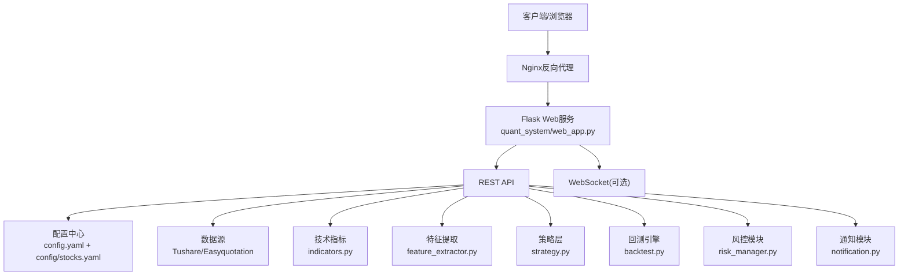

**图示来源**
- [quant_system/web_app.py:1-466](file://quant_system/web_app.py#L1-L466)
- [quant_system/data_source.py:1-423](file://quant_system/data_source.py#L1-L423)
- [quant_system/indicators.py:1-500](file://quant_system/indicators.py#L1-L500)
- [quant_system/feature_extractor.py:1-405](file://quant_system/feature_extractor.py#L1-L405)
- [quant_system/strategy.py:1-556](file://quant_system/strategy.py#L1-L556)
- [quant_system/backtest.py:1-456](file://quant_system/backtest.py#L1-L456)
- [quant_system/risk_manager.py:1-404](file://quant_system/risk_manager.py#L1-L404)
- [quant_system/notification.py:1-301](file://quant_system/notification.py#L1-L301)
- [config.yaml:1-88](file://config.yaml#L1-L88)
- [config/stocks.yaml:1-71](file://config/stocks.yaml#L1-L71)

## 详细组件分析

### 配置管理与目录准备
- 配置文件：tokens、data_storage、stocks、data_collection、technical_indicators、ai_models、backtest、risk_management、web、logging
- 目录确保：数据根目录、历史/实时/新闻/指标/特征/回测子目录、日志文件所在目录
- Web配置：host/port/debug
- 日志：级别、文件路径、轮转大小与备份数

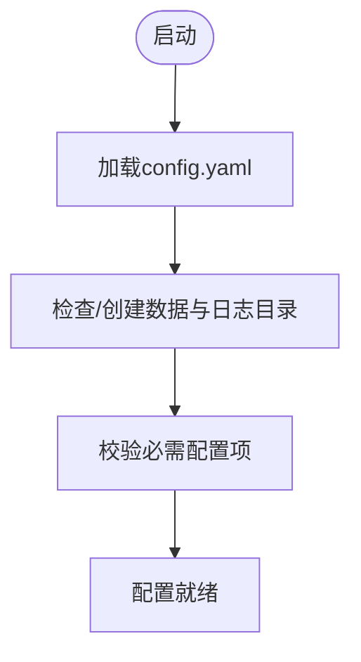

**图示来源**
- [quant_system/config_manager.py:28-55](file://quant_system/config_manager.py#L28-L55)
- [config.yaml:10-88](file://config.yaml#L10-L88)

**章节来源**
- [quant_system/config_manager.py:1-178](file://quant_system/config_manager.py#L1-L178)
- [config.yaml:1-88](file://config.yaml#L1-L88)

### 数据采集与速率限制
- Tushare：按分钟级速率限制，增量合并历史数据，本地CSV缓存
- Easyquotation：实时行情获取，转换为DataFrame
- 统一接口：历史/实时数据标准化列名与格式

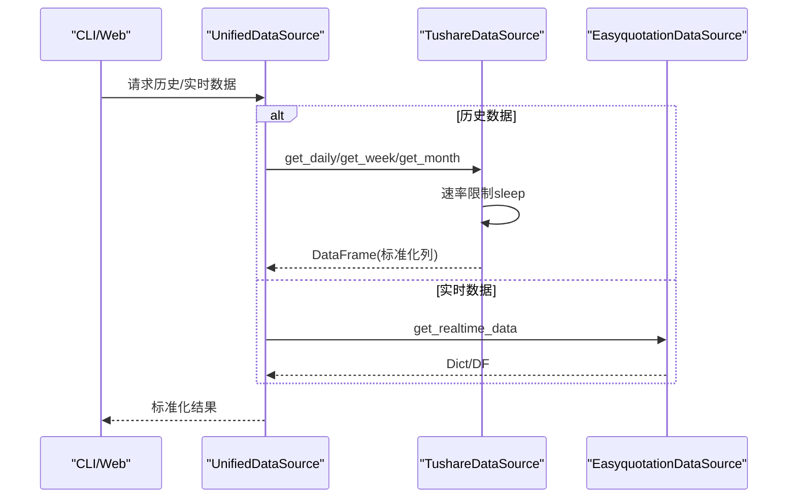

**图示来源**
- [quant_system/data_source.py:43-221](file://quant_system/data_source.py#L43-L221)
- [quant_system/data_source.py:223-298](file://quant_system/data_source.py#L223-L298)
- [quant_system/data_source.py:300-423](file://quant_system/data_source.py#L300-L423)

**章节来源**
- [quant_system/data_source.py:1-423](file://quant_system/data_source.py#L1-L423)

### 技术指标与持久化
- 指标：RSI、RSI百分位、MACD、MA、布林带、KDJ、波动率、涨跌幅、成交量指标
- 多时间框架：day/week/month
- 持久化：CSV文件按股票+频率命名

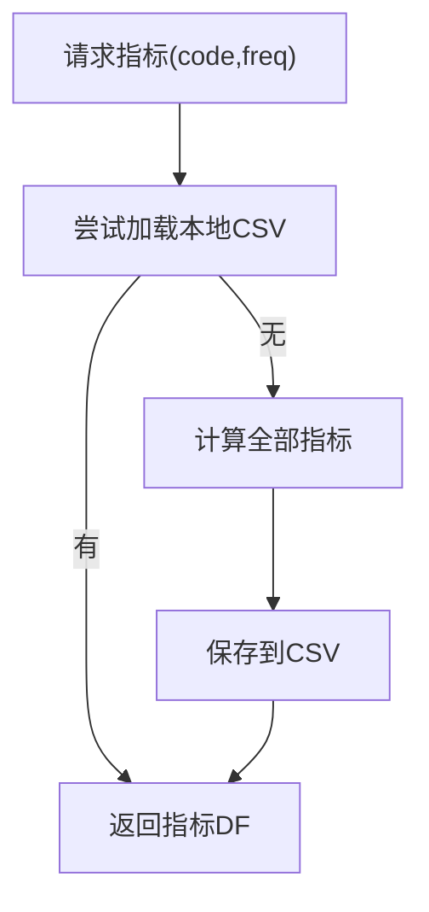

**图示来源**
- [quant_system/indicators.py:188-328](file://quant_system/indicators.py#L188-L328)
- [quant_system/indicators.py:275-305](file://quant_system/indicators.py#L275-L305)

**章节来源**
- [quant_system/indicators.py:1-500](file://quant_system/indicators.py#L1-L500)

### 特征提取与AI分类
- 技术特征：趋势强度、方向、RSI水平、MACD动量、均线排列、波动代理、布林带位置
- 情感特征：平均情感、波动、趋势、新闻量、多头比例
- 市场特征：贝塔、行业排名
- AI分析：ModelScope调用或Mock回退，输出策略类型、置信度、推荐指标、风险等级

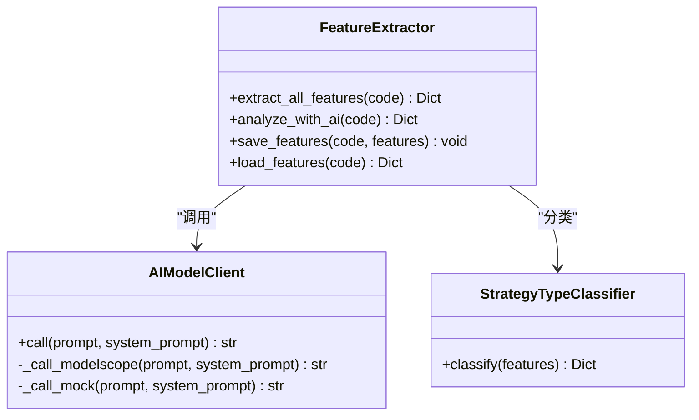

**图示来源**
- [quant_system/feature_extractor.py:24-97](file://quant_system/feature_extractor.py#L24-L97)
- [quant_system/feature_extractor.py:99-321](file://quant_system/feature_extractor.py#L99-L321)
- [quant_system/feature_extractor.py:323-405](file://quant_system/feature_extractor.py#L323-L405)

**章节来源**
- [quant_system/feature_extractor.py:1-405](file://quant_system/feature_extractor.py#L1-L405)

### 策略层与AI决策
- 内置策略：RSI、MACD、均线、综合策略
- 自然语言解析：将描述转为量化规则，再翻译回自然语言
- AI决策：综合指标与特征，输出动作、仓位、置信度、理由与风险评估

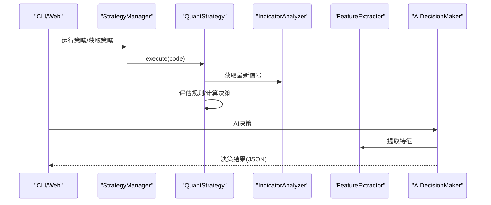

**图示来源**
- [quant_system/strategy.py:318-460](file://quant_system/strategy.py#L318-L460)
- [quant_system/strategy.py:462-556](file://quant_system/strategy.py#L462-L556)
- [quant_system/indicators.py:330-444](file://quant_system/indicators.py#L330-L444)
- [quant_system/feature_extractor.py:190-321](file://quant_system/feature_extractor.py#L190-L321)

**章节来源**
- [quant_system/strategy.py:1-556](file://quant_system/strategy.py#L1-L556)

### 回测引擎与报告
- 输入：股票、策略、起止日期、初始资金
- 交易模拟：滑点、佣金、整手交易
- 指标：总收益、年化收益、最大回撤、夏普比率、胜率、盈亏比、交易明细
- 多股票比较：对比不同策略表现

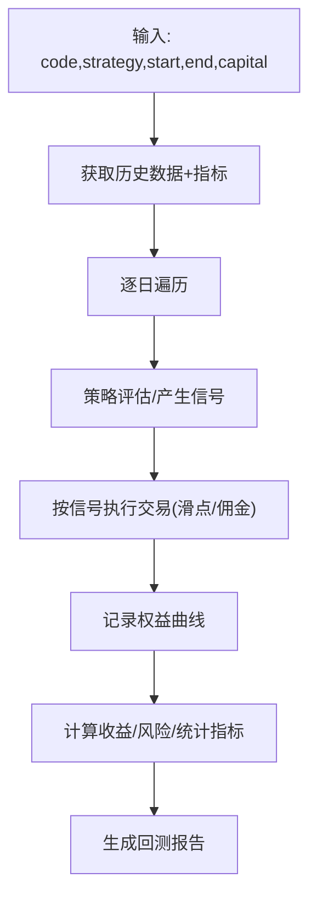

**图示来源**
- [quant_system/backtest.py:75-283](file://quant_system/backtest.py#L75-L283)
- [quant_system/backtest.py:376-451](file://quant_system/backtest.py#L376-L451)

**章节来源**
- [quant_system/backtest.py:1-456](file://quant_system/backtest.py#L1-L456)

### 风控模块
- 限额：单券占比、总仓位占比
- 止损止盈：按浮动盈亏百分比触发
- 资金与持仓校验：交易前检查
- 组合风险：总资金、可用资金、集中度、浮动盈亏、风控提醒

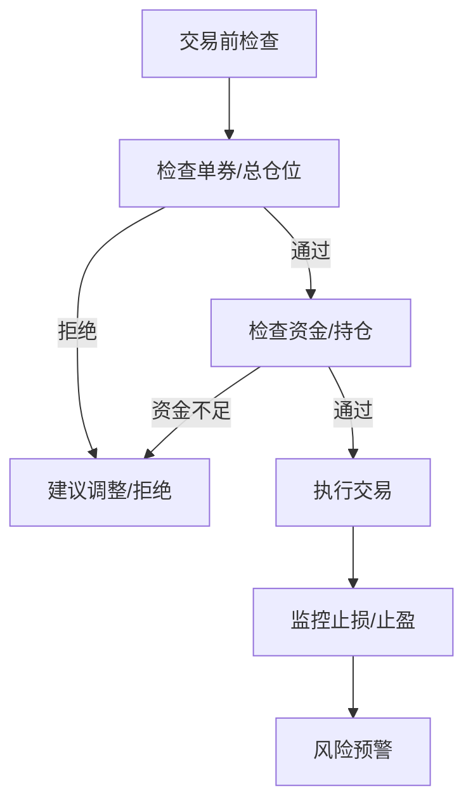

**图示来源**
- [quant_system/risk_manager.py:89-240](file://quant_system/risk_manager.py#L89-L240)
- [quant_system/risk_manager.py:241-293](file://quant_system/risk_manager.py#L241-L293)

**章节来源**
- [quant_system/risk_manager.py:1-404](file://quant_system/risk_manager.py#L1-L404)

### 通知模块
- PushPlus推送：文本/HTML/JSON/Markdown
- 场景：策略信号、交易、回测、风险预警、系统通知、每日报告

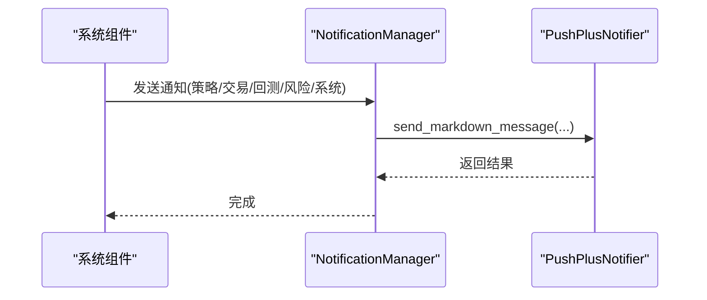

**图示来源**
- [quant_system/notification.py:84-301](file://quant_system/notification.py#L84-L301)

**章节来源**
- [quant_system/notification.py:1-301](file://quant_system/notification.py#L1-L301)

### Web服务与API
- 路由：首页、股票列表、K线图、技术指标、回测、风险、策略、特征、AI决策
- API：/api/stocks、/api/stock/<code>/data、/api/stock/<code>/chart、/api/backtest/run、/api/risk/*、/api/features/<code>、/api/ai/decision
- 启动：读取配置host/port/debug，启动Flask

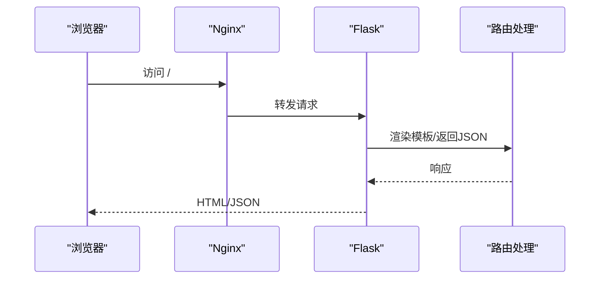

**图示来源**
- [quant_system/web_app.py:37-466](file://quant_system/web_app.py#L37-L466)

**章节来源**
- [quant_system/web_app.py:1-466](file://quant_system/web_app.py#L1-L466)

## 依赖关系分析
- Python依赖集中在requirements.txt，涵盖数据处理、Web框架、可视化、HTTP请求、解析与日期工具
- 模块间耦合：配置中心为全局入口；各模块通过配置读取参数；Web与CLI均依赖配置与数据层
- 外部依赖：Tushare API、Easyquotation、PushPlus、ModelScope（可选）

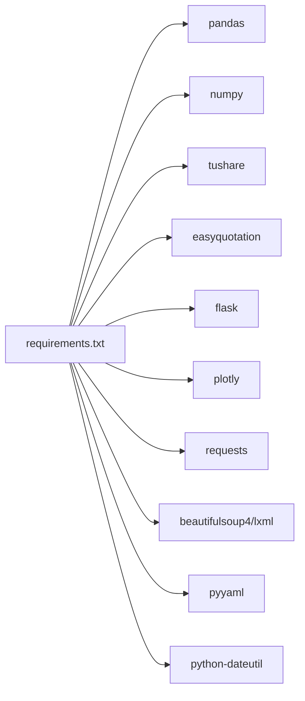

**图示来源**
- [requirements.txt:1-29](file://requirements.txt#L1-L29)

**章节来源**
- [requirements.txt:1-29](file://requirements.txt#L1-L29)

## 性能考虑
- 数据访问
  - 历史数据：本地CSV缓存，增量合并，避免重复拉取
  - 实时数据：批量获取，减少API调用频次
- 指标计算
  - 使用向量化运算（pandas/numpy），滚动窗口与指数加权平滑
  - 多时间框架并行计算（可扩展）
- 回测
  - 逐日循环，尽量避免不必要的DataFrame复制
  - 滑点与佣金参数化，便于调优
- Web服务
  - 生产环境建议使用WSGI（Gunicorn/uWSGI）+ Nginx
  - 图表渲染使用异步或缓存策略
- AI调用
  - ModelScope调用失败回退至Mock，保证系统可用性
  - 控制并发与重试策略

[本节为通用指导，无需特定文件引用]

## 故障排查指南
- 配置问题
  - 缺少Token：Tushare/ModelScope/PushPlus，检查config.yaml对应字段
  - 目录权限：确保数据与日志目录可写
- 数据采集
  - Tushare限流：观察日志与网络异常，适当降低并发
  - 实时数据为空：确认Easyquotation源可用与股票代码正确
- 指标计算
  - 缺失列或空数据：检查数据标准化与缺失值处理
- 回测
  - 无历史数据：确认起止日期与数据下载
  - 交易未发生：检查策略规则与信号阈值
- 风控
  - 资金不足/持仓不足：查看建议调整数量
- 通知
  - PushPlus失败：检查Token与网络连通性
- Web服务
  - 404/500：查看Flask日志与路由映射

**章节来源**
- [quant_system/config_manager.py:28-55](file://quant_system/config_manager.py#L28-L55)
- [quant_system/data_source.py:56-62](file://quant_system/data_source.py#L56-L62)
- [quant_system/indicators.py:204-217](file://quant_system/indicators.py#L204-L217)
- [quant_system/backtest.py:96-107](file://quant_system/backtest.py#L96-L107)
- [quant_system/risk_manager.py:205-217](file://quant_system/risk_manager.py#L205-L217)
- [quant_system/notification.py:40-68](file://quant_system/notification.py#L40-L68)
- [quant_system/web_app.py:75-77](file://quant_system/web_app.py#L75-L77)

## 结论
vibequation系统具备清晰的模块边界与可扩展性，生产部署建议结合容器化、反向代理、日志轮转、监控告警与自动化流水线，确保稳定性与可观测性。通过合理的配置与目录管理、严格的风控与通知机制、以及完善的回测与特征体系，可在生产环境中实现可靠的量化交易闭环。

[本节为总结，无需特定文件引用]

## 附录

### A. 生产环境部署清单
- 服务器准备
  - 操作系统：Linux（推荐Ubuntu/CentOS）
  - 资源：CPU≥2核、内存≥4GB、磁盘≥100GB（视数据规模）
  - 防火墙：开放80/443（Nginx）与应用端口（默认8080）
- 依赖安装
  - Python 3.8+，pip，git
  - 安装Python依赖：pip install -r requirements.txt
- 配置与目录
  - 准备config.yaml与config/stocks.yaml
  - 确保数据与日志目录存在且可写
- Web服务
  - 使用Gunicorn/uWSGI + Nginx
  - 配置静态资源与反向代理
- SSL证书
  - 使用Let’s Encrypt免费证书或商业证书
  - Nginx配置HTTPS与自动续期

[本节为通用指导，无需特定文件引用]

### B. Docker容器化部署（建议）
- 构建镜像
  - 基于官方Python镜像，COPY项目文件，安装依赖
- 容器编排
  - docker-compose定义应用、Nginx、日志卷
  - 挂载数据卷与日志卷
- 环境变量
  - 通过环境变量覆盖部分配置（如host/port）
- 健康检查
  - Web健康探针，Nginx状态页

[本节为通用指导，无需特定文件引用]

### C. Nginx反向代理与SSL
- 反向代理
  - 将/转发至Flask应用（127.0.0.1:8080）
  - 静态资源（CSS/JS）由Nginx直返
- SSL
  - acme.sh或certbot获取证书
  - 强制HTTPS重定向

[本节为通用指导，无需特定文件引用]

### D. 监控与日志
- 监控指标
  - CPU/内存/磁盘/网络
  - 应用进程存活、端口监听、回测耗时、AI调用成功率
- 日志
  - 日志轮转：按大小轮转，保留N份
  - 分类：应用日志、访问日志、错误日志
  - 建议接入集中式日志（如ELK/Graylog）

[本节为通用指导，无需特定文件引用]

### E. 数据库、缓存与文件存储
- 数据库
  - 现有代码未使用数据库，若需持久化回测/风控/通知记录，建议引入轻量数据库（SQLite/PostgreSQL）
- 缓存
  - Redis缓存热点指标/特征/图表数据
- 文件存储
  - 历史/实时/指标/特征/回测结果CSV
  - 建议使用对象存储（OSS/S3）做归档与备份

[本节为通用指导，无需特定文件引用]

### F. 自动化部署与CI/CD
- 流水线
  - 触发：Git提交/PR
  - 步骤：代码检查、单元测试、构建镜像、推送镜像、部署、健康检查
- 版本发布
  - 语义化版本，变更日志，回滚策略（蓝绿/滚动）

[本节为通用指导，无需特定文件引用]

### G. 应急响应与备份恢复
- 应急响应
  - 快速定位：日志、指标、告警
  - 降级：禁用AI、关闭非关键功能
  - 回滚：镜像版本回滚
- 备份
  - 数据目录定期备份
  - 配置文件纳入版本管理
- 恢复
  - 备份恢复演练，RTO/RPO目标

[本节为通用指导，无需特定文件引用]

### H. 运维最佳实践与安全加固
- 最佳实践
  - 最小权限原则、只读配置、密钥管理
  - 定期更新依赖与系统补丁
  - 审计日志与变更追踪
- 安全加固
  - Nginx安全头、HTTPS、IP白名单
  - Web应用防火墙（WAF）
  - 定期渗透测试与漏洞扫描

[本节为通用指导，无需特定文件引用]