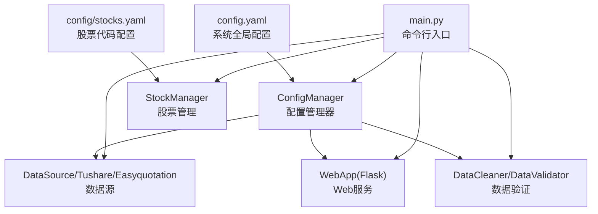
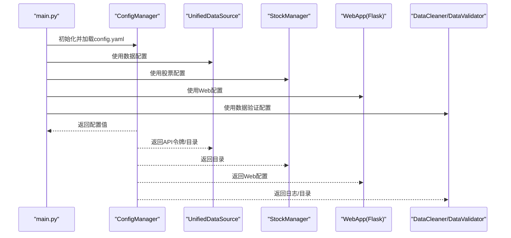
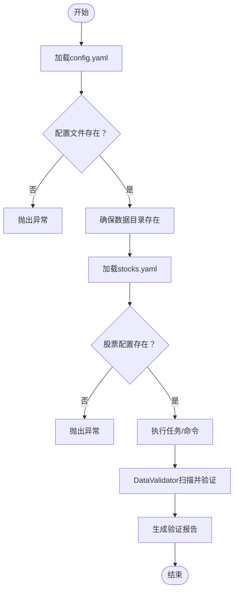
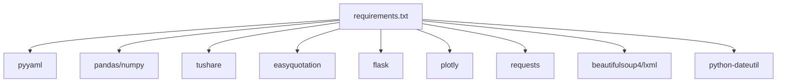

# 配置管理

<cite>
**本文引用的文件**
- [config.yaml](file://config.yaml)
- [stocks.yaml](file://config/stocks.yaml)
- [config_manager.py](file://quant_system/config_manager.py)
- [main.py](file://main.py)
- [data_source.py](file://quant_system/data_source.py)
- [stock_manager.py](file://quant_system/stock_manager.py)
- [web_app.py](file://quant_system/web_app.py)
- [data_cleaner.py](file://quant_system/data_cleaner.py)
- [requirements.txt](file://requirements.txt)
</cite>

## 目录
1. [简介](#简介)
2. [项目结构](#项目结构)
3. [核心组件](#核心组件)
4. [架构总览](#架构总览)
5. [详细组件分析](#详细组件分析)
6. [依赖分析](#依赖分析)
7. [性能考量](#性能考量)
8. [故障排查指南](#故障排查指南)
9. [结论](#结论)
10. [附录](#附录)

## 简介
本文件面向vibequation量化交易系统，提供配置管理的完整技术文档。内容覆盖：
- 配置文件结构与参数说明（config.yaml、stocks.yaml）
- 配置加载机制、优先级与环境变量支持现状
- 配置验证、错误处理与迁移建议
- 生产环境安全与性能优化要点
- Web服务、数据采集、技术指标、回测、风控等模块对配置的使用方式

## 项目结构
系统采用“配置文件 + 单例配置管理器”的集中式配置管理模式，核心文件如下：
- config.yaml：系统全局配置（API令牌、数据存储、采集、指标、AI模型、回测、风控、Web服务、日志）
- config/stocks.yaml：股票代码清单（个股、板块、指数）
- quant_system/config_manager.py：配置读取、写入、目录确保、便捷访问器
- quant_system/data_source.py：数据源模块，读取Tushare/Easyquotation配置
- quant_system/stock_manager.py：股票代码管理，读取stocks.yaml
- quant_system/web_app.py：Web服务，读取Web配置
- quant_system/data_cleaner.py：数据验证与清洗，基于配置进行路径与规则校验
- main.py：命令行入口，负责日志初始化与命令分发

**图表来源**
- [config.yaml](file://config.yaml)
- [stocks.yaml](file://config/stocks.yaml)
- [config_manager.py](file://quant_system/config_manager.py)
- [data_source.py](file://quant_system/data_source.py)
- [stock_manager.py](file://quant_system/stock_manager.py)
- [web_app.py](file://quant_system/web_app.py)
- [data_cleaner.py](file://quant_system/data_cleaner.py)
- [main.py](file://main.py)

**章节来源**
- [config.yaml](file://config.yaml)
- [stocks.yaml](file://config/stocks.yaml)
- [config_manager.py](file://quant_system/config_manager.py)
- [main.py](file://main.py)

## 核心组件
- 配置管理器（ConfigManager）
  - 单例模式，负责加载config.yaml、确保数据目录存在、提供点号路径读取与便捷访问器
  - 提供API令牌、数据目录、技术指标、回测、风控、AI模型、Web服务等配置的读取方法
- 股票管理器（StockManager）
  - 从config/stocks.yaml加载股票、板块、指数清单，提供代码标准化、格式转换、增删改保存
- 数据源（UnifiedDataSource）
  - 统一历史/实时数据接口，内部读取Tushare/Easyquotation配置
- Web服务（Flask）
  - 读取Web配置启动HTTP服务
- 数据验证（DataCleaner/DataValidator）
  - 基于配置的路径与规则进行数据完整性与一致性检查

**章节来源**
- [config_manager.py](file://quant_system/config_manager.py)
- [stock_manager.py](file://quant_system/stock_manager.py)
- [data_source.py](file://quant_system/data_source.py)
- [web_app.py](file://quant_system/web_app.py)
- [data_cleaner.py](file://quant_system/data_cleaner.py)

## 架构总览
配置在系统中的流转路径：
- 启动阶段：main.py加载日志配置并初始化各模块
- 模块使用：各子系统通过ConfigManager读取所需配置
- 写入与持久化：ConfigManager支持写回config.yaml；StockManager支持写回stocks.yaml

**图表来源**
- [main.py](file://main.py)
- [config_manager.py](file://quant_system/config_manager.py)
- [data_source.py](file://quant_system/data_source.py)
- [stock_manager.py](file://quant_system/stock_manager.py)
- [web_app.py](file://quant_system/web_app.py)
- [data_cleaner.py](file://quant_system/data_cleaner.py)

## 详细组件分析

### 配置文件结构与参数说明

#### config.yaml
- API令牌设置
  - tokens.tushare_token：Tushare Pro API令牌
  - tokens.pushplus_token：消息推送令牌
  - tokens.modelscope_token：ModelScope AI模型令牌
- 数据存储配置
  - data_storage.data_dir：数据根目录
  - data_storage.history_dir：历史数据目录
  - data_storage.realtime_dir：实时数据目录
  - data_storage.news_dir：新闻数据目录
  - data_storage.indicators_dir：技术指标目录
  - data_storage.features_dir：特征数据目录
  - data_storage.backtest_dir：回测结果目录
- 股票代码配置
  - stocks.config_file：股票代码配置文件路径（当前未被直接使用，实际读取config/stocks.yaml）
- 数据采集配置
  - data_collection.history.start_date/end_date：默认历史数据时间范围
  - data_collection.realtime.interval：实时数据更新间隔（秒）
  - data_collection.news.track_days：追踪近N天新闻
  - data_collection.news.sentiment_model：情感分析模型选择
- 技术指标配置
  - technical_indicators.rsi.periods/timeframes/history_lookback：RSI周期、时间框架、历史回看
  - technical_indicators.ma.periods：移动平均周期
  - technical_indicators.macd.fast/slow/signal：MACD参数
- AI模型配置
  - ai_models.provider/model_name/max_tokens/temperature：AI服务提供商、模型名、最大token、温度
- 回测配置
  - backtest.initial_capital/commission_rate/slippage：初始资金、手续费率、滑点
- 风控配置
  - risk_management.max_position_ratio/max_single_stock_ratio/stop_loss_ratio/take_profit_ratio：最大仓位比例、单股比例、止损、止盈
- Web服务配置
  - web.host/port/debug：主机、端口、调试模式
- 日志配置
  - logging.level/file/max_size/backup_count：日志级别、输出文件、大小限制、备份数量

**章节来源**
- [config.yaml](file://config.yaml)

#### stocks.yaml
- 股票类别
  - stocks：个股列表，每项含name/code/market/type
  - sectors：板块列表，每项含name/code/type
  - indices：大盘指数列表，每项含name/code/market/type
- 代码格式
  - 个股与指数需提供市场标识（sh/sz），板块可直接使用板块代码
  - type字段用于区分stock/sector/index

**章节来源**
- [stocks.yaml](file://config/stocks.yaml)

### 配置加载机制与优先级
- 加载顺序
  - main.py启动时先读取日志配置并初始化日志
  - 各模块通过ConfigManager单例访问配置
- 优先级规则
  - 当前实现为单一配置源（config.yaml），未实现环境变量覆盖或多配置文件合并
  - 若需扩展，可在ConfigManager中增加环境变量读取与默认值合并逻辑
- 目录确保
  - ConfigManager在加载配置后自动创建数据目录与日志目录

**章节来源**
- [config_manager.py](file://quant_system/config_manager.py)
- [main.py](file://main.py)

### 配置验证与错误处理
- 配置文件存在性
  - ConfigManager加载时若配置文件不存在会抛出异常
  - StockManager加载stocks.yaml时若文件不存在会抛出异常
- 数据目录存在性
  - ConfigManager确保所有数据目录存在，避免运行时IO错误
- 数据验证
  - DataValidator基于配置的history_dir路径扫描并验证CSV文件完整性与一致性
  - DataCleaner提供缺失值、重复日期、OHLC一致性、价格跳空、零成交量等检查

**图表来源**
- [config_manager.py](file://quant_system/config_manager.py)
- [stock_manager.py](file://quant_system/stock_manager.py)
- [data_cleaner.py](file://quant_system/data_cleaner.py)

**章节来源**
- [config_manager.py](file://quant_system/config_manager.py)
- [stock_manager.py](file://quant_system/stock_manager.py)
- [data_cleaner.py](file://quant_system/data_cleaner.py)

### 配置迁移指南
- 迁移步骤建议
  - 备份现有config.yaml与config/stocks.yaml
  - 在新版本中新增配置项时，保留旧配置项并设置合理默认值
  - 使用ConfigManager的便捷访问器读取配置，避免硬编码键路径
  - 对于新增目录，确保ConfigManager的目录确保逻辑覆盖新路径
- 兼容性保障
  - 通过ConfigManager.get(key, default)提供默认值，保证旧配置升级后仍可运行
  - 对于新增模块配置，建议在ConfigManager中新增对应访问器方法

**章节来源**
- [config_manager.py](file://quant_system/config_manager.py)

### 生产环境安全与性能优化
- 安全
  - API令牌建议通过环境变量注入并在ConfigManager中读取，避免将敏感信息提交到版本控制
  - Web服务仅在内网监听（host=127.0.0.1），生产部署时应结合反向代理与防火墙
- 性能
  - 数据目录分散存储，避免单点IO瓶颈
  - Tushare数据源内置速率限制，避免触发平台限流
  - Web服务使用Flask，默认非调试模式，生产环境建议关闭debug

**章节来源**
- [config.yaml](file://config.yaml)
- [data_source.py](file://quant_system/data_source.py)
- [web_app.py](file://quant_system/web_app.py)

## 依赖分析
- YAML解析
  - pyyaml用于解析config.yaml与stocks.yaml
- 数据处理
  - pandas/numpy用于数据验证与清洗
- 数据源
  - tushare/easyquotation用于历史与实时数据采集
- Web框架
  - flask用于Web服务
- 可视化
  - plotly用于图表生成
- 其他
  - requests/beautifulsoup4/lxml用于网络与HTML解析
  - python-dateutil用于日期解析

**图表来源**
- [requirements.txt](file://requirements.txt)

**章节来源**
- [requirements.txt](file://requirements.txt)

## 性能考量
- 配置读取
  - ConfigManager为单例，避免重复解析配置文件
- 目录创建
  - 启动时一次性创建所有必要目录，减少运行时IO开销
- 数据采集
  - Tushare数据源内置速率限制，避免频繁请求导致失败
- Web服务
  - 非调试模式下启动，减少开发期调试开销

[本节为通用指导，无需特定文件引用]

## 故障排查指南
- 配置文件缺失
  - 现象：启动时报错提示配置文件不存在
  - 处理：确认config.yaml与config/stocks.yaml路径正确且可读
- API令牌无效
  - 现象：Tushare数据获取失败
  - 处理：检查tokens.tushare_token是否正确配置
- 目录权限问题
  - 现象：数据无法保存或日志无法写入
  - 处理：确认data_storage与logging.file指向的目录具备写权限
- 数据验证失败
  - 现象：validate-data命令显示数据异常
  - 处理：根据DataValidator报告定位缺失列、重复日期、OHLC不一致等问题

**章节来源**
- [config_manager.py](file://quant_system/config_manager.py)
- [data_source.py](file://quant_system/data_source.py)
- [data_cleaner.py](file://quant_system/data_cleaner.py)

## 结论
vibequation的配置管理采用集中式YAML配置与单例ConfigManager，实现了清晰的职责分离与良好的可维护性。建议在生产环境中引入环境变量支持、增强配置校验与迁移能力，并持续完善目录与权限管理，以提升系统的安全性与稳定性。

[本节为总结，无需特定文件引用]

## 附录

### 配置项速查表
- API令牌
  - tokens.tushare_token
  - tokens.pushplus_token
  - tokens.modelscope_token
- 数据存储
  - data_storage.data_dir
  - data_storage.history_dir
  - data_storage.realtime_dir
  - data_storage.news_dir
  - data_storage.indicators_dir
  - data_storage.features_dir
  - data_storage.backtest_dir
- 股票代码
  - stocks.config_file（当前未使用，实际读取config/stocks.yaml）
- 数据采集
  - data_collection.history.start_date
  - data_collection.history.end_date
  - data_collection.realtime.interval
  - data_collection.news.track_days
  - data_collection.news.sentiment_model
- 技术指标
  - technical_indicators.rsi.periods
  - technical_indicators.rsi.timeframes
  - technical_indicators.rsi.history_lookback
  - technical_indicators.ma.periods
  - technical_indicators.macd.fast
  - technical_indicators.macd.slow
  - technical_indicators.macd.signal
- AI模型
  - ai_models.provider
  - ai_models.model_name
  - ai_models.max_tokens
  - ai_models.temperature
- 回测
  - backtest.initial_capital
  - backtest.commission_rate
  - backtest.slippage
- 风控
  - risk_management.max_position_ratio
  - risk_management.max_single_stock_ratio
  - risk_management.stop_loss_ratio
  - risk_management.take_profit_ratio
- Web服务
  - web.host
  - web.port
  - web.debug
- 日志
  - logging.level
  - logging.file
  - logging.max_size
  - logging.backup_count

**章节来源**
- [config.yaml](file://config.yaml)