# 项目概述

<cite>
**本文档引用的文件**
- [main.py](file://main.py)
- [config.yaml](file://config.yaml)
- [quant_system/__init__.py](file://quant_system/__init__.py)
- [requirements.txt](file://requirements.txt)
- [Prompt.txt](file://Prompt.txt)
- [quant_system/config_manager.py](file://quant_system/config_manager.py)
- [quant_system/data_source.py](file://quant_system/data_source.py)
- [quant_system/indicators.py](file://quant_system/indicators.py)
- [quant_system/strategy.py](file://quant_system/strategy.py)
- [quant_system/backtest.py](file://quant_system/backtest.py)
- [quant_system/risk_manager.py](file://quant_system/risk_manager.py)
- [quant_system/web_app.py](file://quant_system/web_app.py)
- [quant_system/stock_manager.py](file://quant_system/stock_manager.py)
- [quant_system/feature_extractor.py](file://quant_system/feature_extractor.py)
- [quant_system/news_collector.py](file://quant_system/news_collector.py)
- [quant_system/notification.py](file://quant_system/notification.py)
- [config/stocks.yaml](file://config/stocks.yaml)
</cite>

## 目录
1. [引言](#引言)
2. [项目结构](#项目结构)
3. [核心组件](#核心组件)
4. [架构总览](#架构总览)
5. [详细组件分析](#详细组件分析)
6. [依赖关系分析](#依赖关系分析)
7. [性能考虑](#性能考虑)
8. [故障排除指南](#故障排除指南)
9. [结论](#结论)
10. [附录](#附录)

## 引言
vibequation量化交易系统是一套面向实战的Python量化平台，围绕“数据采集—指标计算—特征提取—策略执行—回测验证—风险控制—可视化展示”的完整闭环设计。系统支持多数据源（Tushare + EasyQuotation）、多时间维度（日/周/月）、多指标体系（RSI、MACD、布林带、KDJ等），并引入AI辅助策略解析与特征分类，提供Web可视化界面与消息推送能力，适用于个人投资者与研究团队进行策略开发、验证与监控。

系统核心目标：
- 提供统一的数据采集与标准化接口，确保历史与实时数据一致性
- 构建可扩展的技术指标体系与特征分析模块
- 支持自然语言策略描述与量化规则互译，降低策略门槛
- 提供回测引擎与风险控制系统，保障策略稳健性
- 通过Web界面与消息推送提升可操作性与可观测性

## 项目结构
项目采用模块化分层组织，核心模块位于quant_system目录，命令行入口位于项目根目录，配置文件位于config与根目录。

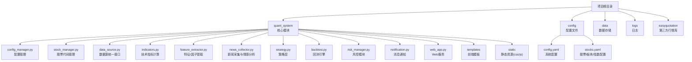

**图表来源**
- [quant_system/__init__.py:1-24](file://quant_system/__init__.py#L1-L24)
- [main.py:1-365](file://main.py#L1-L365)
- [config.yaml:1-88](file://config.yaml#L1-L88)
- [config/stocks.yaml:1-71](file://config/stocks.yaml#L1-L71)

**章节来源**
- [quant_system/__init__.py:1-24](file://quant_system/__init__.py#L1-L24)
- [main.py:261-365](file://main.py#L261-L365)
- [config.yaml:10-19](file://config.yaml#L10-L19)
- [config/stocks.yaml:1-71](file://config/stocks.yaml#L1-L71)

## 核心组件
- 配置管理：集中管理API Token、数据目录、指标参数、回测与风控配置、Web服务参数等
- 股票管理：统一管理股票、板块、指数的代码映射与格式转换
- 数据源：统一Tushare与EasyQuotation接口，标准化历史与实时数据
- 技术指标：RSI、MACD、布林带、KDJ、移动平均线、波动率等
- 特征提取：结合技术指标与新闻情感，AI辅助策略类型分类
- 新闻采集：从新浪财经采集新闻并进行情感分析
- 策略层：自然语言到量化规则的解析与翻译，策略执行与决策
- 回测引擎：基于历史数据的策略回测与统计指标计算
- 风控模块：仓位限制、止损止盈、组合风险评估
- 通知模块：PushPlus微信推送
- Web服务：Flask提供可视化界面与API

**章节来源**
- [quant_system/config_manager.py:12-178](file://quant_system/config_manager.py#L12-L178)
- [quant_system/stock_manager.py:62-278](file://quant_system/stock_manager.py#L62-L278)
- [quant_system/data_source.py:24-423](file://quant_system/data_source.py#L24-L423)
- [quant_system/indicators.py:21-500](file://quant_system/indicators.py#L21-L500)
- [quant_system/feature_extractor.py:99-405](file://quant_system/feature_extractor.py#L99-L405)
- [quant_system/news_collector.py:24-465](file://quant_system/news_collector.py#L24-L465)
- [quant_system/strategy.py:27-553](file://quant_system/strategy.py#L27-L553)
- [quant_system/backtest.py:66-456](file://quant_system/backtest.py#L66-L456)
- [quant_system/risk_manager.py:47-404](file://quant_system/risk_manager.py#L47-L404)
- [quant_system/notification.py:17-301](file://quant_system/notification.py#L17-L301)
- [quant_system/web_app.py:29-466](file://quant_system/web_app.py#L29-L466)

## 架构总览
系统采用“命令行入口 + 模块化服务 + Web可视化”的架构。命令行提供数据更新、指标计算、特征提取、策略运行、回测、风险报告、Web启动等子命令；模块间通过统一配置中心与股票管理器解耦；Web服务通过Flask提供REST API与前端页面。

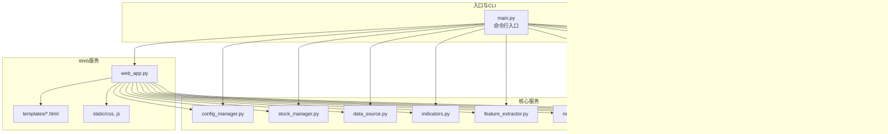

**图表来源**
- [main.py:14-25](file://main.py#L14-L25)
- [quant_system/web_app.py:29-466](file://quant_system/web_app.py#L29-L466)

**章节来源**
- [main.py:261-365](file://main.py#L261-L365)
- [quant_system/web_app.py:444-466](file://quant_system/web_app.py#L444-L466)

## 详细组件分析

### 配置管理与数据存储
- 配置中心集中管理API Token、数据目录、指标参数、回测与风控配置、Web服务参数
- 自动确保数据目录存在，支持动态保存与读取
- 提供便捷的配置访问方法，支持嵌套键路径

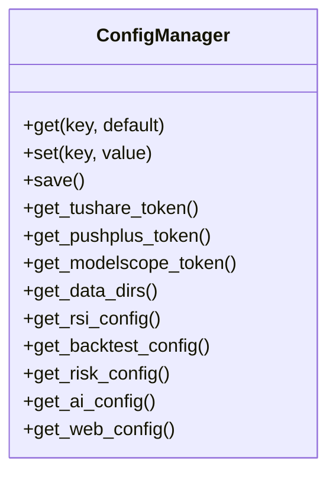

**图表来源**
- [quant_system/config_manager.py:12-178](file://quant_system/config_manager.py#L12-L178)

**章节来源**
- [quant_system/config_manager.py:23-178](file://quant_system/config_manager.py#L23-L178)
- [config.yaml:3-88](file://config.yaml#L3-L88)

### 股票代码管理
- 统一管理股票、板块、指数的名称、代码、市场与格式转换
- 提供Tushare/EasyQuotation格式代码转换，支持模糊匹配与标准化
- 支持从配置文件加载与动态保存

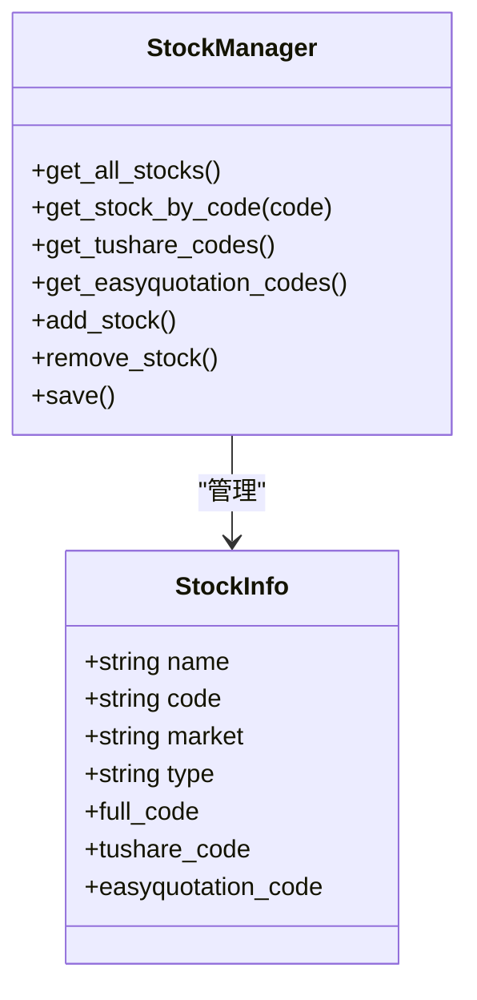

**图表来源**
- [quant_system/stock_manager.py:20-278](file://quant_system/stock_manager.py#L20-L278)
- [config/stocks.yaml:1-71](file://config/stocks.yaml#L1-L71)

**章节来源**
- [quant_system/stock_manager.py:62-278](file://quant_system/stock_manager.py#L62-L278)
- [config/stocks.yaml:4-71](file://config/stocks.yaml#L4-L71)

### 数据源与统一接口
- Tushare数据源：历史日线/周线/月线，带速率限制与增量更新
- EasyQuotation数据源：实时行情，支持批量获取与标准化
- 统一数据源接口：标准化列名与数据格式，提供历史与实时统一访问

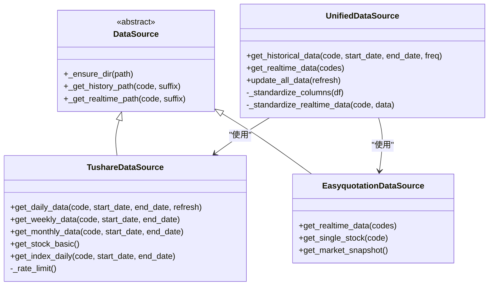

**图表来源**
- [quant_system/data_source.py:24-423](file://quant_system/data_source.py#L24-L423)

**章节来源**
- [quant_system/data_source.py:43-423](file://quant_system/data_source.py#L43-L423)

### 技术指标计算与分析
- 指标覆盖：RSI（含历史百分位）、MACD、移动平均线、布林带、KDJ、波动率、成交量比率等
- 支持多时间框架（日/周/月）与多周期配置
- 指标分析器：生成最新信号与综合评分，支持报告输出

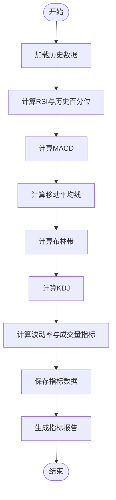

**图表来源**
- [quant_system/indicators.py:188-328](file://quant_system/indicators.py#L188-L328)

**章节来源**
- [quant_system/indicators.py:21-500](file://quant_system/indicators.py#L21-L500)

### 特征提取与策略类型分类
- 特征提取：技术特征、情感特征、市场特征
- AI辅助：调用ModelScope API进行策略类型判断与推荐指标
- 策略分类器：基于特征打分，输出最适合的策略类型与置信度

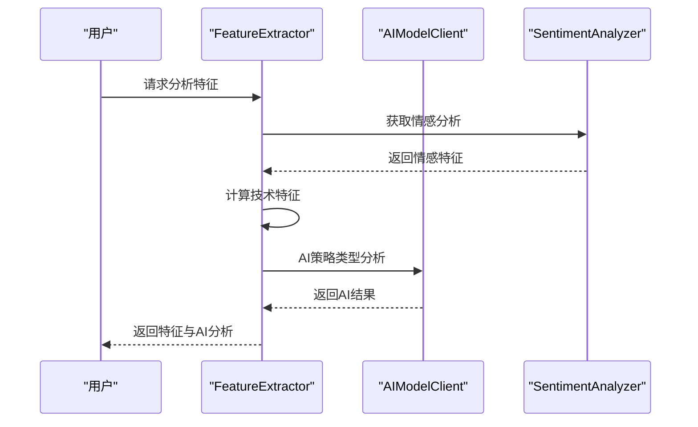

**图表来源**
- [quant_system/feature_extractor.py:213-284](file://quant_system/feature_extractor.py#L213-L284)
- [quant_system/news_collector.py:353-400](file://quant_system/news_collector.py#L353-L400)

**章节来源**
- [quant_system/feature_extractor.py:99-405](file://quant_system/feature_extractor.py#L99-L405)
- [quant_system/news_collector.py:205-465](file://quant_system/news_collector.py#L205-L465)

### 新闻采集与情感分析
- 新闻采集：按日期范围抓取新浪财经新闻，去重合并，本地持久化
- 情感分析：支持ModelScope API与本地关键词规则，支持按日聚合
- 流水线：采集—分析—保存的完整流程

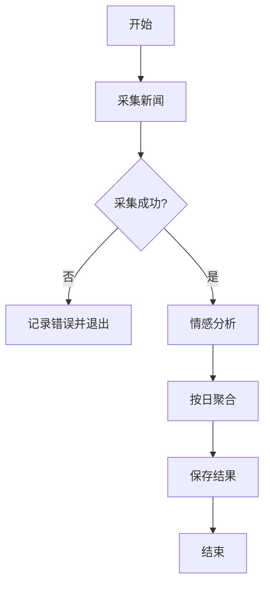

**图表来源**
- [quant_system/news_collector.py:409-458](file://quant_system/news_collector.py#L409-L458)

**章节来源**
- [quant_system/news_collector.py:24-465](file://quant_system/news_collector.py#L24-L465)

### 策略层与AI决策
- 策略解析：将自然语言描述转换为量化规则，支持规则翻译
- 策略执行：评估条件、汇总信号、生成决策（动作、仓位、置信度、理由）
- AI决策：综合技术指标与特征，给出交易建议与风险评估

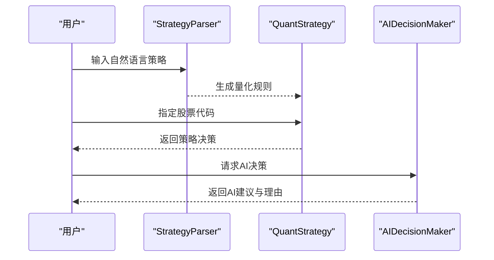

**图表来源**
- [quant_system/strategy.py:56-148](file://quant_system/strategy.py#L56-L148)
- [quant_system/strategy.py:229-300](file://quant_system/strategy.py#L229-L300)
- [quant_system/strategy.py:462-548](file://quant_system/strategy.py#L462-L548)

**章节来源**
- [quant_system/strategy.py:27-553](file://quant_system/strategy.py#L27-L553)

### 回测引擎与分析
- 回测流程：加载历史数据与指标，逐日执行策略，记录交易与净值曲线
- 风险与收益指标：总收益、年化收益、最大回撤、夏普比率、胜率、盈亏比等
- 多股票回测与结果比较

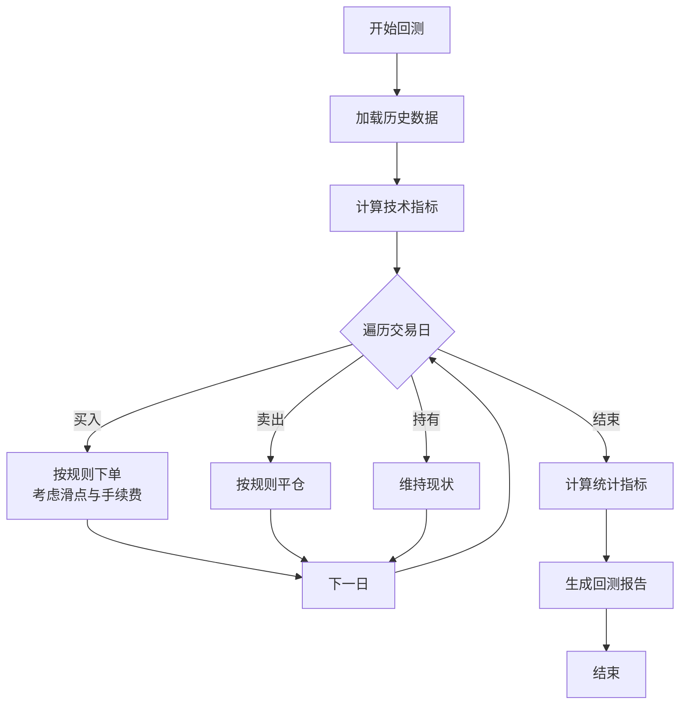

**图表来源**
- [quant_system/backtest.py:75-282](file://quant_system/backtest.py#L75-L282)

**章节来源**
- [quant_system/backtest.py:66-456](file://quant_system/backtest.py#L66-L456)

### 风控模块
- 仓位限制：单股与总仓位上限控制
- 止损止盈：基于浮动盈亏触发
- 组合风险：集中度、总仓位、预警提醒
- 风险报告：资金、持仓、风险等级与提醒汇总

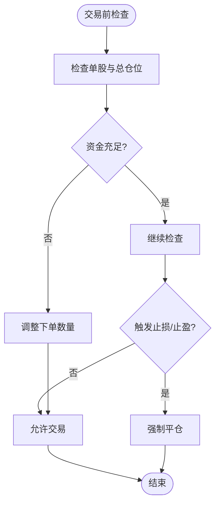

**图表来源**
- [quant_system/risk_manager.py:89-240](file://quant_system/risk_manager.py#L89-L240)

**章节来源**
- [quant_system/risk_manager.py:47-404](file://quant_system/risk_manager.py#L47-L404)

### Web服务与可视化
- API：股票数据、指标、K线图、策略执行、回测、风险、新闻与特征
- 页面：仪表盘、股票详情、回测、风控、策略
- 图表：K线叠加均线、回测权益曲线

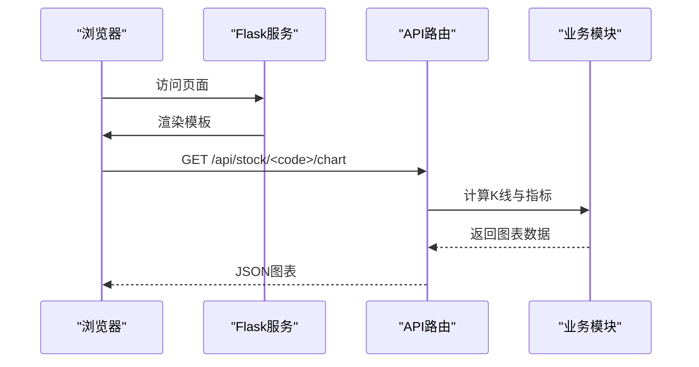

**图表来源**
- [quant_system/web_app.py:107-163](file://quant_system/web_app.py#L107-L163)
- [quant_system/web_app.py:264-312](file://quant_system/web_app.py#L264-L312)

**章节来源**
- [quant_system/web_app.py:29-466](file://quant_system/web_app.py#L29-L466)

### 消息通知
- PushPlus微信推送：交易提醒、策略信号、风险预警、回测报告、系统通知
- Markdown/HTML/JSON模板，支持富文本展示

**章节来源**
- [quant_system/notification.py:17-301](file://quant_system/notification.py#L17-L301)

## 依赖关系分析
- Python版本与第三方库：pandas、numpy、tushare、easyquotation、flask、plotly、requests、beautifulsoup4、lxml、pyyaml、python-dateutil
- 模块内聚与耦合：通过ConfigManager与StockManager实现低耦合；各模块职责清晰，接口稳定
- 外部依赖：Tushare API、EasyQuotation、ModelScope API、PushPlus

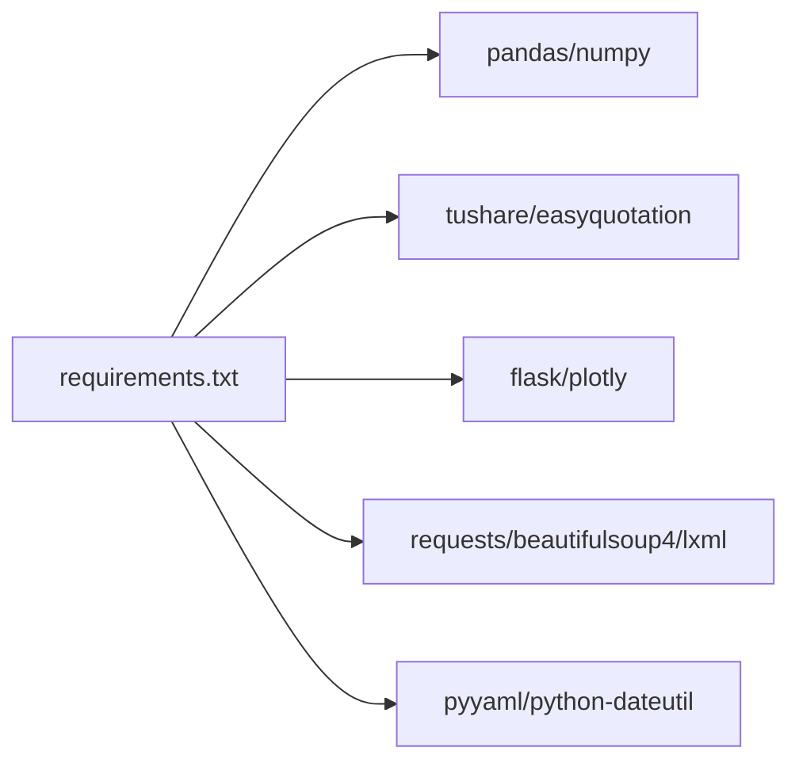

**图表来源**
- [requirements.txt:1-29](file://requirements.txt#L1-L29)

**章节来源**
- [requirements.txt:1-29](file://requirements.txt#L1-L29)

## 性能考虑
- 数据采集：Tushare速率限制与增量更新，避免重复抓取
- 指标计算：滚动窗口与向量化计算，合理设置周期与回看长度
- 回测优化：条件评估使用安全字典与最小化eval调用，必要时可替换为纯函数评估
- Web服务：图表数据按需加载，分页与缓存策略减少前端压力
- AI调用：ModelScope API降级为本地规则，保证稳定性

[本节为通用指导，无需特定文件引用]

## 故障排除指南
- 配置问题：确认config.yaml中Token与数据目录配置正确
- 数据采集失败：检查网络与Tushare额度限制，查看日志定位异常
- 指标为空：确认历史数据已更新，检查列名标准化与数值类型
- 回测报错：核对策略规则语法，确保指标列存在
- 风控拦截：根据提示调整下单数量或检查资金/持仓
- Web服务：确认端口未被占用，Flask调试模式便于排错
- 通知失败：检查PushPlus Token与网络连通性

**章节来源**
- [quant_system/config_manager.py:28-50](file://quant_system/config_manager.py#L28-L50)
- [quant_system/data_source.py:56-62](file://quant_system/data_source.py#L56-L62)
- [quant_system/backtest.py:96-107](file://quant_system/backtest.py#L96-L107)
- [quant_system/risk_manager.py:199-239](file://quant_system/risk_manager.py#L199-L239)
- [quant_system/web_app.py:444-466](file://quant_system/web_app.py#L444-L466)
- [quant_system/notification.py:22-82](file://quant_system/notification.py#L22-L82)

## 结论
vibequation量化交易系统通过模块化设计与清晰的分层架构，实现了从数据采集到策略执行、回测验证与风险控制的全链路闭环。系统具备良好的扩展性与可维护性，结合AI辅助分析与Web可视化，能够满足个人投资者与研究团队在策略研发、验证与日常监控中的多样化需求。

[本节为总结性内容，无需特定文件引用]

## 附录
- 应用场景与价值定位
  - 策略研发：自然语言策略解析、指标与特征分析、回测验证
  - 风险管理：仓位控制、止损止盈、组合风险评估
  - 实时监控：Web可视化、消息推送、新闻情感监控
  - 教学与研究：模块化学习、指标体系与回测报告

- 技术栈选择理由
  - Python生态成熟，量化与AI集成便利
  - pandas/numpy提供高效数据处理
  - Flask轻量易用，适合快速迭代
  - Plotly交互式图表，提升可视化体验
  - YAML配置简洁直观，便于维护

- 架构优势与创新点
  - 统一数据源与标准化接口，降低数据接入成本
  - 指标与特征模块化，支持灵活扩展
  - AI与规则混合策略，兼顾可解释性与智能化
  - 完整的回测与风控闭环，提升策略稳健性
  - Web服务与消息推送一体化，增强可观测性

**章节来源**
- [Prompt.txt:1-112](file://Prompt.txt#L1-L112)
- [quant_system/__init__.py:1-24](file://quant_system/__init__.py#L1-L24)