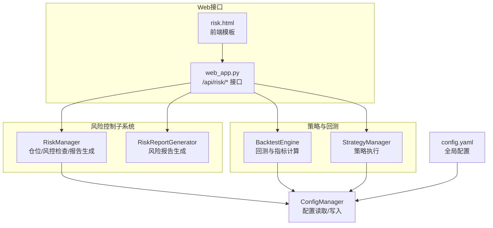
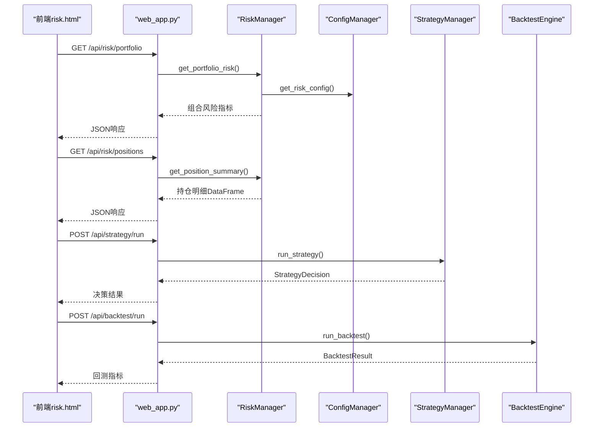
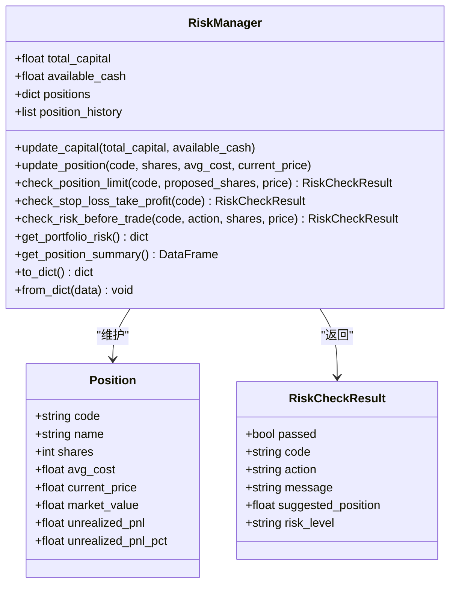
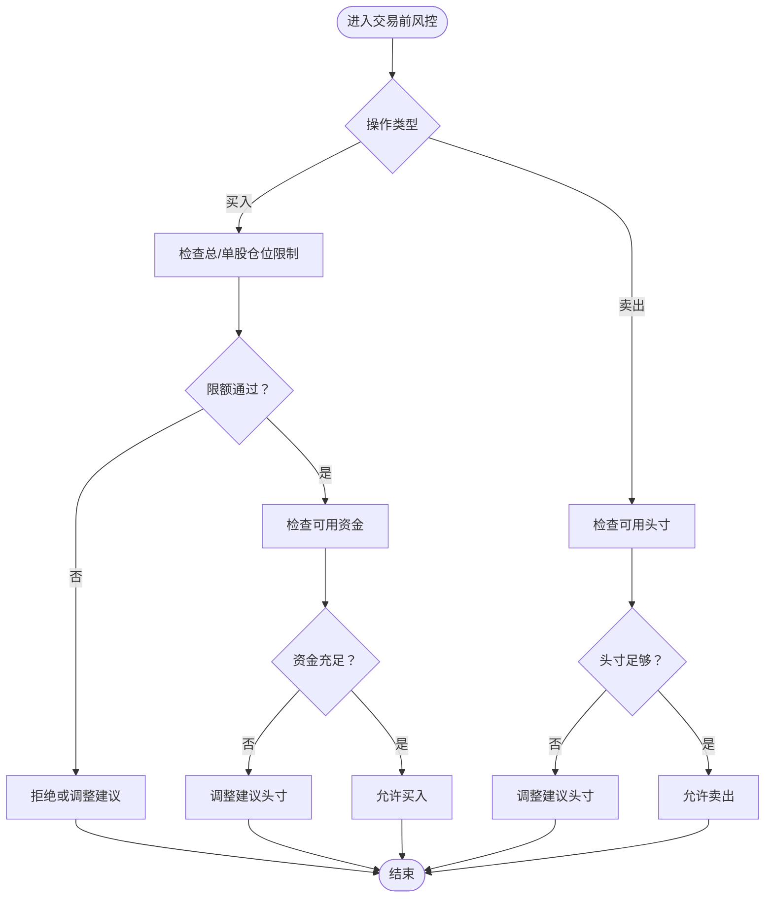
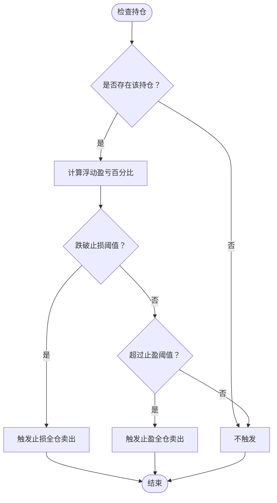
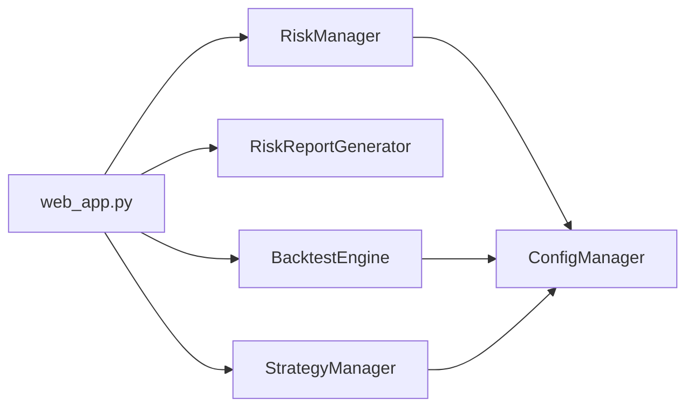

# 风险控制

<cite>
**本文引用的文件**
- [quant_system/risk_manager.py](file://quant_system/risk_manager.py)
- [quant_system/web_app.py](file://quant_system/web_app.py)
- [quant_system/backtest.py](file://quant_system/backtest.py)
- [quant_system/strategy.py](file://quant_system/strategy.py)
- [quant_system/config_manager.py](file://quant_system/config_manager.py)
- [config.yaml](file://config.yaml)
- [quant_system/templates/risk.html](file://quant_system/templates/risk.html)
- [config/stocks.yaml](file://config/stocks.yaml)
</cite>

## 目录
1. [简介](#简介)
2. [项目结构](#项目结构)
3. [核心组件](#核心组件)
4. [架构总览](#架构总览)
5. [详细组件分析](#详细组件分析)
6. [依赖关系分析](#依赖关系分析)
7. [性能与稳定性考量](#性能与稳定性考量)
8. [故障排查指南](#故障排查指南)
9. [结论](#结论)
10. [附录](#附录)

## 简介
本文件面向vibequation量化交易系统中的“风险控制模块”，系统性阐述其设计原则、控制策略与监控机制。内容覆盖：
- 仓位管理算法与头寸限制
- 止损止盈规则与自动风控触发
- 风险敞口控制与集中度管理
- 风险指标计算（VaR、最大回撤、夏普比率等）
- 风险预警机制与异常交易监控
- 风险报告生成、合规检查与审计追踪
- 参数配置指南与实际应用案例

## 项目结构
风险控制模块位于quant_system子系统内，与Web接口、策略引擎、回测引擎协同工作，通过配置中心统一管理风控参数，并通过Web模板提供可视化界面。

**图表来源**
- [quant_system/risk_manager.py:47-404](file://quant_system/risk_manager.py#L47-L404)
- [quant_system/web_app.py:314-336](file://quant_system/web_app.py#L314-L336)
- [quant_system/backtest.py:66-282](file://quant_system/backtest.py#L66-L282)
- [quant_system/strategy.py:318-460](file://quant_system/strategy.py#L318-L460)
- [quant_system/config_manager.py:149-156](file://quant_system/config_manager.py#L149-L156)
- [config.yaml:69-75](file://config.yaml#L69-L75)
- [quant_system/templates/risk.html:1-242](file://quant_system/templates/risk.html#L1-L242)

**章节来源**
- [quant_system/risk_manager.py:1-404](file://quant_system/risk_manager.py#L1-L404)
- [quant_system/web_app.py:1-466](file://quant_system/web_app.py#L1-L466)
- [quant_system/backtest.py:1-456](file://quant_system/backtest.py#L1-L456)
- [quant_system/strategy.py:1-556](file://quant_system/strategy.py#L1-L556)
- [quant_system/config_manager.py:1-178](file://quant_system/config_manager.py#L1-L178)
- [config.yaml:1-88](file://config.yaml#L1-L88)
- [quant_system/templates/risk.html:1-242](file://quant_system/templates/risk.html#L1-L242)

## 核心组件
- 风控管理器（RiskManager）
  - 仓位管理：按总仓位与单股仓位上限进行限制
  - 止损止盈：基于浮动盈亏百分比触发
  - 交易前风控：资金、头寸与可用性检查
  - 组合风险指标：集中度、总仓位比例、浮动盈亏、风险等级
  - 持仓汇总与序列化
- 风险报告生成器（RiskReportGenerator）
  - 生成结构化风险报告，包含资金概况、风险指标、风控提醒与持仓明细
- Web接口（web_app.py）
  - 提供组合风险与持仓查询API
  - 集成前端模板risk.html展示实时风控数据
- 配置中心（config.yaml + ConfigManager）
  - 统一读取风控参数（最大总仓位、单股上限、止损/止盈比例）
  - 提供回测与AI配置，支撑风险策略与报告生成

**章节来源**
- [quant_system/risk_manager.py:47-283](file://quant_system/risk_manager.py#L47-L283)
- [quant_system/risk_manager.py:351-398](file://quant_system/risk_manager.py#L351-L398)
- [quant_system/web_app.py:314-336](file://quant_system/web_app.py#L314-L336)
- [quant_system/templates/risk.html:1-242](file://quant_system/templates/risk.html#L1-L242)
- [quant_system/config_manager.py:149-156](file://quant_system/config_manager.py#L149-L156)
- [config.yaml:69-75](file://config.yaml#L69-L75)

## 架构总览
风险控制模块围绕“交易前风控检查”和“实时组合风险评估”两条主线构建，结合Web接口与模板实现可视化监控。

**图表来源**
- [quant_system/web_app.py:314-336](file://quant_system/web_app.py#L314-L336)
- [quant_system/web_app.py:183-208](file://quant_system/web_app.py#L183-L208)
- [quant_system/web_app.py:210-262](file://quant_system/web_app.py#L210-L262)
- [quant_system/risk_manager.py:241-283](file://quant_system/risk_manager.py#L241-L283)
- [quant_system/strategy.py:409-424](file://quant_system/strategy.py#L409-L424)
- [quant_system/backtest.py:75-282](file://quant_system/backtest.py#L75-L282)

## 详细组件分析

### 风控管理器（RiskManager）
- 设计原则
  - 以“资金安全优先”为核心，通过总仓位与单股仓位双重限制控制风险敞口
  - 以浮动盈亏百分比驱动止损止盈，避免情绪化交易
  - 交易前检查资金、头寸与可用性，降低执行风险
- 关键算法
  - 仓位限制检查：比较拟买入后总值与总资产的比例，以及单股市值与总资产的比例
  - 止损止盈检查：根据持仓浮动盈亏百分比与阈值比较，决定是否触发卖出
  - 交易前风控：买入时检查资金与限额；卖出时检查可用头寸
  - 组合风险评估：计算总仓位比例、集中度、浮动盈亏，并给出风险等级
- 数据结构
  - Position：记录单个持仓的代码、名称、数量、成本、市价、市值、浮动盈亏及百分比
  - RiskCheckResult：封装风控检查结果（通过/拒绝、建议头寸、风险等级等）

**图表来源**
- [quant_system/risk_manager.py:23-87](file://quant_system/risk_manager.py#L23-L87)
- [quant_system/risk_manager.py:47-283](file://quant_system/risk_manager.py#L47-L283)

**章节来源**
- [quant_system/risk_manager.py:47-283](file://quant_system/risk_manager.py#L47-L283)

### 风控检查流程（交易前）

**图表来源**
- [quant_system/risk_manager.py:185-239](file://quant_system/risk_manager.py#L185-L239)

**章节来源**
- [quant_system/risk_manager.py:185-239](file://quant_system/risk_manager.py#L185-L239)

### 止损止盈触发流程

**图表来源**
- [quant_system/risk_manager.py:145-183](file://quant_system/risk_manager.py#L145-L183)

**章节来源**
- [quant_system/risk_manager.py:145-183](file://quant_system/risk_manager.py#L145-L183)

### 风险报告生成器（RiskReportGenerator）
- 输出字段
  - 资金概况：总资产、可用资金、持仓市值、总仓位比例、浮动盈亏
  - 风险指标：风险等级、集中度、持仓数量
  - 风控提醒：触发止损/止盈的股票清单
  - 持仓明细：逐只股票的头寸、成本、市价、市值、浮动盈亏与占资比
- 用途
  - 为交易员与风控人员提供快速审阅组合风险状况的工具
  - 作为合规检查与审计追踪的依据

**章节来源**
- [quant_system/risk_manager.py:351-398](file://quant_system/risk_manager.py#L351-L398)

### Web接口与前端集成
- 接口
  - GET /api/risk/portfolio：返回组合风险指标
  - GET /api/risk/positions：返回持仓明细
- 前端
  - risk.html通过AJAX拉取上述接口，动态渲染风险等级、总仓位、集中度、风险提醒与持仓表格
  - 提供风控参数滑块（最大仓位、单股上限、止损、止盈），便于演示与配置

**章节来源**
- [quant_system/web_app.py:314-336](file://quant_system/web_app.py#L314-L336)
- [quant_system/templates/risk.html:1-242](file://quant_system/templates/risk.html#L1-L242)

### 风险指标计算方法
- 总仓位比例：∑(单股市值)/总资产
- 持仓集中度：max(单股市值)/∑(单股市值)
- 风险等级：基于总仓位比例与集中度阈值评估
- 最大回撤（回测引擎提供）
  - 计算权益曲线的滚动最高值与当前净值之差，再除以滚动最高值得到百分比
- 夏普比率（回测引擎提供）
  - 日收益率均值除以标准差，再乘以√252（年化）

注意：当前仓库未提供VaR（风险价值）计算实现，可在后续版本扩展。

**章节来源**
- [quant_system/risk_manager.py:241-283](file://quant_system/risk_manager.py#L241-L283)
- [quant_system/backtest.py:217-226](file://quant_system/backtest.py#L217-L226)

### 风险预警机制与异常监控
- 风控提醒
  - 当任意持仓的浮动盈亏达到止损/止盈阈值时，RiskManager会收集相关提醒并返回给前端
- 异常交易监控
  - 交易前风控检查可拦截超限买入与资金不足的订单，必要时建议调整头寸
- 自动风控触发条件
  - 浮动盈亏跌破止损阈值
  - 浮动盈亏超过止盈阈值
  - 买入导致总仓位或单股仓位超限
  - 卖出导致可用头寸不足

**章节来源**
- [quant_system/risk_manager.py:145-183](file://quant_system/risk_manager.py#L145-L183)
- [quant_system/risk_manager.py:185-239](file://quant_system/risk_manager.py#L185-L239)

### 风险报告生成、合规检查与审计追踪
- 风险报告
  - RiskReportGenerator生成标准化报告，包含资金、风险指标、提醒与明细
- 合规检查
  - 通过风控参数与限额检查，确保交易符合内部合规要求
- 审计追踪
  - Web接口与日志记录交易请求与回测结果，便于事后审计

**章节来源**
- [quant_system/risk_manager.py:351-398](file://quant_system/risk_manager.py#L351-L398)
- [quant_system/web_app.py:1-466](file://quant_system/web_app.py#L1-L466)

### 参数配置指南
- 风控参数（来自config.yaml与ConfigManager）
  - 最大总仓位比例：影响整体风险敞口
  - 单只股票最大仓位：防止过度集中
  - 止损比例：控制单笔潜在损失
  - 止盈比例：锁定利润，避免回吐
- 配置读取
  - ConfigManager提供get_risk_config()统一读取
- 应用建议
  - 高波动市场下调止损比例、上调单股上限
  - 低波动市场可适度提高止盈比例以提升收益

**章节来源**
- [config.yaml:69-75](file://config.yaml#L69-L75)
- [quant_system/config_manager.py:149-156](file://quant_system/config_manager.py#L149-L156)

### 实际应用案例
- 案例1：单股超限
  - 场景：某只股票当前市值已占总资产的25%，拟追加买入使其占比超过30%
  - 风控动作：拒绝买入并建议将追加头寸降至建议值
- 案例2：触发止损
  - 场景：某持仓浮动盈亏跌破-5%
  - 风控动作：自动触发卖出指令，清仓止损
- 案例3：触发止盈
  - 场景：某持仓浮动盈亏达到10%
  - 风控动作：自动触发卖出指令，锁定利润

**章节来源**
- [quant_system/risk_manager.py:89-143](file://quant_system/risk_manager.py#L89-L143)
- [quant_system/risk_manager.py:145-183](file://quant_system/risk_manager.py#L145-L183)

## 依赖关系分析
- 模块耦合
  - RiskManager依赖ConfigManager读取风控参数
  - Web接口依赖RiskManager提供风控数据
  - 回测引擎与策略引擎独立于风控，但共享配置中心
- 外部依赖
  - pandas/numpy用于数据处理与指标计算
  - Flask用于Web接口
  - YAML用于配置文件

**图表来源**
- [quant_system/risk_manager.py:17-51](file://quant_system/risk_manager.py#L17-L51)
- [quant_system/web_app.py:23-25](file://quant_system/web_app.py#L23-L25)
- [quant_system/backtest.py:17-21](file://quant_system/backtest.py#L17-L21)
- [quant_system/strategy.py:19-22](file://quant_system/strategy.py#L19-L22)

**章节来源**
- [quant_system/risk_manager.py:1-404](file://quant_system/risk_manager.py#L1-L404)
- [quant_system/web_app.py:1-466](file://quant_system/web_app.py#L1-L466)
- [quant_system/backtest.py:1-456](file://quant_system/backtest.py#L1-L456)
- [quant_system/strategy.py:1-556](file://quant_system/strategy.py#L1-L556)

## 性能与稳定性考量
- 计算复杂度
  - 仓位检查与止损止盈检查均为O(n)（n为持仓数）
  - 组合风险评估与集中度计算为O(n)
- 数据结构选择
  - 使用字典维护持仓，便于快速查找与更新
- 稳定性建议
  - 在高频交易场景下，建议将RiskManager的状态持久化，避免重启丢失
  - 对外部API调用增加重试与熔断机制（当前未实现，建议扩展）

[本节为通用建议，无需具体文件引用]

## 故障排查指南
- 常见问题
  - 交易被拒：检查总仓位与单股仓位是否超限，确认可用资金是否充足
  - 止损/止盈频繁触发：适当上调止损/止盈比例或降低单股上限
  - 前端无数据显示：确认Web服务已启动，/api/risk/*接口可访问
- 排查步骤
  - 查看Web日志定位错误
  - 使用/strategy/run与/backtest/run接口验证策略与回测正常
  - 检查config.yaml中的风控参数是否正确

**章节来源**
- [quant_system/web_app.py:314-336](file://quant_system/web_app.py#L314-L336)
- [quant_system/web_app.py:183-208](file://quant_system/web_app.py#L183-L208)
- [quant_system/web_app.py:210-262](file://quant_system/web_app.py#L210-L262)

## 结论
vibequation的风险控制模块以简洁高效的风控检查与组合风险评估为核心，结合Web可视化界面与回测指标，形成完整的风控闭环。通过合理的参数配置与持续优化，可有效控制风险敞口、提升交易稳定性，并为合规与审计提供可靠支撑。

[本节为总结性内容，无需具体文件引用]

## 附录

### 风控参数一览表
- 最大总仓位比例：控制整体风险敞口
- 单只股票最大仓位：控制集中度
- 止损比例：控制单笔潜在损失
- 止盈比例：锁定利润

**章节来源**
- [config.yaml:69-75](file://config.yaml#L69-L75)
- [quant_system/config_manager.py:149-156](file://quant_system/config_manager.py#L149-L156)

### 股票与板块配置参考
- 股票列表：用于策略与回测的数据源
- 板块与指数：用于宏观与行业层面的风控视角

**章节来源**
- [config/stocks.yaml:1-71](file://config/stocks.yaml#L1-L71)