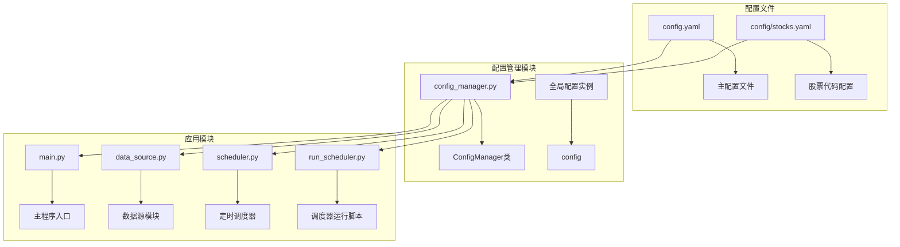
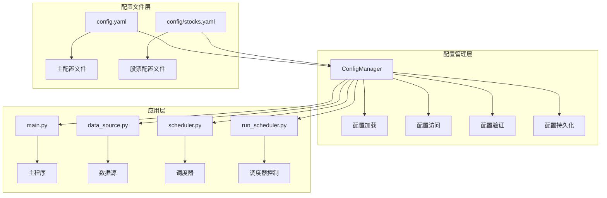
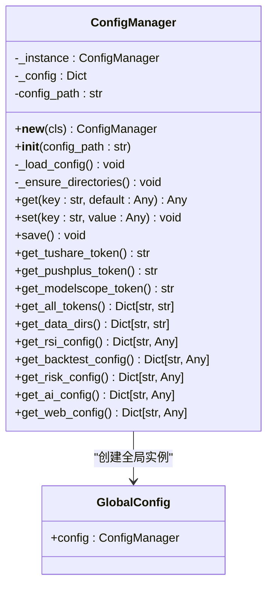
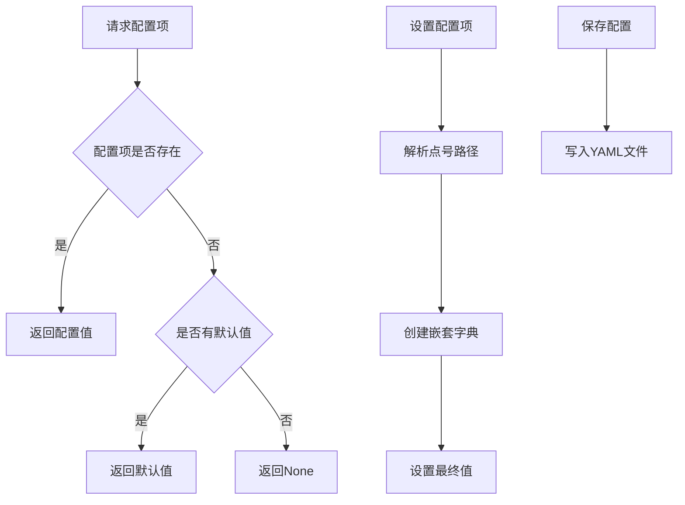

# 配置管理模块

<cite>
**本文档引用的文件**
- [config.yaml](file://config.yaml)
- [stocks.yaml](file://config/stocks.yaml)
- [config_manager.py](file://quant_system/config_manager.py)
- [main.py](file://main.py)
- [data_source.py](file://quant_system/data_source.py)
- [scheduler.py](file://quant_system/scheduler.py)
- [run_scheduler.py](file://run_scheduler.py)
</cite>

## 目录
1. [简介](#简介)
2. [项目结构](#项目结构)
3. [核心组件](#核心组件)
4. [架构概览](#架构概览)
5. [详细组件分析](#详细组件分析)
6. [配置文件详解](#配置文件详解)
7. [依赖关系分析](#依赖关系分析)
8. [性能考虑](#性能考虑)
9. [故障排除指南](#故障排除指南)
10. [结论](#结论)

## 简介

vibequation量化交易系统的配置管理模块是一个统一的配置管理系统，负责管理整个系统的各种配置参数。该模块采用单例模式设计，提供了集中化的配置访问接口，支持配置文件的动态加载、验证和持久化存储。系统通过配置文件实现了高度的可定制性和可维护性，使得用户可以根据不同的需求调整量化交易策略的各种参数。

## 项目结构

配置管理模块在项目中的组织结构如下：



**图表来源**
- [config_manager.py:12-27](file://quant_system/config_manager.py#L12-L27)
- [main.py:14](file://main.py#L14)
- [data_source.py:17](file://quant_system/data_source.py#L17)
- [scheduler.py:19](file://quant_system/scheduler.py#L19)

**章节来源**
- [config_manager.py:1-178](file://quant_system/config_manager.py#L1-L178)
- [config.yaml:1-88](file://config.yaml#L1-L88)
- [stocks.yaml:1-71](file://config/stocks.yaml#L1-L71)

## 核心组件

配置管理模块的核心组件包括：

### ConfigManager类
ConfigManager是配置管理模块的核心类，采用了单例模式设计，确保整个应用程序只有一个配置实例。该类提供了以下主要功能：
- 配置文件的加载和解析
- 配置项的获取和设置
- 数据目录的自动创建
- 配置的持久化存储

### 全局配置实例
通过全局配置实例`config`，其他模块可以方便地访问配置信息，无需重复创建配置管理器实例。

### 配置文件结构
系统使用YAML格式的配置文件，支持嵌套的配置层次结构，便于组织不同类型和用途的配置参数。

**章节来源**
- [config_manager.py:12-178](file://quant_system/config_manager.py#L12-L178)

## 架构概览

配置管理模块采用分层架构设计，实现了配置的集中化管理和模块间的松耦合：



**图表来源**
- [config_manager.py:28-99](file://quant_system/config_manager.py#L28-L99)
- [main.py:26-42](file://main.py#L26-L42)
- [data_source.py:24-41](file://quant_system/data_source.py#L24-L41)
- [scheduler.py:34-76](file://quant_system/scheduler.py#L34-L76)

## 详细组件分析

### ConfigManager类设计

ConfigManager类采用了单例模式和工厂模式的结合，提供了线程安全的配置管理能力：



**图表来源**
- [config_manager.py:12-178](file://quant_system/config_manager.py#L12-L178)

#### 配置加载机制

配置管理器的配置加载过程具有以下特点：

1. **文件存在性检查**：在加载配置前首先检查配置文件是否存在
2. **YAML解析**：使用`yaml.safe_load()`安全地解析配置文件
3. **目录自动创建**：根据配置自动创建必要的数据目录
4. **错误处理**：对配置文件不存在的情况抛出明确的异常

#### 配置访问模式

ConfigManager提供了灵活的配置访问方式：

1. **点号分隔访问**：支持`data_storage.data_dir`这样的嵌套访问
2. **默认值机制**：为每个配置项提供合理的默认值
3. **类型安全**：保持配置值的原始类型不变

**章节来源**
- [config_manager.py:28-99](file://quant_system/config_manager.py#L28-L99)

### 配置验证和默认值策略

配置管理模块实现了多层次的配置验证和默认值设置：



**图表来源**
- [config_manager.py:56-99](file://quant_system/config_manager.py#L56-L99)

#### 默认值设置策略

系统为重要的配置项设置了合理的默认值：
- **数据目录**：默认使用相对路径`./data`
- **日志级别**：默认`INFO`
- **Web服务**：默认监听`127.0.0.1:8080`
- **技术指标**：提供标准的RSI和移动平均线参数

**章节来源**
- [config_manager.py:133-173](file://quant_system/config_manager.py#L133-L173)

## 配置文件详解

### 主配置文件 config.yaml

主配置文件包含了量化交易系统的所有核心配置参数，采用YAML格式组织：

#### API令牌配置
```yaml
tokens:
  tushare_token: "2876ea85cb005fb5fa17c809a98174f2d5aae8b1f830110a5ead6211'"
  pushplus_token: "8e7050dc70fd4ebf9b6c11affcf7abf7"
  modelscope_token: "8ef57051-c443-4b9f-8ba7-9f412f276ec9"
```

#### 数据存储配置
```yaml
data_storage:
  data_dir: "./data"
  history_dir: "./data/history"
  realtime_dir: "./data/realtime"
  news_dir: "./data/news"
  indicators_dir: "./data/indicators"
  features_dir: "./data/features"
  backtest_dir: "./data/backtests"
```

#### 数据采集配置
```yaml
data_collection:
  history:
    start_date: "20200101"
    end_date: "20241231"
  realtime:
    interval: 5
  news:
    track_days: 30
    sentiment_model: "modelscope"
```

#### 技术指标配置
```yaml
technical_indicators:
  rsi:
    periods: [6, 12, 24]
    timeframes: ["day", "week", "month"]
    history_lookback: 252
  ma:
    periods: [5, 10, 20, 60, 120, 250]
  macd:
    fast: 12
    slow: 26
    signal: 9
```

#### AI模型配置
```yaml
ai_models:
  provider: "modelscope"
  model_name: "qwen-max"
  max_tokens: 2000
  temperature: 0.7
```

#### 回测配置
```yaml
backtest:
  initial_capital: 1000000
  commission_rate: 0.0003
  slippage: 0.001
```

#### 风控配置
```yaml
risk_management:
  max_position_ratio: 0.8
  max_single_stock_ratio: 0.3
  stop_loss_ratio: 0.05
  take_profit_ratio: 0.1
```

#### Web服务配置
```yaml
web:
  host: "127.0.0.1"
  port: 8080
  debug: false
```

#### 日志配置
```yaml
logging:
  level: "INFO"
  file: "./logs/quant_system.log"
  max_size: "10MB"
  backup_count: 5
```

**章节来源**
- [config.yaml:1-88](file://config.yaml#L1-L88)

### 股票代码配置文件 stocks.yaml

股票代码配置文件定义了系统关注的股票、板块和指数列表：

#### 个股配置
```yaml
stocks:
  - name: "贵州茅台"
    code: "600519"
    market: "sh"
    type: "stock"
```

#### 板块配置
```yaml
sectors:
  - name: "半导体"
    code: "BK1036"
    type: "sector"
```

#### 指数配置
```yaml
indices:
  - name: "上证指数"
    code: "000001"
    market: "sh"
    type: "index"
```

**章节来源**
- [stocks.yaml:1-71](file://config/stocks.yaml#L1-L71)

## 依赖关系分析

配置管理模块与其他系统组件的依赖关系如下：

```mermaid
graph TB
subgraph "配置管理依赖"
A[config_manager.py] --> B[config.yaml]
A --> C[stocks.yaml]
A --> D[os模块]
A --> E[yaml模块]
A --> F[pathlib模块]
end
subgraph "被配置管理依赖的模块"
G[main.py] --> A
H[data_source.py] --> A
I[indicators.py] --> A
J[feature_extractor.py] --> A
K[risk_manager.py] --> A
L[scheduler.py] --> A
M[web_app.py] --> A
end
subgraph "配置使用示例"
N[数据目录获取] --> O[config.get_data_dirs()]
P[API令牌获取] --> Q[config.get_tushare_token()]
R[技术指标配置] --> S[config.get_rsi_config()]
T[回测配置] --> U[config.get_backtest_config()]
end
A --> N
A --> P
A --> R
A --> T
```

**图表来源**
- [config_manager.py:6-9](file://quant_system/config_manager.py#L6-L9)
- [main.py:14](file://main.py#L14)
- [data_source.py:17](file://quant_system/data_source.py#L17)
- [indicators.py:24-25](file://quant_system/indicators.py#L24-L25)

### 配置使用模式

配置管理模块在各个应用模块中的使用模式：

1. **直接访问**：模块通过`config.get()`方法直接获取配置值
2. **配置封装**：模块提供专门的方法来获取特定类型的配置
3. **默认值处理**：所有配置访问都带有合理的默认值

**章节来源**
- [main.py:27-42](file://main.py#L27-L42)
- [data_source.py:27-41](file://quant_system/data_source.py#L27-L41)
- [indicators.py:24-25](file://quant_system/indicators.py#L24-L25)

## 性能考虑

配置管理模块在性能方面的考虑包括：

### 内存优化
- 使用单例模式避免重复创建配置实例
- 配置数据在内存中缓存，避免频繁的文件I/O操作
- 懒加载机制：只有在首次访问时才加载配置文件

### 文件系统优化
- 目录自动创建：在配置加载时一次性创建所有必要的目录
- 路径处理：使用`pathlib.Path`进行高效的路径操作

### 并发安全性
- 单例模式天然保证了线程安全
- 配置访问方法都是原子操作

## 故障排除指南

### 常见配置错误及解决方案

#### 配置文件不存在
**症状**：启动时抛出文件不存在异常
**原因**：配置文件路径错误或文件被删除
**解决方案**：
1. 检查配置文件路径是否正确
2. 确认配置文件存在于指定位置
3. 重新创建配置文件

#### 配置格式错误
**症状**：YAML解析失败
**原因**：配置文件格式不符合YAML规范
**解决方案**：
1. 使用在线YAML验证工具检查格式
2. 确保缩进正确
3. 检查特殊字符转义

#### 目录权限问题
**症状**：数据目录无法创建
**原因**：用户没有写入权限
**解决方案**：
1. 检查目标目录的权限
2. 以管理员身份运行程序
3. 修改配置文件中的目录路径

#### API令牌无效
**症状**：数据源访问失败
**原因**：API令牌配置错误或过期
**解决方案**：
1. 检查API令牌的有效性
2. 重新申请有效的API令牌
3. 更新配置文件中的令牌值

### 配置验证方法

#### 手动验证
```python
# 验证配置文件
from quant_system.config_manager import config

# 检查关键配置项
print("数据目录:", config.get('data_storage.data_dir'))
print("Tushare令牌:", config.get('tokens.tushare_token'))
print("RSI配置:", config.get_rsi_config())
```

#### 自动验证
系统提供了配置验证机制，可以在启动时自动检查配置的有效性。

**章节来源**
- [config_manager.py:30-34](file://quant_system/config_manager.py#L30-L34)
- [data_source.py:46-52](file://quant_system/data_source.py#L46-L52)

## 结论

vibequation量化交易系统的配置管理模块通过精心设计的架构和完善的实现，为整个系统提供了强大而灵活的配置管理能力。该模块的主要优势包括：

1. **统一管理**：所有配置集中在单一的配置管理器中
2. **易于使用**：提供简单直观的配置访问接口
3. **类型安全**：保持配置值的原始类型
4. **默认值策略**：为配置项提供合理的默认值
5. **扩展性强**：支持新的配置项和配置文件的添加

通过合理使用配置管理模块，用户可以轻松地定制量化交易系统的各种行为，包括数据采集策略、技术指标参数、AI模型配置、回测参数和风控策略等。这使得vibequation系统能够适应不同用户的需求和市场环境的变化。